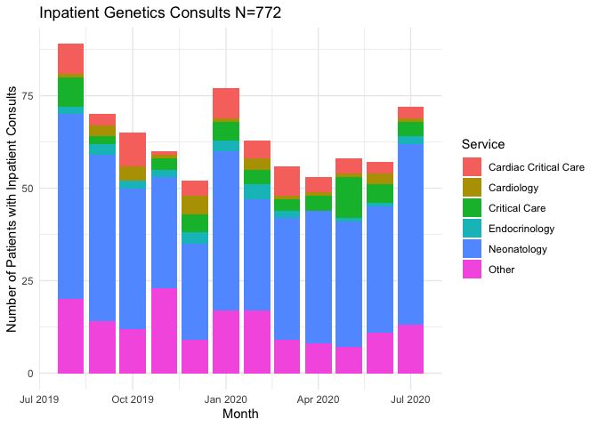
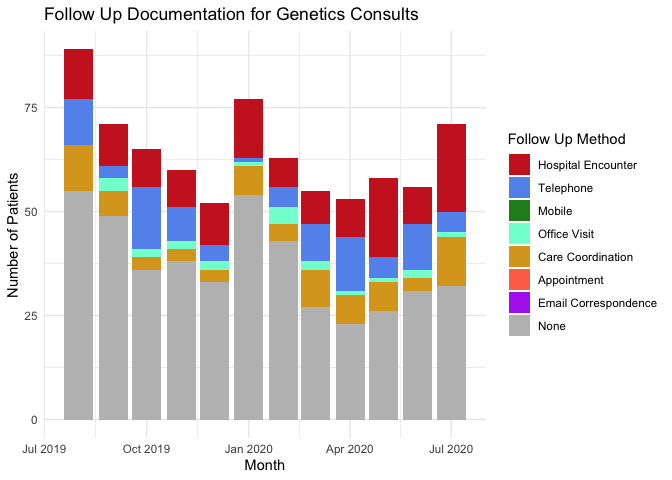
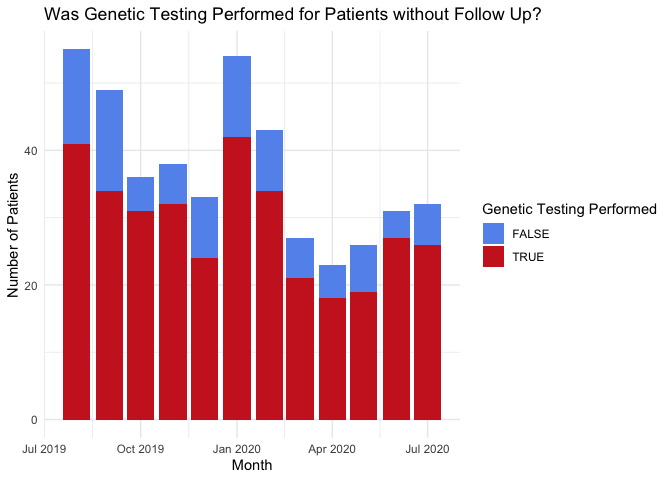
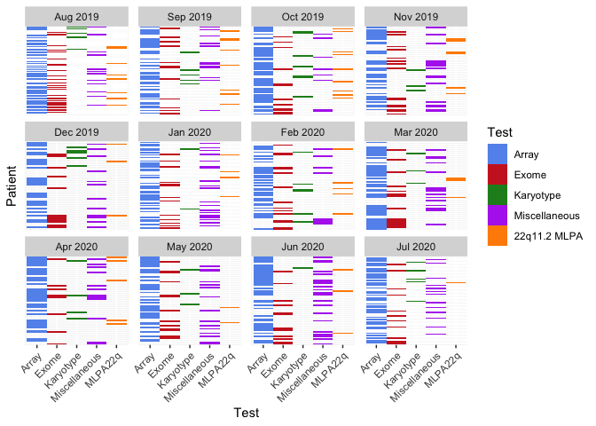

```r
options(width = 400)
library(data.table)
library(tidyverse)
library(magrittr)
library(lubridate)
library(texreg)
```
***

### Overview
Clinical Genetics consultation during hospitalization attempts to identify an underlying cause of a patient’s multiple medical problems and may include genetic testing which takes many weeks or months to complete. Because the patient may be discharged from the hospital before the testing results become available, ensuring that the results are effectively communicated to the patient or family and their healthcare team is challenging. I used data extracted from the Children’s Hospital of Philadelphia electronic health record to identify factors which increase the risk of failed follow up. I used this information to inform implementation of a system including clinical decision support in an attempt to improve timely delivery of care.

### Introduction 
Genetic testing has the ability to provide an overarching reason for a patient’s medical problems. Likewise, it can inform prognosis, management, surveillance and recurrence risk. However, to be useful, the testing must be reviewed and interpreted by professionals that can implement care based on the knowledge gained and inform the patient or their family members of its meaning. Too frequently, genetic testing is sent and never followed up on by a provider. When sent as an inpatient, this testing is often performed at the expense of the hospital. If the patient or family member never realizes the benefit of the testing, there is the potential that this hospital resource could be wasted. 

To reduce the rate of testing that is never followed up on, we will implement a comprehensive tracking system that takes the place of disparate systems used by individual providers. To facilitate the implementation, we will model the characteristics of patients that appear to be at increased risk of never having documented follow up. Information gained through this analysis will be used to design the tracking system; it will aim to decrease the time and effort needed for providers to access needed data and perform follow-up tasks. We will also aim to measure follow up before and after the intervention. 


### Methods
As part of a quality improvement project, I extracted from the CHOP Data Warehouse. This Netezza SQL database houses data that is loaded via Extract Transform Load processes from the Clarity database of the CHOP Epic electronic health record implementation. Due to institutional restrictions, I extracted the data using a separate IDE.

I obtained a list of patients who had an evaluation by the consulting service of Clinical Genetics while hospitalized between the dates of `2019-08-01` and `2020-08-01`. I identified these patients by searching for clinical notes of type `CONSULT NOTE`. I also extracted other information about their hospitalization, insurance coverage and demographic information. 

```sql
SELECT EI.MRN,
       NI.PAT_KEY,
	     NI.NOTE_SVC_DT,
	     days_between(NI.NOTE_SVC_DT, PA.DOB) "Age in Days",
	     PA.gestational_age_complete_weeks + (PA.gestational_age_remainder_days /7) "Gestational Age",
	     EI.admission_service,
	     EI.hospital_los_days,
	     EI.payor_group,
	     EI.icu_los_days,
	     EI.patient_address_zip_code,
	     EI.admission_source,
	     EI.sex
FROM CDWPRD.ADMIN.NOTE_INFO NI
INNER JOIN CHOP_ANALYTICS.NOTE_EDIT_METADATA_HISTORY NEMH
ON NI.NOTE_KEY = NEMH.NOTE_KEY
AND LAST_EDIT_IND = 1 
AND NEMH.NOTE_TYPE_ID = 400005 --CONSULT NOTE
AND NEMH.VERSION_AUTHOR_SERVICE_ID = 14 --GENETICS
AND NEMH.VERSION_AUTHOR_TITLE = 'MD' --Exclude GC Only consults (from ENGIN)
INNER JOIN CHOP_ANALYTICS.PATIENT_ALL PA
ON NI.PAT_KEY = PA.PAT_KEY 
INNER JOIN CHOP_ANALYTICS.ENCOUNTER_INPATIENT EI
ON NI.VISIT_KEY = EI.VISIT_KEY 
WHERE NI.NOTE_SVC_DT >= '2019-08-01' AND NI.NOTE_SVC_DT < '2020-08-01'
AND NI.UNSIGN_IND <> 1 --NOT Unsigned
AND NEMH.MRN <> 'UNKNOWN'
AND NI.DIM_DEL_CAT_KEY = 0
```
Next I obtained a list of follow up clinical notes. 

```sql
SELECT NEMH.MRN, NI.PAT_KEY,
	   NI.NOTE_SVC_DT "Initial Date",
	   NI.NOTE_KEY "Initial Key",
	   NEMHF.NOTE_KEY "Subsequent Key",
	   NIF.NOTE_SVC_DT "Subsequent Date",
	   NEMHF.NOTE_TYPE "Type",
	   NIF.AMBUL_NOTE_IND "AMB",
	   D.DICT_NM "Encounter Type"
FROM CDWPRD.ADMIN.NOTE_INFO NI
INNER JOIN CHOP_ANALYTICS.NOTE_EDIT_METADATA_HISTORY NEMH
ON NI.NOTE_KEY = NEMH.NOTE_KEY
AND NEMH.LAST_EDIT_IND = 1 
AND NEMH.NOTE_TYPE_ID = 400005 --CONSULT NOTE
AND NEMH.VERSION_AUTHOR_SERVICE_ID = 14 --GENETICS
AND NEMH.VERSION_AUTHOR_TITLE = 'MD' --Exclude GC Only consults (from ENGIN)
LEFT JOIN CHOP_ANALYTICS.NOTE_EDIT_METADATA_HISTORY NEMHF
ON NI.PAT_KEY = NEMHF.PAT_KEY 
AND NEMHF.NOTE_ENTRY_DATE > NEMH.NOTE_ENTRY_DATE 
AND NI.NOTE_KEY <> NEMHF.NOTE_KEY
AND NEMHF.VERSION_AUTHOR_SERVICE_ID = 14
AND NEMHF.NOTE_TYPE_ID <> 400005
AND NEMHF.LAST_EDIT_IND = 1 
LEFT JOIN CDWPRD.ADMIN.NOTE_INFO NIF
ON NEMHF.NOTE_KEY = NIF.NOTE_KEY
AND NIF.DIM_DEL_CAT_KEY = 0
LEFT JOIN CDWPRD.ADMIN.VISIT V
ON NIF.VISIT_KEY = V.VISIT_KEY 
LEFT JOIN CDWPRD.ADMIN.CDW_DICTIONARY D
ON V.DICT_ENC_TYPE_KEY = D.DICT_KEY 
WHERE NI.NOTE_SVC_DT >= '2019-08-01' AND NI.NOTE_SVC_DT < '2020-08-01'
AND NI.UNSIGN_IND <> 1 --NOT Unsigned
AND NEMH.MRN <> 'UNKNOWN'
AND NI.DIM_DEL_CAT_KEY = 0
ORDER BY NI.PAT_KEY DESC
```
Finally, I obtained a list of genetic tests that were performed for each patient. I manually reviewed each order name to identify genetic tests. 

```sql
SELECT NI.PAT_KEY,
       PROC_ORD_NM,
       PO.PLACED_DT,
       POR.RSLT_DT, 
       PO.SPECIMEN_TAKEN_DT,
       RC.COMP_NM,
       POR.RSLT_VAL
FROM CDWPRD.ADMIN.NOTE_INFO NI
INNER JOIN CHOP_ANALYTICS.NOTE_EDIT_METADATA_HISTORY NEMH
ON NI.NOTE_KEY = NEMH.NOTE_KEY
AND LAST_EDIT_IND = 1 
AND NEMH.NOTE_TYPE_ID = 400005 --CONSULT NOTE
AND NEMH.VERSION_AUTHOR_SERVICE_ID = 14 --GENETICS
AND NEMH.VERSION_AUTHOR_TITLE = 'MD' --Exclude GC Only consults (from ENGIN)
LEFT JOIN CDWPRD.ADMIN.PROCEDURE_ORDER PO
ON NI.PAT_KEY = PO.PAT_KEY
AND PO.DICT_LAB_STAT_KEY = 21038 --Status FINAL
AND PO.DICT_ORD_TYPE_KEY = 21554 --Lab
LEFT JOIN CDWPRD.ADMIN.PROCEDURE P 
ON PO.PROC_KEY = P.PROC_KEY
LEFT JOIN CDWPRD.ADMIN.PROCEDURE_ORDER_RESULT POR
ON PO.PROC_ORD_KEY = POR.PROC_ORD_KEY 
LEFT JOIN CDWPRD.ADMIN.RESULT_COMPONENT RC 
ON POR.RSLT_COMP_KEY = RC.RSLT_COMP_KEY 
WHERE NI.NOTE_SVC_DT >= '2019-08-01' AND NI.NOTE_SVC_DT < '2020-08-01'
AND NI.UNSIGN_IND <> 1 --NOT Unsigned
AND NEMH.MRN <> 'UNKNOWN'
AND NI.DIM_DEL_CAT_KEY = 0
AND PROC_ORD_NM IN ('Chromosomal SNP Microarray','MISC Genetic Referred Testing','Exome Sequencing, Proband (CHOP Medical Exome Version 2)','Karyotype, Constitutional','22q11.2 Del/Dup','MitoGenome Seq + Del','Beckwith-Wiedemann Meth-Copy','Noonan Panel SEQ','Exome Sequencing, Proband (Send Out)','Comprehensive Pulmonary-Vascular SEQ + Del/Dup Panel','Exome Sequencing, Proband','Osteogenesis Imperfecta SEQ + Del/Dup Panel','PRADER-WILLI/ANGELMAN Methylation','CHD7 SEQ + Del/Dup','Kabuki SEQ + Del/Dup Panel','Russell Silver Panel w/Reflex','Fragile X Syndrome','Cancer, FISH Analysis','Exome Reanalysis','Very Early Onset Inflam Bowel Dis Panel','Chromosome Breakage Studies','Stickler syndrome SEQ + Del/Dup Panel','CFTR SEQ + Del/Dup Analysis','Pulmonary Hypertension SEQ + Del/Dup Panel','Pneumothorax SEQ + Del/Dup Panel','XomeDx Trio','MSOG- Genetics Send Out','Ketotic Hypoglycemia SEQ + Del/Dup Panel','Ipex Syndrome - FOXP3','Exome & mtDNA-GeneDx (XomeDX Plus)','Exome + MitoGenome Combined Test  (Send Out)','Alagille Syndrome SEQ + Del/Dup Panel','Seq Known Genetic Variant','CHOP Epilepsy Panel','TPMT Genotyping','Exome DNA Extract Family Member','Inherited Neutropenia Panel','Full Exome Analysis from Exome Panel','CCHS PHOX2B SEQ + Del/Dup','Cholestasis SEQ + Del/Dup Panel','Severe combined immunodeficiency SEQ + Del/Dup Panel','Connective Tissue SEQ + Del/Dup Panel','TBX1 Gene Sequencing','MID1 SEQ + Del/Dup','Chromosome Stress Test','FISH, Constitutional','MECP2 Del/Dup','Marfan SEQ + Del/Dup Analysis','Fanconi Anemia/Rare Chrom Breakage Panel','NUDT15 Genotyping','GJB2 SEQ Analysis','Glycogen Storage Disease SEQ + Del/Dup Panel','SPINK1 N34S Variant','Chromosomal Microarray, Postnatal -Q','Humoral dysfunction SEQ Panel','(MSOG) Cholestasis Liver Panel- (Emory)','MECP2 SEQ + Del/Dup','SMN1 Deletion Testing','Pancreatitis SEQ + Del/Dup Panel','Cornelia de Lange SEQ + Del/Dup Panel','MSOG Genetic Send Out','Primary Ciliary Dyskinesia SEQ +Del/Dup Panel','PTEN SEQ + Del/Dup','Primary Ciliary Dyskinesia SEQ+Del/Dup Panel')
ORDER BY PAT_KEY DESC
```
I saved each dataset as a `.csv` file for further analysis in `R`.


```r
InitialConsult <- fread("~/Penn/BMIN503/Project/Queries/Initial Consults.csv")
setnames(InitialConsult,
         c("Patient", "ConsultDate", "AgeDays", "GestationalAge","AdmissionService", "HospitalLOS", "PayorGroup",
           "CriticalCareLOS", "Zip", "AdmissionSource", "LegalSex",
           "Race", "RaceEthnicity","PreferredLanguage"))

SubsequentNotes <- fread("~/Penn/BMIN503/Project/Queries/Subsequent Notes.csv")
setnames(SubsequentNotes,c("Patient", "InitialDate", "InitialKey", "SubsequentKey", "SubsequentDate", "Type",
                           "AmbulatoryContext", "EncounterType"))

GeneticResults <- fread("~/Penn/BMIN503/Project/Queries/Genetic Results.csv")
setnames(GeneticResults,c("Patient", "OrderName", "PlacedDate", "ResultDate", "SpecimenCollectDate", "ResultComponent",
                          "ResultValue"))
```
### Results

#### Timing and Hospital Service of Inpatient Genetics Consults
There were a total of `772` inpatient consults performed during the study period (`2019-08-01 - 2020-08-01`).

```r
FilteredConsult <- InitialConsult %>% 
                       mutate(ConsultDate = mdy_hm(ConsultDate)) %>%
                       group_by(Patient) %>%
                       dplyr::filter(ConsultDate == min(ConsultDate)) %>%
                       ungroup()  

FilteredConsult %>%
  mutate(ConsultMonth = as.Date(cut(ConsultDate, breaks = "month")),
         Service = fct_other(AdmissionService,
                             keep = c("Neonatology","Cardiology","Cardiac Critical Care","Critical Care","Endocrinology"),
                             other_level = "Other")) %>%
ggplot(aes(x = ConsultMonth, fill = Service)) + 
  geom_bar(stat="count") +
  labs(y = "Number of Patients with Inpatient Consults",
       x = "Month") + 
  ggtitle(paste0("Inpatient Genetics Consults N=",nrow(FilteredConsult))) +
  theme_minimal()
```

<!-- -->

The distribution of the consulting hospital service remained stable during the study period. There is a notable decrease in consults in December with a subsequent rise in Janurary, likely due to the effects of winter holidays.

#### Documentation of Follow Up Care Following Initial Consultation


```r
SummarizedSubsequentNotes <- SubsequentNotes %>% 
  mutate(InitialDate = mdy_hm(InitialDate)) %>%
  group_by(Patient) %>%
  dplyr::filter(InitialDate == min(InitialDate)) %>%
  dplyr::summarise(FollowUpType = names(sort(table(EncounterType),decreasing = TRUE))[1],
                   ConsultMonth = as.Date(cut(InitialDate, breaks = "month"))[1]) %>%
  mutate(FollowUpType = replace(FollowUpType, FollowUpType == "", "None")) %>%
  mutate(FollowUpType = str_to_title(FollowUpType)) %>%
  mutate(FollowUpType = factor(FollowUpType,
                               levels = c("Hospital Encounter", "Telephone", "Mobile", "Office Visit",
                                          "Care Coordination","Appointment", "Email Correspondence",
                                          "Orders Only", "Letter (Out)","None")))

ggplot(SummarizedSubsequentNotes, aes(x = ConsultMonth, fill = FollowUpType)) + 
  geom_bar(stat="count") +
  labs(y = "Number of Patients",
       x = "Month",
       fill = "Follow Up Method") + 
  ggtitle("Follow Up Documentation for Genetics Consults") +
  scale_fill_manual(values = c("Hospital Encounter" = "firebrick3", 
                               "Telephone" = "cornflowerblue", 
                               "Mobile" = "forestgreen",
                               "Office Visit" = "aquamarine1",
                               "Care Coordination" = "goldenrod",
                               "Appointment" = "coral1",
                               "Email Correspondence" = "darkorchid2",
                               "None" ="gray")) +
  theme_minimal()
```

<!-- -->

Notably, **58%** of patients with completed consults during the study period had no subsequent clinical note documented by any member of the Genetics healthcare team. The rate appeared to remain relatively stable over time.

I hypothesized that a number of consultations actually require no further follow up:

* The patient was evaluated but the clinician felt that no genetic testing nor further follow up was warranted
* The patient previously underwent genetic testing and the Genetics team is being consulted for management during hospitalization
* The patient previously underwent genetic testing and was diagnosed with a specific condition, the family desires further counseling from the CHOP Genetics team, but no long-term follow up is required

In other cases, I hypothesized that genetic testing was recommended, but the results of that testing was either never reviewed or the interpretation and follow up plan was not documented in the patient's chart.


```r
SummarizedSubsequentNotes %>%
  mutate(GeneticResults = Patient %in% GeneticResults$Patient) %>%
  dplyr::filter(FollowUpType  == "None") %>%
ggplot(aes(x = ConsultMonth, fill = GeneticResults)) + 
  geom_bar(stat="count") +
  labs(y = "Number of Patients",
       x = "Month",
       fill = "Genetic Testing Performed") + 
  ggtitle("Was Genetic Testing Performed for Patients without Follow Up?") +
  scale_fill_manual(values = c("TRUE" = "cornflowerblue", 
                               "FALSE" = "firebrick3"),
                    labels = c("FALSE" = "No",
                               "TRUE" = "Yes")) +
  theme_minimal()
```

<!-- -->
Interestingly, **78%** of patients with no documented follow up had genetic testing performed.  


```r
GeneticResultsSummary <- GeneticResults %>% 
  mutate(OrderName = case_when(str_detect(OrderName,regex("xome",ignore_case = TRUE)) ~ "Exome",
                               str_detect(ResultValue,regex("xome",ignore_case = TRUE)) ~ "Exome",
                               str_detect(OrderName,regex("MISC",ignore_case = TRUE)) ~ "Miscellaneous",
                               str_detect(OrderName,regex("MSO",ignore_case = TRUE)) ~ "Miscellaneous",
                               TRUE ~ OrderName)) %>%
  dplyr::filter(OrderName %in% names(sort(table(OrderName),TRUE))[1:5]) %>%
  group_by(Patient) %>% summarise(OrderName = unique(OrderName),
                                  Value = 1) %>%
  pivot_wider(id_cols = Patient, names_from = OrderName, values_from = Value, values_fill = 0) %>%
  rename(Array = `Chromosomal SNP Microarray`,
         Karyotype = `Karyotype, Constitutional`,
         MLPA22q = `22q11.2 Del/Dup`)

FilteredConsult %>% 
  mutate(ConsultMonth = as.Date(cut(ConsultDate, breaks = "month"))) %>%
  left_join(GeneticResultsSummary) %>%
  mutate(across(Array:MLPA22q,~recode(., `0` = NA_real_))) %>%
  dplyr::select(Patient, ConsultMonth, Array:MLPA22q) %>%
  pivot_longer(-c(Patient,ConsultMonth), names_to = "Test", values_to = "Performed") %>%
ggplot(aes(y = as.factor(Patient), x = Test, fill = interaction(as.factor(Performed),Test))) +
  geom_tile() +
  facet_wrap(. ~ConsultMonth,
             scales = "free_y",
             labeller = function(x) format(x, "%b %Y")) +
  labs(x = "Test",y = "Patient",fill = "Test") + 
  scale_fill_manual(values = c("1.Array" = "cornflowerblue",
                               "1.Exome" = "firebrick3",
                               "1.Karyotype" = "forestgreen",
                               "1.Miscellaneous" = "darkorchid2",
                               "1.MLPA22q" = "darkorange"),
                    labels = c("1.Array" = "Array",
                               "1.Exome" = "Exome",
                               "1.Karyotype" = "Karyotype",
                               "1.Miscellaneous" = "Miscellaneous",
                               "1.MLPA22q" = "22q11.2 MLPA",
                               "NA" = "Not Performed"),
                    na.translate = FALSE) +
  theme(axis.text.y=element_blank(),
        axis.ticks.y=element_blank()) +
  guides(x = guide_axis(angle = 45))
```

<!-- -->

The most common specific genetic tests sent during the study period were chromosomal microarrays, exome sequencing, karyotypes and multiplex ligation probe amplification for 22q11.2 deltions. Other genetic tests sent to outside reference labs ("Miscellaneous" tests) where also common. The distribution of tests performed did not vary over time.


```r
ADI.2015.DE <- fread("~/Penn/BMIN503/Project/ADI/DE_2015_ADI_9 Digit Zip Code_v2.0.txt")
ADI.2015.MD <- fread("~/Penn/BMIN503/Project/ADI/MD_2015_ADI_9 Digit Zip Code_v2.0.txt")
ADI.2015.NJ <- fread("~/Penn/BMIN503/Project/ADI/NJ_2015_ADI_9 Digit Zip Code_v2.0.txt")
ADI.2015.NY <- fread("~/Penn/BMIN503/Project/ADI/NY_2015_ADI_9 Digit Zip Code_v2.0.txt")
ADI.2015.PA <- fread("~/Penn/BMIN503/Project/ADI/PA_2015_ADI_9 Digit Zip Code_v2.0.txt")
ADI <- rbind(ADI.2015.DE,ADI.2015.MD,ADI.2015.NJ,ADI.2015.NY,ADI.2015.PA)
rm(list = ls(pattern="ADI\\."))
ADI[,Zip := str_extract(ZIPID,"(?<=G)[0-9]{5}")]
AggregateADI <- ADI[,.(MedianStateADI = median(as.numeric(ADI_STATERNK),na.rm = TRUE), 
                       MedianNationalADI = median(as.numeric(ADI_NATRANK),na.rm = TRUE)), by = Zip]
```

To assess how socioeconomic factors may influence follow up, I relied on a previously developed metric called the Area Deprivation Index. This index attempts to include information about income, education, employment, and housing quality. I downloaded census tract level data for Pennsylvania and surrounding states from the [University of Wisconsin website](https://www.neighborhoodatlas.medicine.wisc.edu/). I aggregated the data to zip code level using the median index for that zip code.   


```r
FilteredConsult %>% 
    left_join(SummarizedSubsequentNotes) %>%
    left_join(GeneticResultsSummary) %>%
    mutate(across(Array:MLPA22q,replace_na,0),
           FollowUp = recode(FollowUpType, None = 0, .default = 1),
           AnyTesting = as.integer(Patient %in% GeneticResults$Patient),
           ArrayOnly = as.logical(Array) & !rowSums(cbind(Exome,Miscellaneous,Karyotype,MLPA22q)),
           Service = recode(AdmissionService,
                            "Cardiovascular Surgery" = "Cardiology",
                            "Cardiac Critical Care" = "Cardiology",
                            "Cardiology" = "Cardiology",
                            "Critical Care" = "Critical Care",
                            "Neonatology" = "Neonatology",
                            .default = "Other"),
           ServiceType = recode(Service,
                                "Other" = "Non-Critical Care",
                                .default = "Crtical Care"),
           SDU = fct_other(AdmissionSource, keep = "SDU Neonate",
                           other_level = "Other"),
           PayorGroup = fct_other(PayorGroup, keep = "COMMERCIAL",
                                  other_level = "Other"),
           PreferredLanguage = fct_other(PreferredLanguage, keep = "ENGLISH",
                                  other_level = "Other"),
           Race = fct_other(RaceEthnicity,
                             keep = c("Non-Hispanic Black","Hispanic or Latino","Non-Hispanic White"),
                             other_level = "Other"),
           Zip = str_pad(str_extract(Zip,"^[0-9]{4,5}"), 5,"left","0")) %>%
    left_join(AggregateADI) %>%
    assign("ModelData",. ,envir = .GlobalEnv)

NoFollowUpModel <- glm(FollowUp ~ ConsultMonth + AnyTesting + ServiceType + HospitalLOS + GestationalAge + Exome + PayorGroup * MedianStateADI,data = ModelData, family = "binomial")
summary(NoFollowUpModel)
```

```
## 
## Call:
## glm(formula = FollowUp ~ ConsultMonth + AnyTesting + ServiceType + 
##     HospitalLOS + GestationalAge + Exome + PayorGroup * MedianStateADI, 
##     family = "binomial", data = ModelData)
## 
## Deviance Residuals: 
##     Min       1Q   Median       3Q      Max  
## -1.9823  -0.9073  -0.6732   1.1000   2.2183  
## 
## Coefficients:
##                                  Estimate Std. Error z value Pr(>|z|)    
## (Intercept)                    -4.971e+01  1.558e+01  -3.191  0.00142 ** 
## ConsultMonth                    2.534e-03  8.487e-04   2.986  0.00283 ** 
## AnyTesting                      8.237e-01  2.883e-01   2.857  0.00428 ** 
## ServiceTypeNon-Critical Care    4.873e-01  2.362e-01   2.064  0.03906 *  
## HospitalLOS                     4.220e-03  1.573e-03   2.683  0.00729 ** 
## GestationalAge                  6.071e-02  3.084e-02   1.969  0.04899 *  
## Exome                           1.370e+00  2.324e-01   5.896 3.73e-09 ***
## PayorGroupOther                -9.183e-01  4.326e-01  -2.123  0.03379 *  
## MedianStateADI                 -7.809e-02  4.833e-02  -1.616  0.10616    
## PayorGroupOther:MedianStateADI  1.051e-01  6.978e-02   1.507  0.13186    
## ---
## Signif. codes:  0 '***' 0.001 '**' 0.01 '*' 0.05 '.' 0.1 ' ' 1
## 
## (Dispersion parameter for binomial family taken to be 1)
## 
##     Null deviance: 816.43  on 603  degrees of freedom
## Residual deviance: 725.21  on 594  degrees of freedom
##   (168 observations deleted due to missingness)
## AIC: 745.21
## 
## Number of Fisher Scoring iterations: 4
```


I then developed a generalized linear model for documented follow up based on a number patient demographics.

The model identifies the strongest predictor of documented follow-up as having exome sequencing performed. This is to be expected, as patients and their families undergo an extensive consent process prior to ordering the test. Thus they are expecting the results. Having any genetic testing performed was also associated with increased likelihood of follow up, as expected. Another perhaps unsurprising result was that patients were more likely to have documented follow up if they were hospitalized for longer. Additional research will be required to assess if this is a proxy for medical complexity or if the association is with the state of being admitted when results return. 

More interestingly, there was a significant positive correlation with gestational age at birth and documented follow-up, indicated that premature infants were less likely to have documented follow-up. Patients admitted to a non-critical care service were also more likely to have documented follow up. It may be that healthcare providers in a critical care setting have a lower threshold to consult Genetics, while providers caring for patients admitted to lower levels of care only request evaluation in the cases most likely to have genetic disease. Additionally, the month the initial consult was completed was positively correlated with documented follow-up, potentially indicating a shift following the onset of the SARS-COV-2 pandemic. Additional research will be required to address if this is due to staff changes or differences from off-site work. 

Finally, the model identified having non-commercial insurance as being negatively correlated with documented follow up. It is unclear what this association may be a proxy for. The Area Deprivation Index of the patient's home zip code was not correlated with follow-up.  

Analysis revealed no significant association among sex assigned at birth, age at consult, race, ethnicity, or preferred language (data not shown). Likewise, there was no clear association with delivery in the "Special Delivery Unit" Obstetric floor at CHOP.


```r
names(NoFollowUpModel$coefficients) <- c("(Intercept)","Consult Month","Any Genetic Testing", "Non-Critical Care Service",
                                 "Hospital Length of Stay","Gestational Age at Birth","Exome Performed",
                                 "Non-commertial Insurance", "Home Zip Code Median ADI","Insurance : ADI Interaction")
htmlreg(NoFollowUpModel, single.row = TRUE, digits = 4, type = "html", doctype = FALSE,
        center = FALSE, html.tag = FALSE, inline.css = TRUE) %>%
  htmltools::HTML()
```

<!--html_preserve--><table class="texreg" style="margin: 10px;border-collapse: collapse;border-spacing: 0px;caption-side: bottom;color: #000000;border-top: 2px solid #000000;">
<caption>Statistical models</caption>
<thead>
<tr>
<th style="padding-left: 5px;padding-right: 5px;">&nbsp;</th>
<th style="padding-left: 5px;padding-right: 5px;">Model 1</th>
</tr>
</thead>
<tbody>
<tr style="border-top: 1px solid #000000;">
<td style="padding-left: 5px;padding-right: 5px;">(Intercept)</td>
<td style="padding-left: 5px;padding-right: 5px;">-49.7083 (15.5782)<sup>**</sup></td>
</tr>
<tr>
<td style="padding-left: 5px;padding-right: 5px;">Consult Month</td>
<td style="padding-left: 5px;padding-right: 5px;">0.0025  (0.0008)<sup>**</sup></td>
</tr>
<tr>
<td style="padding-left: 5px;padding-right: 5px;">Any Genetic Testing</td>
<td style="padding-left: 5px;padding-right: 5px;">0.8237  (0.2883)<sup>**</sup></td>
</tr>
<tr>
<td style="padding-left: 5px;padding-right: 5px;">Non-Critical Care Service</td>
<td style="padding-left: 5px;padding-right: 5px;">0.4873  (0.2362)<sup>*</sup></td>
</tr>
<tr>
<td style="padding-left: 5px;padding-right: 5px;">Hospital Length of Stay</td>
<td style="padding-left: 5px;padding-right: 5px;">0.0042  (0.0016)<sup>**</sup></td>
</tr>
<tr>
<td style="padding-left: 5px;padding-right: 5px;">Gestational Age at Birth</td>
<td style="padding-left: 5px;padding-right: 5px;">0.0607  (0.0308)<sup>*</sup></td>
</tr>
<tr>
<td style="padding-left: 5px;padding-right: 5px;">Exome Performed</td>
<td style="padding-left: 5px;padding-right: 5px;">1.3704  (0.2324)<sup>***</sup></td>
</tr>
<tr>
<td style="padding-left: 5px;padding-right: 5px;">Non-commertial Insurance</td>
<td style="padding-left: 5px;padding-right: 5px;">-0.9183  (0.4326)<sup>*</sup></td>
</tr>
<tr>
<td style="padding-left: 5px;padding-right: 5px;">Home Zip Code Median ADI</td>
<td style="padding-left: 5px;padding-right: 5px;">-0.0781  (0.0483)</td>
</tr>
<tr>
<td style="padding-left: 5px;padding-right: 5px;">Insurance : ADI Interaction</td>
<td style="padding-left: 5px;padding-right: 5px;">0.1051  (0.0698)</td>
</tr>
<tr style="border-top: 1px solid #000000;">
<td style="padding-left: 5px;padding-right: 5px;">AIC</td>
<td style="padding-left: 5px;padding-right: 5px;">745.2090</td>
</tr>
<tr>
<td style="padding-left: 5px;padding-right: 5px;">BIC</td>
<td style="padding-left: 5px;padding-right: 5px;">789.2448</td>
</tr>
<tr>
<td style="padding-left: 5px;padding-right: 5px;">Log Likelihood</td>
<td style="padding-left: 5px;padding-right: 5px;">-362.6045</td>
</tr>
<tr>
<td style="padding-left: 5px;padding-right: 5px;">Deviance</td>
<td style="padding-left: 5px;padding-right: 5px;">725.2090</td>
</tr>
<tr style="border-bottom: 2px solid #000000;">
<td style="padding-left: 5px;padding-right: 5px;">Num. obs.</td>
<td style="padding-left: 5px;padding-right: 5px;">604</td>
</tr>
</tbody>
<tfoot>
<tr>
<td style="font-size: 0.8em;" colspan="2"><sup>***</sup>p &lt; 0.001; <sup>**</sup>p &lt; 0.01; <sup>*</sup>p &lt; 0.05</td>
</tr>
</tfoot>
</table>
<!--/html_preserve-->
