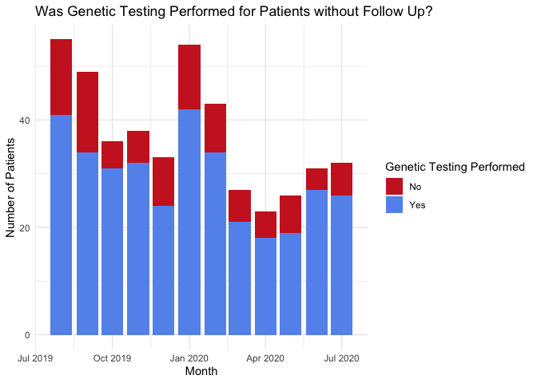

```r
options(width = 400)
library(data.table)
library(tidyverse)
library(magrittr)
library(lubridate)
library(texreg)
library(cowplot)
library(sjPlot)
```
***

### Overview
Clinical Genetics consultation during hospitalization attempts to identify an underlying cause of a patient’s multiple medical problems and may include genetic testing which takes many weeks or months to complete. Because the patient may be discharged from the hospital before the testing results become available, ensuring that the results are effectively communicated to the patient or family and their healthcare team is challenging. I used data extracted from the Children’s Hospital of Philadelphia (CHOP) electronic health record (EHR) to identify factors which increase the risk of failed follow up. I used this information to inform implementation of a system including clinical decision support in an attempt to improve timely delivery of care.

### Introduction 
Genetic testing has the ability to provide an overarching reason for a patient’s medical problems. Likewise, it can inform prognosis, management, surveillance and recurrence risk. However, to be useful, the testing must be reviewed and interpreted by professionals that can implement care based on the knowledge gained and inform the patient or their family members of its meaning. 

In a typical workflow, a patient is admitted to the hospital. Their primary care team suspects there may be an underlying genetic etiology of the patient's medical problems and requests consulation of a geneticist. The geneticist evaluates the patient and leaves documentation and may recommend genetic testing. The primary team then implements these recommendations, and a DNA or other sample is sent to a reference laboratory for processing. Weeks or months later, the test results are completed and conveyed as a test report. This report is entered into the patient's EHR. Because significant time has passed, the patient has frequently been discharged from the hospital.


In an ideal situation, the consulting geneticist becomes aware of the results, interprets them in the context of the patient's medical problems and returns the results to the family. However, too frequently, genetic testing is sent and never followed up on by a provider. When sent as an inpatient, this testing is often performed at the expense of the hospital. If the patient or family member never realizes the benefit of the testing, there is the potential that this hospital resource could be wasted. 

To reduce the rate of testing that is never followed up on, we implemented a comprehensive tracking system that takes the place of disparate systems used by individual providers. To facilitate the implementation, we modeled the characteristics of patients that appear to be at increased risk of never having documented follow up. Information gained through this analysis was used to design the tracking system; in addition to improving follow up documentation, it will hopefully decrease the time and effort needed for providers to access needed data and perform follow-up tasks. We will also aim to measure follow up before and after the intervention. 

### Methods
At CHOP, health information is collected through a commercial EHR, Epic. This data is operationally held in an InterSystems Caché database called Chronicles. The EHR vendor provides extract transform load (ETL) processes that convert this data into a relational database named Clarity. At CHOP, this is an Oracle SQL database. To minimize impacts to the EHR relational database, CHOP uses custom ETL processes to copy the data from Clarity into a Netezza SQL database called the CHOP Data Warehouse (CDW). 


As part of a quality improvement project, I extracted the required EHR data from the CDW. Due to institutional restrictions, I extracted the data using a separate IDE.

I obtained a list of patients who had an evaluation by the consulting service of Clinical Genetics while hospitalized between the dates of `2019-08-01` and `2020-08-01`. I identified these patients by searching for clinical notes of type `CONSULT NOTE`. I also extracted other information about their hospitalization, insurance coverage and demographic information. 

```sql
SELECT EI.MRN,
       NI.PAT_KEY,
	     NI.NOTE_SVC_DT,
	     days_between(NI.NOTE_SVC_DT, PA.DOB) "Age in Days",
	     PA.gestational_age_complete_weeks + (PA.gestational_age_remainder_days /7) "Gestational Age",
	     EI.admission_service,
	     EI.hospital_los_days,
	     EI.payor_group,
	     EI.icu_los_days,
	     EI.patient_address_zip_code,
	     EI.admission_source,
	     EI.sex
FROM CDWPRD.ADMIN.NOTE_INFO NI
INNER JOIN CHOP_ANALYTICS.NOTE_EDIT_METADATA_HISTORY NEMH
ON NI.NOTE_KEY = NEMH.NOTE_KEY
AND LAST_EDIT_IND = 1 
AND NEMH.NOTE_TYPE_ID = 400005 --CONSULT NOTE
AND NEMH.VERSION_AUTHOR_SERVICE_ID = 14 --GENETICS
AND NEMH.VERSION_AUTHOR_TITLE = 'MD' --Exclude GC Only consults (from ENGIN)
INNER JOIN CHOP_ANALYTICS.PATIENT_ALL PA
ON NI.PAT_KEY = PA.PAT_KEY 
INNER JOIN CHOP_ANALYTICS.ENCOUNTER_INPATIENT EI
ON NI.VISIT_KEY = EI.VISIT_KEY 
WHERE NI.NOTE_SVC_DT >= '2019-08-01' AND NI.NOTE_SVC_DT < '2020-08-01'
AND NI.UNSIGN_IND <> 1 --NOT Unsigned
AND NEMH.MRN <> 'UNKNOWN'
AND NI.DIM_DEL_CAT_KEY = 0
```
Next I obtained a list of follow up clinical notes. 

```sql
SELECT NEMH.MRN, NI.PAT_KEY,
	   NI.NOTE_SVC_DT "Initial Date",
	   NI.NOTE_KEY "Initial Key",
	   NEMHF.NOTE_KEY "Subsequent Key",
	   NIF.NOTE_SVC_DT "Subsequent Date",
	   NEMHF.NOTE_TYPE "Type",
	   NIF.AMBUL_NOTE_IND "AMB",
	   D.DICT_NM "Encounter Type"
FROM CDWPRD.ADMIN.NOTE_INFO NI
INNER JOIN CHOP_ANALYTICS.NOTE_EDIT_METADATA_HISTORY NEMH
ON NI.NOTE_KEY = NEMH.NOTE_KEY
AND NEMH.LAST_EDIT_IND = 1 
AND NEMH.NOTE_TYPE_ID = 400005 --CONSULT NOTE
AND NEMH.VERSION_AUTHOR_SERVICE_ID = 14 --GENETICS
AND NEMH.VERSION_AUTHOR_TITLE = 'MD' --Exclude GC Only consults (from ENGIN)
LEFT JOIN CHOP_ANALYTICS.NOTE_EDIT_METADATA_HISTORY NEMHF
ON NI.PAT_KEY = NEMHF.PAT_KEY 
AND NEMHF.NOTE_ENTRY_DATE > NEMH.NOTE_ENTRY_DATE 
AND NI.NOTE_KEY <> NEMHF.NOTE_KEY
AND NEMHF.VERSION_AUTHOR_SERVICE_ID = 14
AND NEMHF.NOTE_TYPE_ID <> 400005
AND NEMHF.LAST_EDIT_IND = 1 
LEFT JOIN CDWPRD.ADMIN.NOTE_INFO NIF
ON NEMHF.NOTE_KEY = NIF.NOTE_KEY
AND NIF.DIM_DEL_CAT_KEY = 0
LEFT JOIN CDWPRD.ADMIN.VISIT V
ON NIF.VISIT_KEY = V.VISIT_KEY 
LEFT JOIN CDWPRD.ADMIN.CDW_DICTIONARY D
ON V.DICT_ENC_TYPE_KEY = D.DICT_KEY 
WHERE NI.NOTE_SVC_DT >= '2019-08-01' AND NI.NOTE_SVC_DT < '2020-08-01'
AND NI.UNSIGN_IND <> 1 --NOT Unsigned
AND NEMH.MRN <> 'UNKNOWN'
AND NI.DIM_DEL_CAT_KEY = 0
ORDER BY NI.PAT_KEY DESC
```
Finally, I obtained a list of genetic tests that were performed for each patient. I manually reviewed each order name to identify genetic tests. 

```sql
SELECT NI.PAT_KEY,
       PROC_ORD_NM,
       PO.PLACED_DT,
       POR.RSLT_DT, 
       PO.SPECIMEN_TAKEN_DT,
       RC.COMP_NM,
       POR.RSLT_VAL
FROM CDWPRD.ADMIN.NOTE_INFO NI
INNER JOIN CHOP_ANALYTICS.NOTE_EDIT_METADATA_HISTORY NEMH
ON NI.NOTE_KEY = NEMH.NOTE_KEY
AND LAST_EDIT_IND = 1 
AND NEMH.NOTE_TYPE_ID = 400005 --CONSULT NOTE
AND NEMH.VERSION_AUTHOR_SERVICE_ID = 14 --GENETICS
AND NEMH.VERSION_AUTHOR_TITLE = 'MD' --Exclude GC Only consults (from ENGIN)
LEFT JOIN CDWPRD.ADMIN.PROCEDURE_ORDER PO
ON NI.PAT_KEY = PO.PAT_KEY
AND PO.DICT_LAB_STAT_KEY = 21038 --Status FINAL
AND PO.DICT_ORD_TYPE_KEY = 21554 --Lab
LEFT JOIN CDWPRD.ADMIN.PROCEDURE P 
ON PO.PROC_KEY = P.PROC_KEY
LEFT JOIN CDWPRD.ADMIN.PROCEDURE_ORDER_RESULT POR
ON PO.PROC_ORD_KEY = POR.PROC_ORD_KEY 
LEFT JOIN CDWPRD.ADMIN.RESULT_COMPONENT RC 
ON POR.RSLT_COMP_KEY = RC.RSLT_COMP_KEY 
WHERE NI.NOTE_SVC_DT >= '2019-08-01' AND NI.NOTE_SVC_DT < '2020-08-01'
AND NI.UNSIGN_IND <> 1 --NOT Unsigned
AND NEMH.MRN <> 'UNKNOWN'
AND NI.DIM_DEL_CAT_KEY = 0
AND PROC_ORD_NM IN ('Chromosomal SNP Microarray','MISC Genetic Referred Testing','Exome Sequencing, Proband (CHOP Medical Exome Version 2)','Karyotype, Constitutional','22q11.2 Del/Dup','MitoGenome Seq + Del','Beckwith-Wiedemann Meth-Copy','Noonan Panel SEQ','Exome Sequencing, Proband (Send Out)','Comprehensive Pulmonary-Vascular SEQ + Del/Dup Panel','Exome Sequencing, Proband','Osteogenesis Imperfecta SEQ + Del/Dup Panel','PRADER-WILLI/ANGELMAN Methylation','CHD7 SEQ + Del/Dup','Kabuki SEQ + Del/Dup Panel','Russell Silver Panel w/Reflex','Fragile X Syndrome','Cancer, FISH Analysis','Exome Reanalysis','Very Early Onset Inflam Bowel Dis Panel','Chromosome Breakage Studies','Stickler syndrome SEQ + Del/Dup Panel','CFTR SEQ + Del/Dup Analysis','Pulmonary Hypertension SEQ + Del/Dup Panel','Pneumothorax SEQ + Del/Dup Panel','XomeDx Trio','MSOG- Genetics Send Out','Ketotic Hypoglycemia SEQ + Del/Dup Panel','Ipex Syndrome - FOXP3','Exome & mtDNA-GeneDx (XomeDX Plus)','Exome + MitoGenome Combined Test  (Send Out)','Alagille Syndrome SEQ + Del/Dup Panel','Seq Known Genetic Variant','CHOP Epilepsy Panel','TPMT Genotyping','Exome DNA Extract Family Member','Inherited Neutropenia Panel','Full Exome Analysis from Exome Panel','CCHS PHOX2B SEQ + Del/Dup','Cholestasis SEQ + Del/Dup Panel','Severe combined immunodeficiency SEQ + Del/Dup Panel','Connective Tissue SEQ + Del/Dup Panel','TBX1 Gene Sequencing','MID1 SEQ + Del/Dup','Chromosome Stress Test','FISH, Constitutional','MECP2 Del/Dup','Marfan SEQ + Del/Dup Analysis','Fanconi Anemia/Rare Chrom Breakage Panel','NUDT15 Genotyping','GJB2 SEQ Analysis','Glycogen Storage Disease SEQ + Del/Dup Panel','SPINK1 N34S Variant','Chromosomal Microarray, Postnatal -Q','Humoral dysfunction SEQ Panel','(MSOG) Cholestasis Liver Panel- (Emory)','MECP2 SEQ + Del/Dup','SMN1 Deletion Testing','Pancreatitis SEQ + Del/Dup Panel','Cornelia de Lange SEQ + Del/Dup Panel','MSOG Genetic Send Out','Primary Ciliary Dyskinesia SEQ +Del/Dup Panel','PTEN SEQ + Del/Dup','Primary Ciliary Dyskinesia SEQ+Del/Dup Panel')
ORDER BY PAT_KEY DESC
```
I saved each dataset as a `.csv` file for further analysis in `R`.


```r
InitialConsult <- fread("~/Penn/BMIN503/Project/Queries/Initial Consults.csv")
setnames(InitialConsult,
         c("Patient", "ConsultDate", "AgeDays", "GestationalAge","AdmissionService", "HospitalLOS", "PayorGroup",
           "CriticalCareLOS", "Zip", "AdmissionSource", "LegalSex",
           "Race", "RaceEthnicity","PreferredLanguage"))

SubsequentNotes <- fread("~/Penn/BMIN503/Project/Queries/Subsequent Notes.csv")
setnames(SubsequentNotes,c("Patient", "InitialDate", "InitialKey", "SubsequentKey", "SubsequentDate", "Type",
                           "AmbulatoryContext", "EncounterType"))

GeneticResults <- fread("~/Penn/BMIN503/Project/Queries/Genetic Results.csv")
setnames(GeneticResults,c("Patient", "OrderName", "PlacedDate", "ResultDate", "SpecimenCollectDate", "ResultComponent",
                          "ResultValue"))
```
### Results

#### Timing and Hospital Service of Inpatient Genetics Consults
There were a total of `772` inpatient consults performed during the study period (`2019-08-01 - 2020-08-01`).

```r
FilteredConsult <- InitialConsult %>% 
                       mutate(ConsultDate = mdy_hm(ConsultDate)) %>%
                       group_by(Patient) %>%
                       dplyr::filter(ConsultDate == min(ConsultDate)) %>%
                       ungroup()  

FilteredConsult %>%
  mutate(ConsultMonth = as.Date(cut(ConsultDate, breaks = "month")),
         Service = fct_other(AdmissionService,
                             keep = c("Neonatology","Cardiology","Cardiac Critical Care","Critical Care","Endocrinology"),
                             other_level = "Other")) %>%
ggplot(aes(x = ConsultMonth, fill = Service)) + 
  geom_bar(stat="count") +
  labs(y = "Number of Patients with Inpatient Consults",
       x = "Month") + 
  ggtitle(paste0("Inpatient Genetics Consults N=",nrow(FilteredConsult))) +
  theme_minimal()
```

<!-- -->

The distribution of the consulting hospital services remained stable during the study period. There is a notable decrease in consults in December with a subsequent rise in Janurary, likely due to the effects of winter holidays.

#### Documentation of Follow Up Care Following Initial Consultation


```r
SummarizedSubsequentNotes <- SubsequentNotes %>% 
  mutate(InitialDate = mdy_hm(InitialDate)) %>%
  group_by(Patient) %>%
  dplyr::filter(InitialDate == min(InitialDate)) %>%
  dplyr::summarise(FollowUpType = names(sort(table(EncounterType),decreasing = TRUE))[1],
                   ConsultMonth = as.Date(cut(InitialDate, breaks = "month"))[1]) %>%
  mutate(FollowUpType = replace(FollowUpType, FollowUpType == "", "None")) %>%
  mutate(FollowUpType = str_to_title(FollowUpType)) %>%
  mutate(FollowUpType = factor(FollowUpType,
                               levels = c("Hospital Encounter", "Telephone", "Mobile", "Office Visit",
                                          "Care Coordination","Appointment", "Email Correspondence",
                                          "Orders Only", "Letter (Out)","None")))

ggplot(SummarizedSubsequentNotes, aes(x = ConsultMonth, fill = FollowUpType)) + 
  geom_bar(stat="count") +
  labs(y = "Number of Patients",
       x = "Month",
       fill = "Follow Up Method") + 
  ggtitle("Follow Up Documentation for Genetics Consults") +
  scale_fill_manual(values = c("Hospital Encounter" = "firebrick3", 
                               "Telephone" = "cornflowerblue", 
                               "Mobile" = "forestgreen",
                               "Office Visit" = "aquamarine1",
                               "Care Coordination" = "goldenrod",
                               "Appointment" = "coral1",
                               "Email Correspondence" = "darkorchid2",
                               "None" ="gray")) +
  theme_minimal()
```

<!-- -->

Notably, **58%** of patients with completed consults during the study period had no subsequent clinical note documented by any member of the Genetics healthcare team. The rate appeared to remain relatively stable over time, although there may have been a drop in patients without documented follow up starting in March 2020.

I hypothesized that some consultations actually require no further follow up:

* The patient was evaluated but the Geneticist felt that no genetic testing nor further follow up was warranted
* The patient previously underwent genetic testing and the Genetics team was consulted for management during hospitalization
* The patient previously underwent genetic testing and was diagnosed with a specific condition, the family desires further counseling from the CHOP Genetics team, but long-term follow up is not required

In other cases, I hypothesized that genetic testing was recommended, but the results of that testing were either never reviewed or the interpretation and follow up plan was not documented in the patient's chart.


```r
SummarizedSubsequentNotes %>%
  mutate(GeneticResults = Patient %in% GeneticResults$Patient) %>%
  dplyr::filter(FollowUpType  == "None") %>%
ggplot(aes(x = ConsultMonth, fill = GeneticResults)) + 
  geom_bar(stat="count") +
  labs(y = "Number of Patients",
       x = "Month",
       fill = "Genetic Testing Performed") + 
  ggtitle("Was Genetic Testing Performed for Patients without Follow Up?") +
  scale_fill_manual(values = c("TRUE" = "cornflowerblue", 
                               "FALSE" = "firebrick3"),
                    labels = c("FALSE" = "No",
                               "TRUE" = "Yes")) +
  theme_minimal()
```

<!-- -->

Interestingly, **78%** of patients with no documented follow up had genetic testing performed.  


```r
GeneticResultsSummary <- GeneticResults %>% 
  mutate(OrderName = case_when(str_detect(OrderName,regex("xome",ignore_case = TRUE)) ~ "Exome",
                               str_detect(ResultValue,regex("xome",ignore_case = TRUE)) ~ "Exome",
                               str_detect(OrderName,regex("MISC",ignore_case = TRUE)) ~ "Miscellaneous",
                               str_detect(OrderName,regex("MSO",ignore_case = TRUE)) ~ "Miscellaneous",
                               TRUE ~ OrderName)) %>%
  dplyr::filter(OrderName %in% names(sort(table(OrderName),TRUE))[1:5]) %>%
  group_by(Patient) %>% summarise(OrderName = unique(OrderName),
                                  Value = 1) %>%
  pivot_wider(id_cols = Patient, names_from = OrderName, values_from = Value, values_fill = 0) %>%
  rename(Array = `Chromosomal SNP Microarray`,
         Karyotype = `Karyotype, Constitutional`,
         MLPA22q = `22q11.2 Del/Dup`)

FilteredConsult %>% 
  mutate(ConsultMonth = as.Date(cut(ConsultDate, breaks = "month"))) %>%
  left_join(GeneticResultsSummary) %>%
  mutate(across(Array:MLPA22q,~recode(., `0` = NA_real_))) %>%
  dplyr::select(Patient, ConsultMonth, Array:MLPA22q) %>%
  pivot_longer(-c(Patient,ConsultMonth), names_to = "Test", values_to = "Performed") %>%
ggplot(aes(y = as.factor(Patient), x = Test, fill = interaction(as.factor(Performed),Test))) +
  geom_tile() +
  facet_wrap(. ~ConsultMonth,
             scales = "free_y",
             labeller = function(x) format(x, "%b %Y")) +
  labs(x = "Test",y = "Patient",fill = "Test") + 
  scale_fill_manual(values = c("1.Array" = "cornflowerblue",
                               "1.Exome" = "firebrick3",
                               "1.Karyotype" = "forestgreen",
                               "1.Miscellaneous" = "darkorchid2",
                               "1.MLPA22q" = "darkorange"),
                    labels = c("1.Array" = "Array",
                               "1.Exome" = "Exome",
                               "1.Karyotype" = "Karyotype",
                               "1.Miscellaneous" = "Miscellaneous",
                               "1.MLPA22q" = "22q11.2 MLPA",
                               "NA" = "Not Performed"),
                    na.translate = FALSE) +
  theme(axis.text.y=element_blank(),
        axis.ticks.y=element_blank()) +
  guides(x = guide_axis(angle = 45))
```

<!-- -->

The most common specific genetic tests sent during the study period were chromosomal microarrays, exome sequencing, karyotypes and multiplex ligation probe amplification for 22q11.2 deltions. Other genetic tests sent to outside reference labs ("Miscellaneous" tests) where also common. The distribution of tests performed did not vary over time.


```r
ADI.2015.DE <- fread("~/Penn/BMIN503/Project/ADI/DE_2015_ADI_9 Digit Zip Code_v2.0.txt")
ADI.2015.MD <- fread("~/Penn/BMIN503/Project/ADI/MD_2015_ADI_9 Digit Zip Code_v2.0.txt")
ADI.2015.NJ <- fread("~/Penn/BMIN503/Project/ADI/NJ_2015_ADI_9 Digit Zip Code_v2.0.txt")
ADI.2015.NY <- fread("~/Penn/BMIN503/Project/ADI/NY_2015_ADI_9 Digit Zip Code_v2.0.txt")
ADI.2015.PA <- fread("~/Penn/BMIN503/Project/ADI/PA_2015_ADI_9 Digit Zip Code_v2.0.txt")
ADI <- rbind(ADI.2015.DE,ADI.2015.MD,ADI.2015.NJ,ADI.2015.NY,ADI.2015.PA)
rm(list = ls(pattern="ADI\\."))
ADI[,Zip := str_extract(ZIPID,"(?<=G)[0-9]{5}")]
AggregateADI <- ADI[,.(MedianStateADI = median(as.numeric(ADI_STATERNK),na.rm = TRUE), 
                       MedianNationalADI = median(as.numeric(ADI_NATRANK),na.rm = TRUE)), by = Zip]
```

To assess how socioeconomic factors may influence follow up, I relied on a previously developed metric called the Area Deprivation Index. This index attempts to include information about income, education, employment, and housing quality. I downloaded census tract level data for Pennsylvania and surrounding states from the [University of Wisconsin website](https://www.neighborhoodatlas.medicine.wisc.edu/). I aggregated the data to zip code level using the median index for that zip code.   

I then developed a multivariate generalized linear model for documented follow up based on a number patient demographics.


```r
FilteredConsult %>% 
    left_join(SummarizedSubsequentNotes) %>%
    left_join(GeneticResultsSummary) %>%
    mutate(across(Array:MLPA22q,replace_na,0),
           FollowUp = factor(recode(FollowUpType, None = 0, .default = 1),
                             labels = c("No","Yes")),
           Exome = factor(Exome,
                          labels = c("No","Yes")),
           AnyTesting = factor(as.integer(Patient %in% GeneticResults$Patient),
                               labels = c("No","Yes")),
           Service = recode(AdmissionService, #Combine to Cardiology, Crtical Care, Neonatology, Other
                            "Cardiovascular Surgery" = "Cardiology",
                            "Cardiac Critical Care" = "Cardiology",
                            "Critical Care" = "Critical Care",
                            "Neonatology" = "Neonatology",
                            .default = "Other"),
           `Service Type` = recode_factor(Service, #Combine all critical care services
                                "Other" = "Non-Critical Care",
                                .default = "Crtical Care"),
           `Admission Type` = recode_factor(AdmissionSource, #Combine to SDU, Transfer, Other
                            "SDU Neonate" = "SDU",
                            "SDU Birth Parent" = "SDU",
                            "Transfer" = "Transfer",
                            .default = "Other"),
           `Payor Type` = recode_factor(PayorGroup, # Dicotomize
                                 "COMMERCIAL" = "Commercial",
                                 .default = "Government"),
           `Preferred Language` = recode_factor(PreferredLanguage, "ENGLISH" = "English",
                                  .default = "Other"),
           Race = fct_other(RaceEthnicity,
                             keep = c("Non-Hispanic Black", "Hispanic or Latino", "Non-Hispanic White"),
                             other_level = "Other"),
           Zip = str_pad(str_extract(Zip,"^[0-9]{4,5}"), 5,"left","0"), #Pad to join to ADI
           `Consult Month` = as.integer(as.factor(ConsultMonth)),
           `Hospital Length of Stay (Weeks)` = HospitalLOS / 7, #Change from days to weeks for OR
           `Gestational Age (Weeks)` = GestationalAge,
           `Age (Months)` = AgeDays / 30 ) %>%
    left_join(AggregateADI) %>%
    mutate(`Home Zip Area Deprivation Index` = MedianStateADI) %>%
    assign("ModelData",. ,envir = .GlobalEnv)

NoFollowUpModel <- glm(FollowUp ~ `Consult Month` + AnyTesting + Exome + `Service Type` + `Admission Type` +
                         `Hospital Length of Stay (Weeks)` + `Gestational Age (Weeks)` + Race +
                         `Preferred Language` + `Age (Months)` + `Payor Type` * `Home Zip Area Deprivation Index`,
                       data = ModelData, binomial(link = "logit"))

tab_model(NoFollowUpModel, show.reflvl = TRUE,  prefix.labels = "varname",
          rm.terms="Payor TypeGovernment:Home Zip Area Deprivation Index", wrap.labels = 50,
          order.terms = c(1:4,6,8,13,11,7,9,10,14,15,22,23,16:21,5,12))
```

<table style="border-collapse:collapse; border:none;">
<tr>
<th style="border-top: double; text-align:center; font-style:normal; font-weight:bold; padding:0.2cm;  text-align:left; ">&nbsp;</th>
<th colspan="3" style="border-top: double; text-align:center; font-style:normal; font-weight:bold; padding:0.2cm; ">FollowUp</th>
</tr>
<tr>
<td style=" text-align:center; border-bottom:1px solid; font-style:italic; font-weight:normal;  text-align:left; ">Predictors</td>
<td style=" text-align:center; border-bottom:1px solid; font-style:italic; font-weight:normal;  ">Odds Ratios</td>
<td style=" text-align:center; border-bottom:1px solid; font-style:italic; font-weight:normal;  ">CI</td>
<td style=" text-align:center; border-bottom:1px solid; font-style:italic; font-weight:normal;  ">p</td>
</tr>
<tr>
<td style=" padding:0.2cm; text-align:left; vertical-align:top; text-align:left; ">(Intercept)</td>
<td style=" padding:0.2cm; text-align:left; vertical-align:top; text-align:center;  ">0.02</td>
<td style=" padding:0.2cm; text-align:left; vertical-align:top; text-align:center;  ">0.00&nbsp;&ndash;&nbsp;0.25</td>
<td style=" padding:0.2cm; text-align:left; vertical-align:top; text-align:center;  "><strong>0.003</strong></td>
</tr>
<tr>
<td style=" padding:0.2cm; text-align:left; vertical-align:top; text-align:left; ">AnyTesting: No</td>
<td style=" padding:0.2cm; text-align:left; vertical-align:top; text-align:center;  "><em>Reference</em></td>
<td style=" padding:0.2cm; text-align:left; vertical-align:top; text-align:center;  "></td>
<td style=" padding:0.2cm; text-align:left; vertical-align:top; text-align:center;  "></td>
</tr>
<tr>
<td style=" padding:0.2cm; text-align:left; vertical-align:top; text-align:left; ">AnyTesting: Yes</td>
<td style=" padding:0.2cm; text-align:left; vertical-align:top; text-align:center;  ">2.21</td>
<td style=" padding:0.2cm; text-align:left; vertical-align:top; text-align:center;  ">1.27&nbsp;&ndash;&nbsp;4.02</td>
<td style=" padding:0.2cm; text-align:left; vertical-align:top; text-align:center;  "><strong>0.006</strong></td>
</tr>
<tr>
<td style=" padding:0.2cm; text-align:left; vertical-align:top; text-align:left; ">Exome: No</td>
<td style=" padding:0.2cm; text-align:left; vertical-align:top; text-align:center;  "><em>Reference</em></td>
<td style=" padding:0.2cm; text-align:left; vertical-align:top; text-align:center;  "></td>
<td style=" padding:0.2cm; text-align:left; vertical-align:top; text-align:center;  "></td>
</tr>
<tr>
<td style=" padding:0.2cm; text-align:left; vertical-align:top; text-align:left; ">Exome: Yes</td>
<td style=" padding:0.2cm; text-align:left; vertical-align:top; text-align:center;  ">3.96</td>
<td style=" padding:0.2cm; text-align:left; vertical-align:top; text-align:center;  ">2.48&nbsp;&ndash;&nbsp;6.46</td>
<td style=" padding:0.2cm; text-align:left; vertical-align:top; text-align:center;  "><strong>&lt;0.001</td>
</tr>
<tr>
<td style=" padding:0.2cm; text-align:left; vertical-align:top; text-align:left; ">Consult Month</td>
<td style=" padding:0.2cm; text-align:left; vertical-align:top; text-align:center;  ">1.07</td>
<td style=" padding:0.2cm; text-align:left; vertical-align:top; text-align:center;  ">1.02&nbsp;&ndash;&nbsp;1.13</td>
<td style=" padding:0.2cm; text-align:left; vertical-align:top; text-align:center;  "><strong>0.006</strong></td>
</tr>
<tr>
<td style=" padding:0.2cm; text-align:left; vertical-align:top; text-align:left; ">Hospital Length of Stay (Weeks)</td>
<td style=" padding:0.2cm; text-align:left; vertical-align:top; text-align:center;  ">1.03</td>
<td style=" padding:0.2cm; text-align:left; vertical-align:top; text-align:center;  ">1.01&nbsp;&ndash;&nbsp;1.05</td>
<td style=" padding:0.2cm; text-align:left; vertical-align:top; text-align:center;  "><strong>0.007</strong></td>
</tr>
<tr>
<td style=" padding:0.2cm; text-align:left; vertical-align:top; text-align:left; ">Gestational Age (Weeks)</td>
<td style=" padding:0.2cm; text-align:left; vertical-align:top; text-align:center;  ">1.07</td>
<td style=" padding:0.2cm; text-align:left; vertical-align:top; text-align:center;  ">1.01&nbsp;&ndash;&nbsp;1.14</td>
<td style=" padding:0.2cm; text-align:left; vertical-align:top; text-align:center;  "><strong>0.036</strong></td>
</tr>
<tr>
<td style=" padding:0.2cm; text-align:left; vertical-align:top; text-align:left; ">Service Type: Non-Critical Care</td>
<td style=" padding:0.2cm; text-align:left; vertical-align:top; text-align:center;  "><em>Reference</em></td>
<td style=" padding:0.2cm; text-align:left; vertical-align:top; text-align:center;  "></td>
<td style=" padding:0.2cm; text-align:left; vertical-align:top; text-align:center;  "></td>
</tr>
<tr>
<td style=" padding:0.2cm; text-align:left; vertical-align:top; text-align:left; ">Service Type: Crtical Care</td>
<td style=" padding:0.2cm; text-align:left; vertical-align:top; text-align:center;  ">0.76</td>
<td style=" padding:0.2cm; text-align:left; vertical-align:top; text-align:center;  ">0.45&nbsp;&ndash;&nbsp;1.28</td>
<td style=" padding:0.2cm; text-align:left; vertical-align:top; text-align:center;  ">0.296</td>
</tr>
<tr>
<td style=" padding:0.2cm; text-align:left; vertical-align:top; text-align:left; ">Admission Type: SDU</td>
<td style=" padding:0.2cm; text-align:left; vertical-align:top; text-align:center;  "><em>Reference</em></td>
<td style=" padding:0.2cm; text-align:left; vertical-align:top; text-align:center;  "></td>
<td style=" padding:0.2cm; text-align:left; vertical-align:top; text-align:center;  "></td>
</tr>
<tr>
<td style=" padding:0.2cm; text-align:left; vertical-align:top; text-align:left; ">Admission Type: Transfer</td>
<td style=" padding:0.2cm; text-align:left; vertical-align:top; text-align:center;  ">1.58</td>
<td style=" padding:0.2cm; text-align:left; vertical-align:top; text-align:center;  ">1.02&nbsp;&ndash;&nbsp;2.46</td>
<td style=" padding:0.2cm; text-align:left; vertical-align:top; text-align:center;  "><strong>0.041</strong></td>
</tr>
<tr>
<td style=" padding:0.2cm; text-align:left; vertical-align:top; text-align:left; ">Admission Type: Other</td>
<td style=" padding:0.2cm; text-align:left; vertical-align:top; text-align:center;  ">1.14</td>
<td style=" padding:0.2cm; text-align:left; vertical-align:top; text-align:center;  ">0.69&nbsp;&ndash;&nbsp;1.90</td>
<td style=" padding:0.2cm; text-align:left; vertical-align:top; text-align:center;  ">0.602</td>
</tr>
<tr>
<td style=" padding:0.2cm; text-align:left; vertical-align:top; text-align:left; ">Payor Type: Commercial</td>
<td style=" padding:0.2cm; text-align:left; vertical-align:top; text-align:center;  "><em>Reference</em></td>
<td style=" padding:0.2cm; text-align:left; vertical-align:top; text-align:center;  "></td>
<td style=" padding:0.2cm; text-align:left; vertical-align:top; text-align:center;  "></td>
</tr>
<tr>
<td style=" padding:0.2cm; text-align:left; vertical-align:top; text-align:left; ">Payor Type: Government</td>
<td style=" padding:0.2cm; text-align:left; vertical-align:top; text-align:center;  ">0.40</td>
<td style=" padding:0.2cm; text-align:left; vertical-align:top; text-align:center;  ">0.17&nbsp;&ndash;&nbsp;0.94</td>
<td style=" padding:0.2cm; text-align:left; vertical-align:top; text-align:center;  "><strong>0.037</strong></td>
</tr>
<tr>
<td style=" padding:0.2cm; text-align:left; vertical-align:top; text-align:left; ">Race: Hispanic or Latino</td>
<td style=" padding:0.2cm; text-align:left; vertical-align:top; text-align:center;  "><em>Reference</em></td>
<td style=" padding:0.2cm; text-align:left; vertical-align:top; text-align:center;  "></td>
<td style=" padding:0.2cm; text-align:left; vertical-align:top; text-align:center;  "></td>
</tr>
<tr>
<td style=" padding:0.2cm; text-align:left; vertical-align:top; text-align:left; ">Race: Non-Hispanic Black</td>
<td style=" padding:0.2cm; text-align:left; vertical-align:top; text-align:center;  ">0.95</td>
<td style=" padding:0.2cm; text-align:left; vertical-align:top; text-align:center;  ">0.49&nbsp;&ndash;&nbsp;1.84</td>
<td style=" padding:0.2cm; text-align:left; vertical-align:top; text-align:center;  ">0.889</td>
</tr>
<tr>
<td style=" padding:0.2cm; text-align:left; vertical-align:top; text-align:left; ">Race: Non-Hispanic White</td>
<td style=" padding:0.2cm; text-align:left; vertical-align:top; text-align:center;  ">0.98</td>
<td style=" padding:0.2cm; text-align:left; vertical-align:top; text-align:center;  ">0.55&nbsp;&ndash;&nbsp;1.78</td>
<td style=" padding:0.2cm; text-align:left; vertical-align:top; text-align:center;  ">0.955</td>
</tr>
<tr>
<td style=" padding:0.2cm; text-align:left; vertical-align:top; text-align:left; ">Race: Other</td>
<td style=" padding:0.2cm; text-align:left; vertical-align:top; text-align:center;  ">1.17</td>
<td style=" padding:0.2cm; text-align:left; vertical-align:top; text-align:center;  ">0.60&nbsp;&ndash;&nbsp;2.28</td>
<td style=" padding:0.2cm; text-align:left; vertical-align:top; text-align:center;  ">0.638</td>
</tr>
<tr>
<td style=" padding:0.2cm; text-align:left; vertical-align:top; text-align:left; ">Preferred Language: English</td>
<td style=" padding:0.2cm; text-align:left; vertical-align:top; text-align:center;  "><em>Reference</em></td>
<td style=" padding:0.2cm; text-align:left; vertical-align:top; text-align:center;  "></td>
<td style=" padding:0.2cm; text-align:left; vertical-align:top; text-align:center;  "></td>
</tr>
<tr>
<td style=" padding:0.2cm; text-align:left; vertical-align:top; text-align:left; ">Preferred Language: Other</td>
<td style=" padding:0.2cm; text-align:left; vertical-align:top; text-align:center;  ">0.77</td>
<td style=" padding:0.2cm; text-align:left; vertical-align:top; text-align:center;  ">0.38&nbsp;&ndash;&nbsp;1.52</td>
<td style=" padding:0.2cm; text-align:left; vertical-align:top; text-align:center;  ">0.462</td>
</tr>
<tr>
<td style=" padding:0.2cm; text-align:left; vertical-align:top; text-align:left; ">Age (Months)</td>
<td style=" padding:0.2cm; text-align:left; vertical-align:top; text-align:center;  ">1.00</td>
<td style=" padding:0.2cm; text-align:left; vertical-align:top; text-align:center;  ">1.00&nbsp;&ndash;&nbsp;1.01</td>
<td style=" padding:0.2cm; text-align:left; vertical-align:top; text-align:center;  ">0.834</td>
</tr>
<tr>
<td style=" padding:0.2cm; text-align:left; vertical-align:top; text-align:left; ">Home Zip Area Deprivation Index</td>
<td style=" padding:0.2cm; text-align:left; vertical-align:top; text-align:center;  ">0.93</td>
<td style=" padding:0.2cm; text-align:left; vertical-align:top; text-align:center;  ">0.84&nbsp;&ndash;&nbsp;1.02</td>
<td style=" padding:0.2cm; text-align:left; vertical-align:top; text-align:center;  ">0.145</td>
</tr>
<tr>
<td style=" padding:0.2cm; text-align:left; vertical-align:top; text-align:left; padding-top:0.1cm; padding-bottom:0.1cm; border-top:1px solid;">Observations</td>
<td style=" padding:0.2cm; text-align:left; vertical-align:top; padding-top:0.1cm; padding-bottom:0.1cm; text-align:left; border-top:1px solid;" colspan="3">604</td>
</tr>
<tr>
<td style=" padding:0.2cm; text-align:left; vertical-align:top; text-align:left; padding-top:0.1cm; padding-bottom:0.1cm;">R<sup>2</sup> Tjur</td>
<td style=" padding:0.2cm; text-align:left; vertical-align:top; padding-top:0.1cm; padding-bottom:0.1cm; text-align:left;" colspan="3">0.151</td>
</tr>

</table>


The model identifies the strongest predictor of documented follow-up as having exome sequencing performed. This is to be expected, as patients and their families undergo an extensive consent process prior to ordering the test. Thus they are expecting the results. Having any genetic testing performed was also associated with increased likelihood of follow up, as expected. 


```r
SummarizedSubsequentNotes %>%
  left_join(FilteredConsult) %>%
  mutate(LOSCat = factor(cut(HospitalLOS,20))) %>%
  mutate(LOSCat = factor(LOSCat,levels = levels(LOSCat),
                         labels = str_replace_all(str_replace_all(levels(LOSCat),"[\\(\\]]",""),",","-"))) %>%
  mutate(FollowUp = !FollowUpType=="None") %T>%
{ggplot(.,aes(x = LOSCat, fill = as.factor(FollowUp))) + 
  geom_bar(position = "fill",
           show.legend = FALSE) +
  labs(y = "Percentage of Patients",
       fill = "Follow Up Documented?") + 
  ggtitle("Was Hospital Length of Stay Associated with Follow Up?") +
  scale_fill_manual(values = c("TRUE" = "cornflowerblue", 
                               "FALSE" = "firebrick3"),
                    labels = c("FALSE" = "No",
                               "TRUE" = "Yes")) +
  scale_y_continuous(labels = scales::percent) +
  guides(x = guide_axis(angle = 45)) +
  theme_minimal() +
  theme(legend.position = "bottom",
        axis.text.x =element_blank(),
        axis.title.x = element_blank()) ->> plot3} %>%
{ggplot(.,aes(x = LOSCat, fill = as.factor(FollowUp))) + 
  geom_bar(position = "stack") +
  labs(y = "Number of Patients",
       x = "Hospital Length of Stay (Days)",
       fill = "Follow Up Documented?") +
  scale_fill_manual(values = c("TRUE" = "cornflowerblue", 
                               "FALSE" = "firebrick3"),
                    labels = c("FALSE" = "No",
                               "TRUE" = "Yes")) +
  guides(x = guide_axis(angle = 45)) +
  theme_minimal() +
  theme(legend.position = "bottom") ->> plot4}
cowplot::plot_grid(plot3, plot4, ncol =1, rel_heights = c(0.4,0.6))
```

<!-- -->

Another perhaps unsurprising result was that patients were more likely to have documented follow up if they were hospitalized for longer. Additional research will be required to assess if this is a proxy for medical complexity or if the association is with the state of being admitted when results return. 


```r
SummarizedSubsequentNotes %>%
  left_join(FilteredConsult) %>%
  mutate(GestationalAge = floor(GestationalAge),
         FollowUp = !FollowUpType=="None") %T>%
{ggplot(., aes(x = as.factor(GestationalAge), fill = as.factor(FollowUp))) + 
  geom_bar(position = "fill",
           show.legend = FALSE) +
  labs(y = "Percentage of Patients",
       x = "Gestational Age",
       fill = "Follow Up Documented?") + 
  ggtitle("Was Gestational Age Associated with Follow Up?") +
  scale_fill_manual(values = c("TRUE" = "cornflowerblue", 
                               "FALSE" = "firebrick3"),
                    labels = c("FALSE" = "No",
                               "TRUE" = "Yes")) +
  scale_y_continuous(labels = scales::percent) +
  theme_minimal() +
  theme(legend.position = "bottom",
        axis.text.x =element_blank(),
        axis.title.x = element_blank()) ->> plot1} %>%
{ggplot(., aes(x = as.factor(GestationalAge), fill = as.factor(FollowUp))) + 
  geom_bar(position = "stack") +
  labs(y = "Number of Patients",
       x = "Gestational Age (Completed Weeks)",
       fill = "Follow Up Documented?") + 
  scale_fill_manual(values = c("TRUE" = "cornflowerblue", 
                               "FALSE" = "firebrick3"),
                    labels = c("FALSE" = "No",
                               "TRUE" = "Yes")) +
  theme_minimal() +
  theme(legend.position = "bottom")->> plot2}
cowplot::plot_grid(plot1, plot2, ncol =1, rel_heights = c(0.4,0.6))
```

<!-- -->

More interestingly, there was a significant positive correlation with gestational age at birth and documented follow-up, indicating that premature infants were less likely to have documented follow-up. Patients transferred from another hospital were more likely to have documented follow up in comparison to patients born at our hospital's Special Delivery Unit (SDU) or admitted from the ambulatory setting.

Additionally, the month the initial consult was completed was positively correlated with documented follow-up, potentially indicating a shift following the onset of the SARS-COV-2 pandemic. Additional research will be required to address if this is due to staff changes or differences from off-site work. 

Finally, the model identified having non-commercial insurance as being negatively correlated with documented follow up. Patients with complex medical issues often qualify for government insurance, and thus, this may be another proxy for medical complexity. However, newborn infants should still be on their parents' insurance and there are other explanatory variables controlling for admission type and age at consultation. Interestingly, the Area Deprivation Index of the patient's home zip code was not correlated with follow-up. More accurate indicators of socioeconomic status such as self reported income would be preferable, but were unavailable.  

Analysis revealed no significant association with age at consult, admission service, race, ethnicity, or preferred language. 

### Conclusion

Overall, I found that a majority (58%) of individuals who undergo evaluation by Clinical Genetics at Children’s Hospital of Philadelphia have no other clinical documentation placed in their EHR by a member of the Genetics team. Although the reason why this occurs is not clear, 78% percent of such patients have had genetic testing at a date subsequent to their consultation. 

A logistic regression model investigating what factors may be associated with having no documented follow up identified a number of interesting associations. Unsurprisingly, having genetic testing, and particularly the most expensive and complex test (exome sequencing), performed increased the likelihood of follow up. Interestingly, having government issued health insurance was associated with decreased likelihood of follow up. While the underpinnings of this possible association remain unclear, one must consider if there social determinants of health that are playing an important role. 

### Future Directions 

Building on the insight gained during this project, I have conceived of, developed, implemented, and administered provider training regarding a comprehensive genetic testing follow up system in the CHOP EHR. After any necessary improvements are made, I will measure the same metrics to assess the effectiveness of my intervention. 

### Acknowledgements

I would like to express my thanks the input and encouragement of my Clinical Informatics colleagues at CHOP:

* Leah Carr, MD
* Eli Lourie, MD
* Tony Luberti, MD
* Eric Shelov, MD
* Joseph Zorc, MD

I also would like to thank my clinical mentor in Genetics:

* Elaine Zackai, MD
