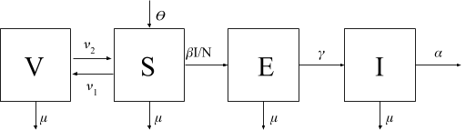

```{r set-options, echo=FALSE, cache=FALSE}
options(width = 400)
```  
***

## Overview

In 2015 in Arequipa city, Peru, a case of canine rabies was detected marking rabies being reintroduced to the city's dog population. Epidemiolgic models of infectious diseases can be useful for examining different disease control strategies when making public health policy decisions. For the past several years, I have been working on making deterministic, compartmental (SEIR) models of canine rabies in Arequipa; in this project I will implement and streamline model simulations in R, as well as explore an extension of the model framework through implementing a stochastic model of canine rabies. Finally, I will present an example of using model results to inform public health policies by exploring different scenarios of rabies response during the current times of COVID-19 restrictions. To parameterize the models, I will use a combination of parameters reported in the literature, as well as estimates using data collected from several sources. Information on positive cases comes from collaboration with the Peru Ministry of Health. Demographic data used to paramaterize the model comes from 5 years worth of survey data collected after the vaccination campaign by the Castillo team. 

The three faculty/staff I collaborated with were Ricardo Castillo-Neyra, Mike Levy, and Julianna Shinnick. 

+ Ricardo Castillo-Neyra (DBEI, assistant professor) is a veterinarian and epidemiologist who is an expert in canine rabies. From Ricardo, I learned a lot about the social context of rabies in Arequipa, about the types of restrictions that occured due to COVID and about rabies dynamics.

+ Mike Levy (DBEI, Associate professor) is an epidemiologist who has worked in Arequipa for years. From Mike, I learned a lot about Arequipa. He is also an expert in mathematical modelling and I have worked closely with him to create the models. 

+ Julianna Shinnick is a nurse and staff member in the Castillo lab. Julianna has been investigating how public health emergencies (such as SARS-CoV-1, SARS-CoV-2, Ebola, Zika) have disrupted established disease control efforts. 

Final project link: https://github.com/bhraynor/BMIN503_Final_Project

## Introduction 

Rabies is a deadly, zoonotic disease leading to 59,000 deaths worldwide each year (World Health Organization, 2013). 99% of human cases are due to the bite of a rabid dog (World Health Organization, 2013). The re-introduction of rabies into Arequipa, Peru after 15 years of epidemiologic silence (Castillo, 2019) is alarming when considering both animal welfare and public health. In Arequipa, the majority of dogs are free-roaming, meaning they are allowed free access to the street at various levels depending on the owner (Castillo, 2019). This adds complications to rabies control efforts, as rabies is transmitted via the bite (saliva) of an infected mammal. In order to control the spread of rabies, the Peru Ministry of Health has instituted yearly mass dog vaccination campaigns were owners bring their dogs to recieve a free rabies vaccination (Castillo, 2019). Additionally, public health officials respond to reports of rabid dogs by eliminating the rabid animal, conducting ring vaccination of dogs around the case, and administering post-exposure prophylaxis to exposed people (Castillo, 2019). However, despite these efforts, rabies has continued to spread throughout the city. To better understand the transmission dynamics I will invesitage epidemiologic models of disease spread, parameterized for canine rabies in Arequipa, Peru (Institute for disease modelling, 2020; King, 2017).  

An added challenge to controlling rabies in the city is the SARS-COV-2 pandemic that has strained public health capacities world wide. The media has extensively covered case counts, death rates, the lagging economy, and peoples fears and low morals. However, less understood and explored are how measures to fight COVID-19 are effecting other public health initiatives. One example is canine rabies in Arequipa, Peru. When SARS-CoV-2 arrived to Peru in early March, 2020 mandates including orders to social distance, curfews and work from home were implemented. Due to this, several vital canine rabies control measures were impacted. To understand how rabies dynamics may be impacted, several social and biological factors must be considered. We identified 2 main areas were COVID-19 measures have effected rabies control programs. First, every summer annually a mass dog vaccination campaign is held city wide to offer free rabies vaccinations to peoples pets. With COVID-19, the campaign was delayed and there were even talks of cancelling it. Second, many surveillance activities were halted as public health officials were unable to leave home.

Peru, and the rest of Latin America, has made enormous strides towards the WHO goal of eliminating canine mediated human rabies by 2030. Epidemiologic models used to explore different control strategies can guide public health policy makers towards the best strategies to achieve these goals. 

## Methods

All work has been done in R using the code contained in this R markdown file. 

I will use the following packages to perform my analyses. 
```{r}
#Load libaries
suppressMessages(suppressWarnings(library(deSolve)))
suppressMessages(suppressWarnings(library(ggplot2)))
suppressMessages(suppressWarnings(library(dplyr)))
suppressMessages(suppressWarnings(library(stringr)))
suppressMessages(suppressWarnings(library(rgdal)))
suppressMessages(suppressWarnings(library(MASS)))
suppressMessages(suppressWarnings(library(leaflet)))
```

#### Data

Data files will not be made publically available as they contain confidential information. The original files are accessible in the Castillo lab "Rabies" github repository. We will use two sources of data:
  1. Rabies case reports
  2. Longitudinal survey data

Rabies case reports come from collaboration from the Ministry of Health and from notes from the Castillo lab zoonotic disease field coordinator, Elvis Diaz. 
```{r}
#Load rabies case data
df      <- read.csv("~/Rabies/models/Data/RabiesCaseData_7May2020.csv")  #Rabies case reports

#clean and format the case data
df <- df %>%
  rename(LabID = ï..LabID) %>%
  mutate(
    Symptoms_date         = as.Date(Symptoms_date,         "%d/%m/%Y"),
    Complaint_date        = as.Date(Complaint_date,        "%d/%m/%Y"),
    Death_date            = as.Date(Death_date,            "%d/%m/%Y"),
    Obtained_date         = as.Date(Obtained_date,         "%d/%m/%Y"),
    Received_date         = as.Date(Received_date,         "%d/%m/%Y"),
    Result_date           = as.Date(Result_date,           "%d/%m/%Y"),
    ContainmentStart_date = as.Date(ContainmentStart_date, "%d/%m/%Y"),
    ContainmentOther_date = as.Date(ContainmentOther_date, "%d/%m/%Y"),
    MedicalAttention_date = as.Date(MedicalAttention_date, "%d/%m/%Y"),
    DateCaseBitten        = as.Date(DateCaseBitten,        "%d/%m/%Y"), 
    NumDogsCaseBit        = as.numeric(as.character(NumDogsCaseBit)),
    Month                 = as.numeric(as.character(Month)), #Format as number
    Years                 = as.numeric(as.character(Years)), #Format as number
    Age                   = Years*365.25 + Month*30.4375     #Calculate age in days
  )

#Add on year labels
df$year <- 2020
df$year[1:19] <- 2015
df$year[20:79] <- 2016
df$year[80:129] <- 2017
df$year[130:165] <- 2018
df$year[166:204] <- 2019

#Read in the incidence table
rabies  <- read.csv("~/Rabies/models/Data/Rabies_IncidenceTable.csv")   #Rabies incidence table
```


Longitudinal survey data was collected from by the Castillo lab. For full methods, see Castillo, 2019. Briefly, in the weeks following the yearly mass dog vaccination campaign, trained surveyers went door to door conducting surveys in defined study areas in the Alta Sevre Alegro district of Arequipa. Surveyers would ascertain if people participated in the campaign and collect demographic data on both the respondant and their dogs. This analysis includes 4 years worth of survey data (2015-2019).

```{r}
#read in 2016 and 2017 data
dogs1   <- read.csv("~/Rabies/rabia_ASA_encuesta_2017/resultados/dogs2016_2017_10Abr18.csv") 

#Clean and format 2016 survey data
df_2016 <- subset(dogs1, !is.na(dogs1$EDAD_M16)) %>%
  dplyr::select(UNICODE, NOMBRE, SEXO, EDAD_A16, EDAD_M16, VACUNADO16, FECHA_VAC16, ACCESO_CALLE16) %>%
  rename(Unicdoe = UNICODE,
         Name = NOMBRE,
         Sex = SEXO,
         Years = EDAD_A16,
         Months = EDAD_M16,
         Vaccine = VACUNADO16,
         Date = FECHA_VAC16,
         Restriction = ACCESO_CALLE16) %>%
  mutate(Date= str_sub(Date, end=-6),
         Date= as.Date(Date, "%d/%m/%y"))

#Clean and format 2017 survey data
df_2017 <- subset(dogs1, !is.na(dogs1$EDAD_MESES17))%>%
  dplyr::select(UNICODE, NOMBRE, SEXO, EDAD_ANIO17, EDAD_MESES17, ESTE_ANIO_VACUNARON17, FECHA17) %>%
  rename(Unicdoe = UNICODE,
         Name = NOMBRE,
         Sex = SEXO,
         Years = EDAD_ANIO17,
         Months = EDAD_MESES17,
         Vaccine = ESTE_ANIO_VACUNARON17,
         Date = FECHA17) 

#2018 survey data
df_2018 <- read.csv("~/Rabies/rabia_ASA_encuesta_2018/resultados/PERRO_CLEAN_2018-08-31.csv") 
df_2018 <-df_2018%>% 
  dplyr::select(PERRO_UNICODE, PERRO_NOMBRE, PERRO_SEXO, PERRO_EDAD_ANIO, 
                PERRO_EDAD_MES, PERRO_ESTE_ANIO_VACUNARON, PERRO_COMO_PERMANECE_CASA, PERRO_DATETIME) %>%
  rename(Unicode = PERRO_UNICODE, 
         Name = PERRO_NOMBRE, 
         Sex = PERRO_SEXO, 
         Years = PERRO_EDAD_ANIO, 
         Months = PERRO_EDAD_MES, 
         Vaccine = PERRO_ESTE_ANIO_VACUNARON, 
         Restriction = PERRO_COMO_PERMANECE_CASA,
         Date = PERRO_DATETIME) %>%
  mutate(Date = substr(as.character(Date), 1, 10))


#2019 survey data
df_2019 <- read.csv("~/Rabies/rabia_ASA_encuesta_2019/resultados/PERRO2019VANCAN_CLEAN_2019-12-10.csv")
df_2019 <-df_2019%>%
  dplyr::select(PERRO_UNICODE, PERRO_NOMBRE, PERRO_SEXO, PERRO_EDAD_ANIO, 
                PERRO_EDAD_MES, PERRO_ESTE_ANIO_VACUNARON, PERRO_COMO_PERMANECE_CASA, PERRO_DATETIME) %>%
  rename(Unicode = PERRO_UNICODE, 
         Name = PERRO_NOMBRE, 
         Sex = PERRO_SEXO, 
         Years = PERRO_EDAD_ANIO, 
         Months = PERRO_EDAD_MES, 
         Vaccine = PERRO_ESTE_ANIO_VACUNARON, 
         Restriction = PERRO_COMO_PERMANECE_CASA,
         Date = PERRO_DATETIME) %>%
  mutate(Date = substr(as.character(Date), 1, 10),
         Months = as.numeric(as.character(Months)),
         Years = as.numeric(as.character(Years)))
```

#### Model framework

I have adapted a classic SEIR model to reflect the rabies system in Arequipa (Institute for Disease Modelling, 2020). I present an SEIV model that reflects the framework used to model the canine rabies disease system in Arequipa (Figure 1). 

```{r, out.width = "50%", echo = FALSE}
setwd("~/EPID600_code/BMIN503_Final_Project")

```

**Figure 1: SEIV model framework for canine rabies system in Arequipa**

In this model, the dog population is split into 4 compartments labeled "V", "S", "E", and "I" corresponding to the following disease states: vaccinated, susceptible, exposed and infected. "N" is the total population (S+E+I+V) The arrows going between the compartments indicate flow of the population from one state to the other. For example, the arrow labeled "V1" indicates susceptibles moving from the susceptible compartment to the vaccinated compartment (by recieving the rabies vaccine). Different from classic SEIR models, there is no "R" or "recovered" population compartment because rabies is fatal once the dog is infected (World Health Organization, 2013). However, there is an effective rabies vaccine which confers immunity, so the "recovered" compartment is replaced with a "vaccinated" compartment. Parameters will be explained and calculated in full detail below. 

From the model framework, we can write a system of ordinary differential equations describing the flow of the population in and out of each compartment.  

$dS/dt = \theta - \beta SI/N - \mu S - \nu_1 S + \nu_2 V$

$dE/dt = \beta SI/N - \gamma E -\mu E$

$dI/dt = \gamma E -\mu I - \alpha I$

$dV/dt = \nu_1 S - \nu_2 V - \mu V$

#### Parameters

The first step to simulating the rabies models is to define the parameters in the model framework (Figure 1). The rates of the population flow between compartments (defined by the parameters) are instantatneous and are equal to the inverse of the time spent in the compartments. We can use this relationship to calculate point estimates for the parameters.  

*Known parameters*

Some parameters are known from the literature on rabies virus biology. The estimate of total dog population is from the Ministry of Health's estimate (Red Arequipa Caylloma, 2019) is 264550.2646. The vaccine is labeled for 1 year (Castillo, 2019), so the instantaneous rate of dogs losing vaccination we conservatively set to 1/365 (days^-1). $\gamma$, the rate of exposed dogs become infectious (the inverse of the latency period) is described in rabies biology literature and we will use the estimate given by Hampson, 2009: 1/50 (days^-1). For simplicity we will set the initial vaccination coverage to be equal to 0, and immediately (day 1) of the model, introduce the first vaccination campaign. 

```{r}
DOG_POPN= 264550.2646 #Peru Ministry of Health estimate
GAMMA= 1/50 #Hampson 2009
NU2 = 1/365 #vaccine label
ETA = 0 #initial vaccination coverage, setting to 0 for simplicity and will have first vancan on day 1

```

After known parameters are collected, unknown parameters are estimated based on the data from Arequipa. 

*$\mu$ (background death rate)*

$\mu$ is the instantaneous per capita death rate of dogs not attributable to rabies. It can be estimated as the inverse of average age of dogs. 

```{r}
df_2019 <- df_2019 %>% 
  mutate(Age = Years*365.25 + Months*30.4375)
MU <- 1/t.test(df_2019$Age)$estimate[[1]] #Mean: 1099.203 [1063.346, 1135.060] 
```

*$\alpha$	(rabies death rate)*
$\alpha$ is the instantaneous per capita death rate of rabid dogs and can be calculated as the inverse of the time spent in the infectious compartment (1/infectious period).

```{r}
df$Infectious <- df$Death_date - df$Symptoms_date
ALPHA <- 1/t.test(df$Infectious)$estimate[[1]] #2.534247 [1.931721, 3.136772]
#Infectious dates reasonable, faily good data, matches with Katie Hampson's findings
```

*$\nu_1$ (vaccination coverage)*

$\nu_1$ is the instantaneous rate of immunity from vaccination. From our data we can calculate the coverage rates of dogs per year, and the day in which the majority of the vaccinations occured. 
Additionally, based on pilot data shared from Sergio Recuenco we assume that 2014 and 2015 vaccine coverage was 48.98%. Finally we can transform coverage rates to instantaneous rates by using the equation: vaccination coverage = 1-e-v1*t, where t = 1 day.

```{r}
# #2016 
# plyr::count(df_2016$Vaccine) #0.6147823
# plyr::count(df_2016$Date) #Mode= June 12
# 
# #2017
# plyr::count(df_2017$Vaccine) #0.4989594
# plyr::count(df_2017$Date) #Mode= September 22
# 
# #2018
# plyr::count(df_2018$Vaccine) #0.5285256
# plyr::count(df_2018$Date) #Mode= August 6
# 
# #2019
# plyr::count(df_2019$Vaccine) #0.5850053
# plyr::count(df_2019$Date) #Mode= October 24

#Build table
NU1 <- data.frame(year=c(2014, 2015, 2016,2017,2018,2019), 
                 date=as.Date(c("2014-06-12", "2015-06-12", "2016-06-12", "2017-09-22", "2018-08-06", "2019-10-02")),
                 vax=c(0.4898, 0.4898, 0.6148, 0.4990, 0.5285, 0.5850))

NU1$inst <- -log(1-NU1$vax)
```

*$R_{0}$ (basic reproductive number) and $\beta$ (transmission coefficient)*

$R_{0}$ is defined as the average number of secondary cases a primary case will infect in a totally susceptible population. An initial estimate of $R_{0}$ can be estimated by from survey data by the number of bites * the probabability of rabies transmission (Hampson, 2009). Using the estimate of rabies transmission probability from Hampson, 2009 (0.49), and the number of dogs a rabid dog bites from rabies case report data in Arequipa. We can calculate a rough estimate of $R_{0}$.

```{r}
#Extract bite data
bites <- as.vector(na.omit(df$NumDogsCaseBit))
bites <- as.data.frame(bites)
colnames(bites) <- c("counts")

unname((0.49*(t.test(bites$counts))$estimate[1]))
```

1.37 is a good starting estimate for $R_{0}$. However, not all bite events are observed by owners/ public health officials, so what is recorded in the data will be an underestimate of $R_{0}$. We can re-run the model increasing the model of R0 in small increments until we find the value of R0 that gives the lowest sum squared of residuals. Doing this, we find an increased value of 1.44.

```{r}
#fit to epidemic data by rerunning system in small increments and then calculate residuals
R_NAUGHT=1.44 
```

$R_{0}$ is not used directly in the system of equations. However, it can be used to derive $\beta$. $\beta$ is the transmission coefficient and is used to describe the infection rate (which is also based on the prevalence of rabies). 

Using next generation matrix techiques (Diekman, 2010), $\beta$ can be derived from the other parameters as:
$\beta = R_{0} (\gamma + \mu) (\mu + \alpha)/\gamma$

#### Deterministic Model

With all parameters calculated, we can formulate the deterministic SEIV model so that R can solve it.

First we save all parameters in a column that a can be inputted into a function. 
```{r}
#Parameters
params <- c(R0= R_NAUGHT, #Bite: 1.366061, #Age:2.487201
            m = MU,#mu (normal death rate)
            g = GAMMA, #gamma (latency rate)
            a = ALPHA, #alpha (death rate attributable to rabies)
            u = NU2, #1 yr vaccine
            eta= ETA, #initial vaccine coverage --- (have vancan start at d1)
            N =DOG_POPN, #2645.503, #Do we want this to be density (per km2) or total
            #rho = RHO, #Reporting rate
            d2= 1) #delta2, density dependency weight [1 (freq), 0 (dens)] 
params["d"] <- 1/params["N"] + params["d2"]*((params["N"]-1)/params["N"]) #model type weight: frequency vs density dependent
params["beta"] <-params["R0"]*params["d"]*(params["g"]+params["m"])*(params["a"]+params["m"])/params["g"]
```

We then set initial conditions. Our assumption is that rabies was reintroduced into Arequipa through the transport of a dog that was exposed to rabies but had not yet become symptomatic. 
```{r}
#Initial conditions
init <- NULL # popn initial values
init["S"] <- (params["N"]-1)*(1-params["eta"]) 
init["E"] <- 1
init["I"] <- 0
init["R"] <- (params["N"]-1)*params["eta"]
init["H"] <- 0 #Accumulator variable
```

Because the vaccination campaign occured yearly we want to "pulse" vaccinations each year corresponding to the vaccination campaign. Here we set up the time dependent series of vaccination pulses.
```{r}
#Time dependent vaccination pulses for the yearly vaccination campaign
times <- seq(0, 2557, by = 1) #time series for model
signal <- data.frame(times = times, vax = rep(0, length(times))) #artificial time series

#specify vaccination coverage
signal$vax[1]    <- NU1$inst[1] #2014-03-16 ***Earliest year we have data from Sergio
signal$vax[366]  <- NU1$inst[2] #2015-03-16 ***Reproted 92.54% coverage ---> don't believe, using 2014
signal$vax[820]  <- NU1$inst[3] #2016-06-12
signal$vax[1287] <- NU1$inst[4] #2017-09-22
signal$vax[1605] <- NU1$inst[5] #2018-08-06
signal$vax[2049] <- NU1$inst[6] #2019-10-24

input <- approxfun(signal)#Interpolating fx
```

Next we can construct a function that encorporates the time series, the initial condition and the parameters into the system of equations derived for the model frame work.
```{r}
#deterministic model description
disease_dynamics <- function(times, state, params) {
  with(
    as.list(c(state, params)), {
      vax <- input(times)
      
      ##Equations (easy to read)
      dS <- (m*N + a*I) - beta*I*S/(d*N) - m*S -vax*S + u*R
      dE <- beta*S*I/(d*N) - g*E - m*E
      dI <- g*E -a*I - m*I
      dR <- vax*S - u*R - m*R
      dH <- beta*S*I/(d*N) #Acummulator variable- just a count of all cases moving into I
      return(list(c(dS, dE, dI, dR, dH), signal=vax))
    }
  )
}
```

Finally, we can use the deSolve package to solve the system of equations and get our results.
```{r}
#Run model
out <- as.data.frame(ode(y = init, times = times, func = disease_dynamics, parms = params))
RESULTS<-data.frame(out$S, out$E, out$I, out$R, out$H) #results
RESULTS$date <-seq(as.Date("2014/03/16"), as.Date("2021/03/16"), "days")

#Convert model results to accumulated incidence
RESULTS <- RESULTS %>%
  mutate(diffH = out.H - lag(out.H))
RESULTS$diffH[is.na(RESULTS$diffH)] <- 0 #set dates don't have date for as 0 (I.e beginning and end)
RESULTS$Date <- seq(as.Date("2014/03/16"), as.Date("2021/03/16"), "days") #Create ref of days
rabies.stim <- data.table::setDT(RESULTS)[, .(Incidence = sum(diffH)), by = .(yr = data.table::year(Date), mon = months(Date))] #count incidence by month
rabies$stim <- rabies.stim$Incidence #Match stim incidence with actual incidence df
rabies$stim_reports <- rabies$stim#*params["rho"] #scale down stim reports by reporting percent
```

#### Changes caused by COVID 19
Determinic models can be used to answer many crucial questions. For instance we can examine the effect of COVID-19 control measures instituded in Peru on rabies dynamics. In March, 2020, much like the rest of the world, Peru instituted lock down, quarantine and work from home measures that disrupted rabies control activities. 

To do so, we can re-initialize the initial conditions based on those when COVID-19 restrictions were started.
```{r}
#Re initialize on March 16 (day of Peru lockdown)
init <- NULL # popn initial values
init["S"] <- RESULTS$out.S[RESULTS$Date == "2020-03-15"]
init["E"] <- RESULTS$out.E[RESULTS$Date == "2020-03-15"]
init["I"] <- RESULTS$out.I[RESULTS$Date == "2020-03-15"]
init["R"] <- RESULTS$out.R[RESULTS$Date == "2020-03-15"]
init["H"] <- RESULTS$out.H[RESULTS$Date == "2020-03-15"]
```

First we can examine the effect a cancelled (0% coverage) or reduced yearly mass vaccination campaign (58% coverage) versus an ideal coverage level (80%) on theoretical rabies cases over a year.
```{r}
#set up pulse vax for a year
times <- seq(0, 365, by = 1) #time series for model

#Ideal vaccination coverage scenario
signal <- data.frame(times = times, vax = rep(0, length(times)))
signal$vax[223] <- -log(1-0.8000) #2020-10-24  ---> 80% coverage
input <- approxfun(signal)
out <- as.data.frame(ode(y = init, times = times, func = disease_dynamics, parms = params)) #Fun model
RESULTS2<-data.frame(out$S, out$E, out$I, out$R, out$H) #format results
RESULTS2 <- RESULTS2 %>%
  mutate(diffH = out.H - lag(out.H))
RESULTS2$diffH[is.na(RESULTS2$diffH)] <- 0 
RESULTS2$Date <- seq(as.Date("2020/03/16"), as.Date("2021/03/16"), "days") #create day ref


#Sub-optimal vaccination coverage scenario
signal <- data.frame(times = times, vax = rep(0, length(times)))
signal$vax[223] <- -log(1-0.5800) #2020-10-24 ---> 48% coverage 
input <- approxfun(signal)
out <- as.data.frame(ode(y = init, times = times, func = disease_dynamics, parms = params)) #Fun model
RESULTS3<-data.frame(out$S, out$E, out$I, out$R, out$H) #format results
RESULTS3 <- RESULTS3 %>%
  mutate(diffH = out.H - lag(out.H))
RESULTS3$diffH[is.na(RESULTS3$diffH)] <- 0 
RESULTS3$Date <- seq(as.Date("2020/03/16"), as.Date("2021/03/16"), "days") #create day ref

#Total cancellation of vaccination campaign
signal <- data.frame(times = times, vax = rep(0, length(times)))
signal$vax[223] <- -log(1-0.0000) #2020-10-24 ---> 0% coverage 
input <- approxfun(signal)
out <- as.data.frame(ode(y = init, times = times, func = disease_dynamics, parms = params)) #Fun model
RESULTS4<-data.frame(out$S, out$E, out$I, out$R, out$H) #format results
RESULTS4 <- RESULTS4 %>%
  mutate(diffH = out.H - lag(out.H))
RESULTS4$diffH[is.na(RESULTS4$diffH)] <- 0 
RESULTS4$Date <- seq(as.Date("2020/03/16"), as.Date("2021/03/16"), "days") #create day ref
```

Next, we can repeat these scenarios but with the added change of decreased surveillance. In Arequipa, public health officials respond to reports of rabid dogs and eliminate suspect cases, decreases the survival time of rabid dogs and affecting the parameter, $\alpha$. However, with COVID-19 restrictions, public health officials were not able to respond to reports of dogs acting rabies. This has the potential to increase the survival time of rabid dogs. Using the estimate of average length of survival of rabid dogs without intervention given by Hampson, 2009, we can set alpha to be the inverse of this estimate (3.7d) and re-run the simulation. 

```{r}
#set alpha based on increasaed survival time or rabid dogs
params["a"] <- 1/3.7

##Rerun scenarios
#Ideal vaccination coverage scenario
signal <- data.frame(times = times, vax = rep(0, length(times)))
signal$vax[223] <- -log(1-0.8000) #2020-10-24  ---> 80% coverage
input <- approxfun(signal)
out <- as.data.frame(ode(y = init, times = times, func = disease_dynamics, parms = params)) #Fun model
RESULTS5<-data.frame(out$S, out$E, out$I, out$R, out$H) #format results
RESULTS5 <- RESULTS5 %>%
  mutate(diffH = out.H - lag(out.H))
RESULTS5$diffH[is.na(RESULTS5$diffH)] <- 0 
RESULTS5$Date <- seq(as.Date("2020/03/16"), as.Date("2021/03/16"), "days") #create day ref


#Sub-optimal vaccination coverage scenario
signal <- data.frame(times = times, vax = rep(0, length(times)))
signal$vax[223] <- -log(1-0.5800) #2020-10-24 ---> 48% coverage 
input <- approxfun(signal)
out <- as.data.frame(ode(y = init, times = times, func = disease_dynamics, parms = params)) #Fun model
RESULTS6<-data.frame(out$S, out$E, out$I, out$R, out$H) #format results
RESULTS6 <- RESULTS6 %>%
  mutate(diffH = out.H - lag(out.H))
RESULTS6$diffH[is.na(RESULTS6$diffH)] <- 0 
RESULTS6$Date <- seq(as.Date("2020/03/16"), as.Date("2021/03/16"), "days") #create day ref

#Total cancellation of vaccination campaign
signal <- data.frame(times = times, vax = rep(0, length(times)))
signal$vax[223] <- -log(1-0.0000) #2020-10-24 ---> 0% coverage 
input <- approxfun(signal)
out <- as.data.frame(ode(y = init, times = times, func = disease_dynamics, parms = params)) #Fun model
RESULTS7<-data.frame(out$S, out$E, out$I, out$R, out$H) #format results
RESULTS7 <- RESULTS7 %>%
  mutate(diffH = out.H - lag(out.H))
RESULTS7$diffH[is.na(RESULTS7$diffH)] <- 0 
RESULTS7$Date <- seq(as.Date("2020/03/16"), as.Date("2021/03/16"), "days") #create day ref
```

#### Stochastic model

Deterministic models give a theoretical idea of how a system is behaving. However, point estimates for each parameter are not realistic of a heterogeneous population. To compensate for this we can build a stochastic model on top of the SEIV framework that adds an element of randomness to the model. I will use the Gillespie algorithm method to simulate this stochatic process by adapting the code from a tutorial from Aaron King, 2017.

Using the same framework as before (Figure 1), instead of creating a system of ordinary differential equations that govern the total flow between compartments, we denote each individual transition (i.e. each arrow in the Figure 1 framework model). To do this we create a "rates" vector that denotes the rates of each transition (based on previously calculated parameters) and a "transitions" matrix that describes what is happening at the population level with each transition level (i.e. if an individual is leaving the susceptible category (-1) to move to the vaccinated category (+1)) during the "vaccination" transition. Then the probability of an event is randomly selected from a probability distribution. 

```{r}
#Gillespie 2
#https://kingaa.github.io/clim-dis/stochsim/gillespie.html

SEIV.onestep <- function (x, params) {
  S <- x[2]
  E <- x[3]
  I <- x[4]
  V <- x[5]
  N <- S+E+I+V
  
  mu <- MU
  gamma <- GAMMA
  alpha <- ALPHA
  nu2 <-NU2
  nu1 <- 0
  beta <- params["beta"]

  
  ## each individual rate
  rates <- c(
    vax= nu1*S,
    vaxloss= nu2*V,
    birth=mu*N + alpha*I,
    infection=beta*S*I/N,
    latency= gamma*E,
    sdeath=mu*S,
    edeath=mu*E,
    ideath=mu*I,
    vdeath=mu*V,
    rabiesdeath= alpha*I
  )
  ## what changes with each event?
  transitions <- list( 
    vax=c(-1,0,0,1),
    vaxloss = c(1,0,0,-1),
    birth=c(1,0,0,0),
    infection=c(-1,1,0,0),
    latency= c(0,-1,1,0),
    sdeath=c(-1,0,0,0),
    edeath=c(0,-1,0,0),
    ideath=c(0,0,-1,0),
    vdeath=c(0,0,0,-1),
    rabiesdeath = c(0,0,-1,0)
  )
  ## total event rate
  total.rate <- sum(rates)
  
  ## waiting time
  if (total.rate==0) 
    tau <- Inf
  else 
    tau <- rexp(n=1,rate=total.rate)
  ## which event occurs?
  event <- sample.int(n=10,size=1,prob=rates/total.rate)
  x+c(tau,transitions[[event]])
}
```

Then like before, a function encorporates all the peices together to be run in a simulation. However, unlike before, the function is re-run many times to see trends when accounting for random effects.
```{r}
SEIV.simul <- function (x, params, maxstep = 10000) {
  output <- array(dim=c(maxstep+1,5))
  colnames(output) <- names(x)
  output[1,] <- x
  k <- 1
  ## loop until either k > maxstep or
  ## there are no more infectives
  while ((k <= maxstep) && (x["I"] > 0)) {
    k <- k+1
    output[k,] <- x <- SEIV.onestep(x,params)
  }
  as.data.frame(output[1:k,])
}

#set params and loop
set.seed(1234)
nsims <- 10
xstart <- c(time=0,S=DOG_POPN ,E=0,I=100, V=0) #initial conditions

x <- vector(mode='list',length=nsims)
for (k in 1:nsims) {
  x[[k]] <- as.data.frame(SEIV.simul(xstart,params))
  x[[k]]$cum.time <- cumsum(x[[k]]$time)
}

```

## Results

#### Epidemiologic data exploration

Since 2015 to March, 2020 (when surveillance was suspended due to COVID restrictions), 214 cases of rabies were reported to the Peru Ministry of Health (Figure 2). The distribution of cases over time can be viewed in Figure 2, and mapped out in Figure 3. Parameters were calculated to paratermerize the model framework (Figure 1) and are displayed in Table 1 except for $\nu_2$ which varied per year displayed in Table 2.

```{r}
#Epi curve
fig2 <- ggplot() +
  theme_classic()+
  geom_col(data = rabies, aes(x=month, y=reports))+
  scale_x_discrete(breaks=seq(0, max(rabies$month)+1, 1),
                   limits=seq(0, max(rabies$month)+1, 4))+
  scale_y_discrete(breaks=seq(0, max(rabies$reports)+1, 1),
                   limits=seq(0, max(rabies$reports)+1, 1))+
  xlab("Month") + ylab("New rabies cases")+
  ggtitle("Arequipa rabies epi curve")
fig2
```
<br />**Figure 2: Epidemiologic curve of reported canine rabies incidence**

```{r}
#Map
#Color palette
pal_fun3 <- colorNumeric("viridis", NULL)   # viridis from viridis

#interactive map
fig3 <- leaflet(df) %>% 
  addProviderTiles(providers$CartoDB.Positron)%>%
  addCircles(lng = ~Longitude, lat = ~Latitude,
             color = ~pal_fun3(year))%>%
   addLegend(data=df, "bottomright",                           # location of legend
             pal=pal_fun3,                             # palette function
             values=~year,                 # variable to be passed to palette function
             labFormat = labelFormat(big.mark = ""),
             title = 'Rabid dog cases',                  # legend title
            opacity = 1) %>%                         # legend opacity (1 = completely opaque)
  addScaleBar()
fig3
```
<br />**Figure 3: Map of reported canine rabies cases since 2015 in Arequipa, Peru**

```{r}
params.table <- data.frame(
  Parameter= c("$\\theta$", "$\\beta$", "$\\mu$", "$\\gamma$", "$\\alpha$", "$\\nu_2$"),
  Estimate= c("mu*N + a*I", unname(params["beta"]), MU, GAMMA, ALPHA, NU2))

params.table %>%
  kableExtra::kbl(caption = "Table 1: Estimated parameters")%>%
  kableExtra::kable_styling()

NU1 %>%
  rename(Year = year, Date=date, Coverage=vax, Rate=inst)%>%
  kableExtra::kbl(caption = "Table 2: Estimated vaccination rates per year")%>%
  kableExtra::kable_styling()
```

#### Deterministic model results

Results from the deterministic model stimulation show an almost cyclical variation in the susceptible and vaccinated populations (Figure 4). This is actually introduced from the vaccination campaign. The vaccination campain will increase the number of vaccinated in one pulse, and these numbers will slowly decline as immunity is lost and is the population turns over. The infected and exposed populations appear to be at 0 (Figure 4), but this is only do to the massive scale of the entire population. When looking at just the infected population (Figure 5), the cyclic variations corresponding to the rise in vaccination with the yearly campaigns are apparent. 

```{r}
#plot whole system dynamics
fig4 <- ggplot()+
  theme_classic()+ #white background w/ out grid
  geom_line(data=RESULTS, aes(x=date, y=out.S, color="Susceptible"))+
  geom_line(data=RESULTS, aes(x=date, y=out.E, color="Exposed"))+
  geom_line(data=RESULTS, aes(x=date, y=out.I, color="Infectious"))+
  geom_line(data=RESULTS, aes(x=date, y=out.R, color="Vaccinated"))+
  scale_x_date(date_breaks= "1 year", date_labels="%Y", limits=c(as.Date("2014-03-16", "%Y"), as.Date("2020", "%Y")))+
   scale_y_continuous(labels = function(l) {
     trans = l / 1000
     paste0(trans, "k")
     })+
  ggtitle("Deterministic model") + #title label
  scale_color_manual(values = c(
    'Susceptible' = 'gold',
    'Exposed' = 'pink',
    'Infectious' = 'red',
    'Vaccinated' = 'blue'),
    name= "Diease state") +
  labs(y= "Number of dogs", x = "Time (days)") #axis labels
fig4
```
<br />**Figure 4: Simulated population dynamics from deterministic rabies model**


When comparing reported cases to simulated cases, the fit seems reasonable (Figure 5). Variations can be explained by uncertainty with case reporting: rabies woldwide is underreported, especially in dogs (World Health Organization, 2013), and by population heterogeneity.

```{r}
#Plot of incidence real vs stim
fig5 <- ggplot()+
  theme_classic()+ #white background w/ out grid
  geom_col(data = rabies, aes(x=month, y=reports, fill="Reported rabies cases", alpha="Reported rabies cases"), width=0.75)+
  geom_col(data = rabies, aes(x=month, y=stim_reports, fill="Simulated cases reported", alpha="Simulated cases reported"),  width= 0.75)+
  ggtitle("Rabies cases") + #title label
  #scale_x_date(date_breaks= "2 months", date_labels="%Y", limits=c(as.Date("2014-03-16", "%Y"), as.Date("2020", "%Y")))+
  scale_fill_manual(values = c(
      'Reported rabies cases' = 'red',
      'Simulated cases reported' = 'blue'),
       name= "Reported cases") +
  scale_alpha_manual(values = c(
    'Reported rabies cases' = 0.5,
    'Simulated cases reported' = 0.5),
    name= "Reported cases") +
  labs(y= "Number of reports", x = "Time (month)") #axis labels
fig5
```
<br />**Figure 5: Observed versus simulated rabies case incidence**

#### COVID 19 changes

Due to restrictions instituted in Peru to control SARS-CoV-2 spread, there has been decreased vaccination and delayed vaccination campaigns. When investigating scenarios of how these measures effect rabies dynamics, we see a range of possibilities over a year depending on the scenario (Figure 6). When control activities are able to maintain the normal survival time (ST) of rabid dogs at 2.5 days, there are less overall cases than an increased ST of 3.7 days (Figure 6). Similarly, the higher the level of vaccination coverage, the lower the overall rabies cases over the year. In the best case scenario where control activities maintain a normal ST and vaccination coverage is optimal, canine rabies is nearly eliminated in a year (Figure 6), while in the worst case scenario with an increased ST and no vaccination coverage, rabies cases grow exponentially (Figure 6). Though it is now December and these predictions begin in March, there is still very little surveillance and subsequent case reports to be able to validate these predictions. 

```{r}
#Plot
COVID_plots <- function(RESULTS, title) {
  p.sub <<- ggplot()+
    theme_classic()+ #white background w/ out grid
    geom_line(data=RESULTS, aes(x=Date, y=out.E, color="Exposed"))+
    geom_line(data=RESULTS, aes(x=Date, y=out.I, color="Infectious"))+
    ggtitle(title) + #title label
    theme(axis.text.x = element_text(angle = 45, hjust=1))+
    scale_color_manual(values = c(
      'Exposed' = 'pink',
      'Infectious' = 'red'),
      name= "Diease state") +
    labs(y= "Number of hosts", x = "Time (days)") #axis labels
}

COVID_plots(RESULTS2, "Optimal vax, normal ST"); C1 <- p.sub
COVID_plots(RESULTS3, "Sub-optimal vax, normal ST"); C2 <- p.sub
COVID_plots(RESULTS4, "No vax, normal ST"); C3 <- p.sub
COVID_plots(RESULTS5, "Optimal vax, incr ST"); C4 <- p.sub
COVID_plots(RESULTS6, "Sub-optimal vaX, incr ST"); C5 <- p.sub
COVID_plots(RESULTS7, "No vax, incr ST"); C6 <- p.sub

ggpubr::ggarrange(C1, C4, C2, C5, C3, C6, nrow = 3, ncol=2) 
```
<br />**Figure 6: Simulated rabies cases for different COVID scenarios**


#### Stochastic model results
Lastly looking at the stochastic model results, we see trends of low level transmission of the rabies virus throughout the population as we see in the field (Figure 7). This model still needs to be fine tuned to better reflect the situation in Arequipa. In order, to not have rabies die out immediately, I had to input a large initial dose which is why the cases seem to curve down. Also, futher work needs to be done to implement the pulsing vaccination coverage caused by the vaccination campaign. 

```{r}

#initialize plot
fig7 <- ggplot()+
  theme_classic()+
  #xlim(0, max.time+1)+
  ggtitle("Rabies dynamics")+
  xlab("Time (days)")+
  ylab("Incidence")+
  geom_line(data=x[[1]], aes(x=cum.time, y=I), color=1)

#add loop through list
for (k in 2:nsims) {
  fig7 <- fig7+
    geom_line(data=x[[k]], aes(x=cum.time, y=I), color=k)
}

fig7

```
<br />**Figure 7: Simulated rabies cases under the stochastic framework**

## Conclusion

Canine rabies in Arequipa, Peru remains an ongoing problem despite efforts to control the spread of the disease. Epidemiologic models are one tool epidemiologists can use to explore different infectious disease control strategies. This project contains the framework and code for both a deterministic and stochastic SEIV mode. Additionally, I investigated different control scenarios for canine rabies in Arequipa and explored the resulting rabies dynamics. This example not only displays the importance of maintaining vaccination and surveillance efforts, but also the usefullness of mathematical modelling when making public health policy decisions.

## References

Castillo-Neyra, R., Toledo, A. M., Arevalo-Nieto, C., MacDonald, H., Puente-León, M. D. la, Naquira-Velarde, C., Paz-Soldan, V. A., Buttenheim, A. M., & Levy, M. Z. (2019). Socio-spatial heterogeneity in participation in mass dog rabies vaccination campaigns, Arequipa, Peru. PLOS Neglected Tropical Diseases, 13(8), e0007600. https://doi.org/10.1371/journal.pntd.0007600

Diekmann, O., Heesterbeek, J. A. P., & Roberts, M. G. (2010). The construction of next-generation matrices for compartmental epidemic models. Journal of the Royal Society Interface, 7(47), 873–885. https://doi.org/10.1098/rsif.2009.0386

Hampson, K., Dushoff, J., Cleaveland, S., Haydon, D. T., Kaare, M., Packer, C., & Dobson, A. (2009). Transmission Dynamics and Prospects for the Elimination of Canine Rabies. PLOS Biology, 7(3), e1000053. https://doi.org/10.1371/journal.pbio.1000053

Institute for Disease Modelling. (2020). SEIR and SEIRS models. https://docs.idmod.org/projects/emod-hiv/en/latest/model-seir.html

King, A. (2017). Exact simulation of birth-death processes via the Gillespie algorithm. https://kingaa.github.io/clim-dis/stochsim/gillespie.html

Red Arequipa Caylloma. (2019). Plan de accion de la campaña de vacunacion antirabica canina 2019. https://redperifericaaqp.gob.pe/wp-content/uploads/2019/04/accion-de-la-campana-atirabica-2019-comprimido.pdf

World Health Organization. (2013). WHO Expert Consultation on Rabies: Second report. World Health Organization. https://apps.who.int/iris/handle/10665/85346
