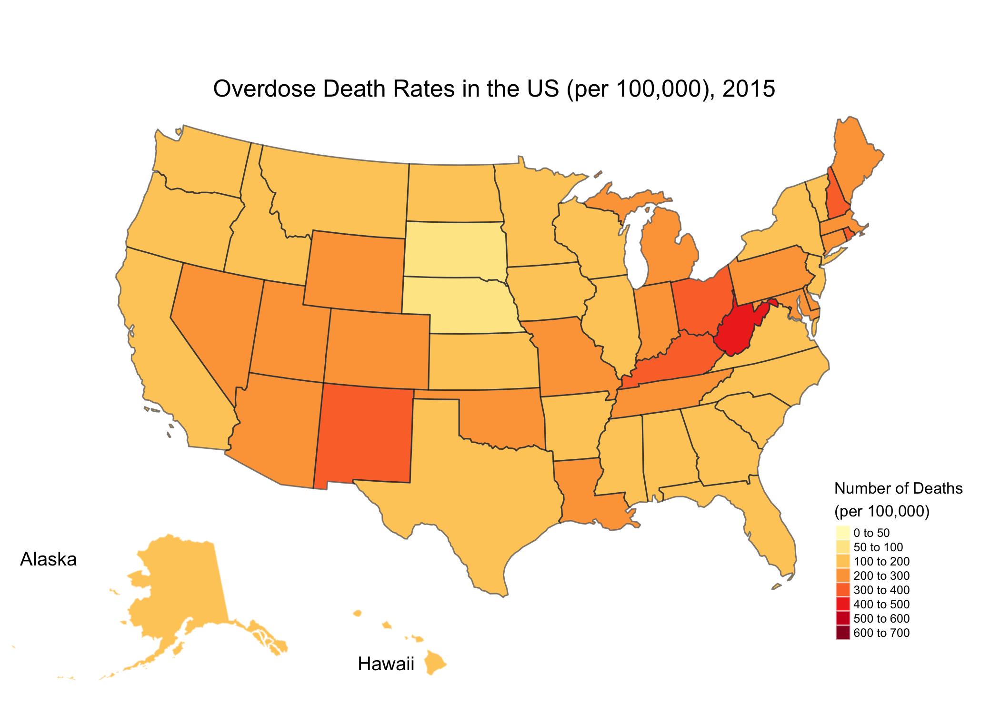
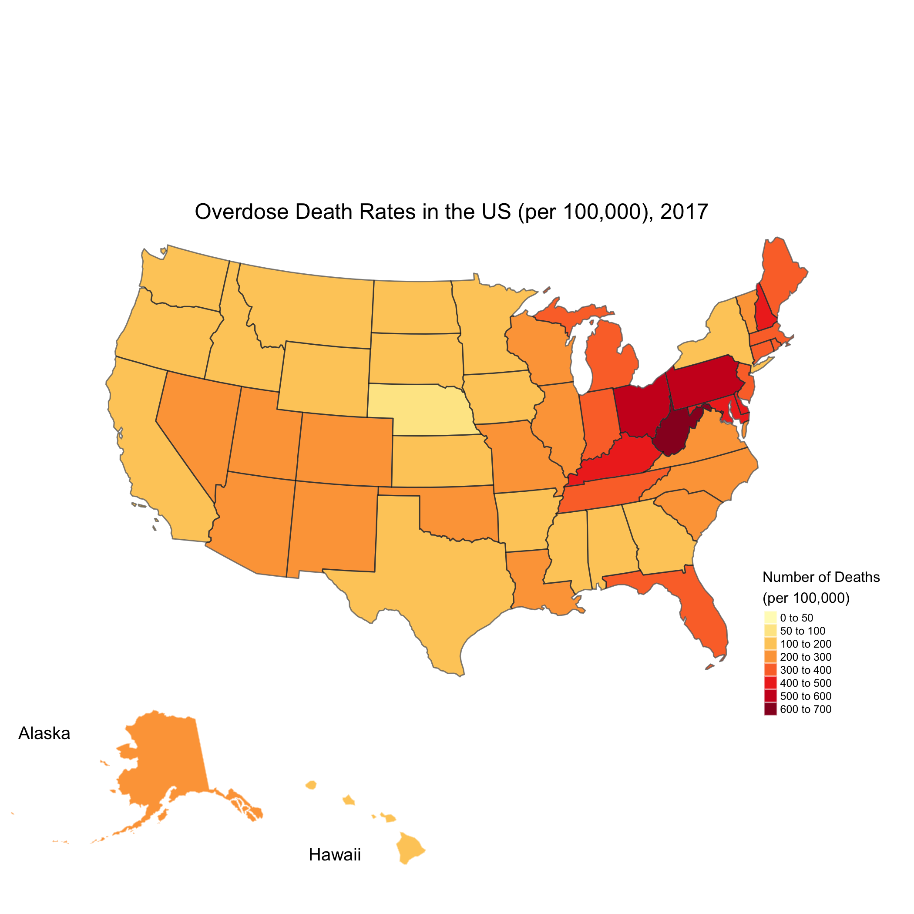

```{r set-options, echo=FALSE, cache=FALSE}
options(width = 400)
```  
***

### Overview
The opioid epidemic is a serious public health problem in the United States. The National Vital Statistics System provides data made available by the CDC and U.S. Department of Health regarding national mortality for drug overdoses over the past several years. The goal of this project is to perform statistical analyses to learn about the relationships between variables in the data set, geospatial analyses to understand the critical centers of the epidemic, as well as forcasting to predict future overdose trajectories.

[Github Repository](https://github.com/kslovik/BMIN503_Final_Project)

### Introduction 
Over the past 20 years, the United States has experienced an increase in the amount of deaths that can be attributed to drug overdoses.  In particular, opioids have been at the heart of this problem, including both prescription medications and illegal opioids. Opioids are used to treat pain by interacting with opioid receptors in the body and brain. In addition to pain relief, opioids also elicit a feeling of pleasure.  This combination of pain relief and pleasure provides some explanation for the addictive quality of opioid drugs. Over-prescribing by clinicians and access to illicit drugs have allowed this to become a severe epidemic that has shown little indication of slowing down, that both local and national agencies are attempting to address. 

To understand the nature of the problem of drug overdose mortality, an interdisciplinary approach can provide the most insight.  Firstly this is a public health issue, requiring the knowledge of clinicians, psychiatrists, and public health officials. This is also an economic and geographic issue, as socioeconomic status and location may have a large affect on drug overdose mortality. Using additional data sets from SAMHSA, NIDA and the DEA to integrate with the drug overdose mortality data will provide more insight for correlative analysis and trends regarding the opioid epidemic.

### Methods
The primary data set used for this project was obtained from the publicly available data from the National Vital Statistics System.  The link to the data download is [here](https://catalog.data.gov/dataset/vsrr-provisional-drug-overdose-death-counts-54e35). The data analyzed is titled "VSRR Provisional Drug Overdose Death Counts" and contains provisional monthly counts for drug overdose deaths and total number of deaths (from mortality data) for all 50 states in the United States over the years 2015-2017.  The data also includes information on the specific drug categories determined to be the cause of overdose for 18 states.

The main goal is to analyze the data with some exploratory analysis as well as graphical analysis to visualize data in a meaningful way to help understand the scale and severity of the opioid epidemic in the United States.

First, all necessary packages are loaded first to keep the code organized.
```{r, message=FALSE, warning=FALSE}
# load necessary packages
library(tidyverse)
library(sf)
library(RColorBrewer)
library(tigris)
library(tmap)
library(tmaptools)
library(grid)
library(leaflet)
library(forecast)
library(ggthemes)
library(png)
```

Next, data needs to be loaded and cleaned for analysis. The `dplyr` package from `tidyverse` will be used to organize the data. First, we load in the two data tables that will be used for further analysis. The first dataset is the actual VSRR drug overdose data and the second dataset is population estimates for each state for the years of interest from the U.S. Census Bureau. Then, all of the necessary variables will be created to perform some geospatial analysis to look at the total number of drug overdoses by state for the years 2015, 2016, and 2017.

```{r, eval=TRUE, message=FALSE, warning=FALSE}
# load in data
data <- read.csv("VSRR_drug_od.csv", header=TRUE)
population <- read.csv("us-pop-est.csv", header=TRUE)
str(data)

# need for subsequent analysis
drop.cols <- "State.Name"

# total deaths by state for each year
totalDeathsbyState <- data %>% 
  select(-one_of(drop.cols)) %>%
  group_by(State, Year, Indicator) %>%
  filter(Year %in% c("2015", "2016", "2017"), 
         Indicator == "Number of Deaths", 
         State != "US",
         State != "YC") %>%
  summarize(TotalDeath = sum(Data.Value))

totalDeathsbyState <- inner_join(totalDeathsbyState, population, by=c("State", "Year"))
totalDeathsbyState <- totalDeathsbyState %>%
  mutate(deathRate = TotalDeath / Population * 100000)

drugODbyState <- data %>% 
  select(-one_of(drop.cols)) %>%
  group_by(State, Year, Indicator) %>%
  filter(Year  %in% c("2015", "2016", "2017"), 
         Indicator == "Number of Drug Overdose Deaths",
         State != "US",
         State != "YC") %>%
  summarize(TotalODDeath = sum(Data.Value))

drugODbyState <- inner_join(drugODbyState, population, by=c("State", "Year"))
drugODbyState <- drugODbyState %>%
  mutate(ODrate = TotalODDeath / Population * 100000)
```

Histograms were generated to look at both the total death rate and the overdose death rate.

```{r, eval=TRUE, message=FALSE, warning=FALSE}
# Histogram for Death Rate
ggplot(data=totalDeathsbyState, aes(x=deathRate)) +
  geom_histogram(bins=20, aes(y=..density..), colour="black", fill="white") +
  ggtitle("Total Death Rate (per 100,000)") +
  geom_density(alpha=.2, fill="lightblue") +
  facet_grid(~Year)

# Histogram for Overdose Death Rate
ggplot(data=drugODbyState, aes(x=ODrate)) +
  geom_histogram(bins=20, aes(y=..density..), colour="black", fill="white") +
  ggtitle("Overdose Death Rate (per 100,000)") +
  geom_density(alpha=.2, fill="lightblue") +
  facet_grid(~Year)
```

After grouping and filtering data, the data can be joined to make it easier for subsequent analysis. The percentage of overdose deaths per state per year can be calculated and added as a new column.

```{r, eval=TRUE, message=FALSE, warning=FALSE}
totalDeathsandOD <- inner_join(drugODbyState, totalDeathsbyState, by=c("State", "Year", "Population"))

percentOD <- totalDeathsandOD %>%
  mutate(percent = ((TotalODDeath / TotalDeath) * 100))
```

A histogram can be used to get an idea of the distribution of the overdose percentages for the years 2015-2017.

```{r, eval=TRUE, message=FALSE, warning=FALSE}
ggplot(data=percentOD, aes(x=percent)) +
  geom_histogram(bins=20, aes(y=..density..), colour="black", fill="white") +
  ggtitle("Percentage of Deaths Attributed to Overdose") +
  geom_density(alpha=.2, fill="lightblue") +
  facet_grid(~Year)
```

Because geographical analysis is a goal, loading in the coordinate data is necessary. Our map shapefile was downloaded from the [US Census Bureau](https://www.census.gov/geo/maps-data/data/cbf/cbf_state.html). The package `sf` is used to import the shapefile as an sf object.

```{r, eval=TRUE, message=FALSE, warning=FALSE}
# importing state shapefile as sf object
US.sf <- st_read("cb_2017_us_state_20m/cb_2017_us_state_20m.shp")
str(US.sf)
US.sf <- US.sf %>%
  select(STATENS, AFFGEOID, GEOID, STUSPS, NAME, LSAD, ALAND, AWATER, geometry) %>%
  rename(State='STUSPS')
```

The geographical data can then be joined to the drug overdose data.

```{r, eval=TRUE, message=FALSE, warning=FALSE}
# join by state in order to make map plots
USdeaths <- inner_join(US.sf, drugODbyState, by = "State")
```

More data manipulation will be employed in the Results section as part of several subsequent analyses. 

### Results

To extract some interesting information, visualizing the total number of overdose deaths across the entire United States can be done by implementing the package `tmap`. Using a for loop to iterate over the 3 years of interest, a static map for each year can be generated and saved.

```{r, eval=TRUE, message=FALSE}
# setting up for plotting static maps
for (year in list("2015", "2016", "2017")){

US_cont <- USdeaths %>% 
  filter(Year == year) %>%
  subset(!GEOID %in% c("02", "15", "72")) %>% 
  simplify_shape(0.2)

US_AK <- USdeaths %>%
  filter(Year == year) %>%
  subset(GEOID == "02") %>% 
  simplify_shape(0.2) 

US_HI <- USdeaths %>% 
  filter(Year == year) %>%
  subset(GEOID == "15") %>% 
  simplify_shape(0.2) 

US_states <- US_cont %>% 
  dplyr::select(geometry) %>% 
  aggregate(by = list(US_cont$State), FUN = mean)

# Contiguous US map
m_cont <- tm_shape(US_cont, projection = 2163) +
  tm_polygons("ODrate", title = "Number of Deaths\n(per 100,000)", showNA = FALSE,
              border.col = "white", border.alpha = .5,
              style = "fixed",
              breaks = c(0, 50, 100, 200, 300, 400, 500, 600, 700),
              palette = "YlOrRd") +
  tm_shape(US_states) +
  tm_borders(lwd=1, col = "black", alpha = .5) +
  tm_layout(title = paste("Total Number of Overdose Deaths in the US (per 100,000),", year),
            title.size = 1,
            title.position = c("center", "top"), 
            legend.position = c("right", "bottom"),
            legend.width = 0.5,
            legend.title.size = 0.8,
            legend.text.size = 0.5,
            legend.outside = FALSE,
            frame = FALSE,
            inner.margins = c(0.1, 0.1, 0.1, 0.1))

# Alaska map  
m_AK <-  tm_shape(US_AK, projection = 3338) +
  tm_polygons("ODrate",
              border.col = "white",
              border.alpha = .5,
              style = "fixed",
              breaks = c(0, 50, 100, 200, 300, 400, 500, 600, 700), 
              palette = "YlOrRd") + 
  tm_layout("Alaska",
            legend.show = FALSE,
            bg.color = NA,
            title.size = 0.8,
            frame = FALSE)

# Hawaii map
m_HI <-  tm_shape(US_HI, projection = 3759) +
  tm_polygons("ODrate",
              border.col = "white",
              border.alpha = .5,
              style = "fixed",
              breaks = c(0, 50, 100, 200, 300, 400, 500, 600, 700),
              palette = "YlOrRd") +
  tm_layout("Hawaii",
            legend.show = FALSE,
            bg.color = NA,
            title.position = c("LEFT", "BOTTOM"),
            title.size = 0.8,
            frame = FALSE)

# Use grid package to set where AK and HI map should be plotted on the contiguous map
vp_AK <- viewport(x = 0.15, y = 0.15, width = 0.3, height = 0.3)
vp_HI <- viewport(x = 0.4, y = 0.1, width = 0.2, height = 0.1)

# plot map to save individual figures
tmap_save(m_cont, 
          insets_tm = list(m_AK, m_HI), 
          insets_vp = list(vp_AK, vp_HI),
          filename=paste0("ODinUS", year, ".png"))
graphics.off() # clears after each plot
}
```

The exported `.png` maps can be re-imported and printed for viewing:





**ADD DESCRIPTION OF RESULTS FROM MAPS HERE**

Next, the percentage of deaths attributed to drug overdoses was calculated (divide the total number of overdose deaths by the total number of deaths) for each state for the years 2015, 2016 and 2017.  The data for each year can be plotted as a interactive choropleth map using the `leaflet` package. 

```{r, eval=TRUE, message=FALSE, warning=FALSE}
## Leaflet Maps
# OD percentage join with shapefile
percentODinUS <- inner_join(US.sf, percentOD, by = "State")
ODmap2015 <- percentODinUS %>% filter(Year == "2015")
ODmap2016 <- percentODinUS %>% filter(Year == "2016")
ODmap2017 <- percentODinUS %>% filter(Year == "2017")

# favorite color palette
pal_fun <- colorNumeric("PuRd", NULL)

# 2015
# popup message
pu_message2015 <- paste0(ODmap2015$NAME, 
                     "<br>Drug Overdose Rate: ",
                     round(ODmap2015$percent, 1), "%")

# leaflet map for OD percentage in 2015
leaflet(ODmap2015) %>%
  addPolygons(stroke = TRUE, weight=1, color="white", 
              fillColor = ~pal_fun(percent),
              fillOpacity = 1,
              popup = pu_message2015) %>%
  setView(lat = 39.8283, lng = -98.5795, zoom = 3) %>%
  addProviderTiles(providers$CartoDB.Positron) %>%
  addLegend("bottomright",                           
            pal=pal_fun,                             
            values=~percent,                 
            title = "Drug Overdose Rate, 2015 (%)",                  
            opacity = 1) %>%                         
  addScaleBar()

# 2016
# popup message
pu_message2016 <- paste0(ODmap2016$NAME, 
                     "<br>Drug Overdose Rate: ",
                     round(ODmap2016$percent, 1), "%")

# leaflet map for OD percentage in 2016
leaflet(ODmap2016) %>%
  addPolygons(stroke = TRUE, weight=1, color="white", 
              fillColor = ~pal_fun(percent),
              fillOpacity = 1,
              popup = pu_message2016) %>%
  setView(lat = 39.8283, lng = -98.5795, zoom = 3) %>%
  addProviderTiles(providers$CartoDB.Positron) %>%
  addLegend("bottomright",                           
            pal=pal_fun,                             
            values=~percent,                 
            title = "Drug Overdose Rate, 2016 (%)",                  
            opacity = 1) %>%                         
  addScaleBar()

# 2017
# popup message
pu_message2017 <- paste0(ODmap2017$NAME, 
                         "<br>Drug Overdose Rate: ",
                         round(ODmap2017$percent, 1), "%")

# leaflet map for OD percentage in 2017
leaflet(ODmap2017) %>%
  addPolygons(stroke = TRUE, weight=1, color="white", 
              fillColor = ~pal_fun(percent),
              fillOpacity = 1,
              popup = pu_message2017) %>%
  setView(lat = 39.8283, lng = -98.5795, zoom = 3) %>%
  addProviderTiles(providers$CartoDB.Positron) %>%
  addLegend("bottomright",                           
            pal=pal_fun,                             
            values=~percent,                 
            title = "Drug Overdose Rate, 2017 (%)",                  
            opacity = 1) %>%                         
  addScaleBar()
```

**ADD DESCRIPTION OF RESULTS HERE**

**Want to implement a leaflet map to show percent change from 2015 to 2017... need to play with the data though**

The data can be visualized to show trends of the number of drug overdose deaths for each state by creating a faceted graph of each region of the US for each year. The four regions are as determined from the U.S. Census, the Northeast, Midwest, South, and West. For this, raw overdose death counts will be used. Additionally, using the `geom_smooth()` function, with `method` set to `auto`, a LOESS curve can be plotted through the points.  This method is intended to use local regression to fit the curve through points in the scatterplot. It is useful for revealing trends in data.   

Using a `for` loop, similarly as above, we can output the facet grid plots for four regions.

```{r, eval=TRUE, message=FALSE, warning=FALSE}
d = data %>% 
  group_by(State, Month) %>% 
  filter(Indicator == "Number of Drug Overdose Deaths") %>% 
  select(State, Year, Month, Data.Value)
  
NE = c('CT', 'ME', 'MA', 'NH', 'RI', 'VT', 'NJ', 'NY', 'PA')
MW = c('IL', 'IN', 'MI', 'OH', 'WI', 'IA', 'KS', 'MN', 'MO', 'NE', 'ND', 'SD')
S = c('DE', 'DC', 'FL', 'GA', 'MD', 'NC', 'SC', 'VA', 'WV', 'AL', 'KY', 'MI', 
      'TN', 'AR', 'LA', 'OK', 'TX')
W = c('AZ', 'CO', 'ID', 'MT', 'NV', 'NM', 'UT', 'WY', 'AK', 'CA', 'HI', 'OR', 'WA')

regions = list("Northeast", "Midwest", "South", "West")
i=1
for(states in list(NE, MW, S, W)){
dd = d %>% 
  filter(State %in% states) %>% 
  filter(Year != 2018)
dd$Year = factor(dd$Year, levels=c("2015", "2016", "2017"))
dd$Month = factor(dd$Month, levels = c("January", "February", "March", "April", "May", "June", "July", "August", "September", "October", "November", "December"))

ggplot(dd, aes(y=Data.Value, x = Month, colour=State, group=State)) + 
  geom_line(aes(x=Month, y = Data.Value)) + 
  geom_point() +
  geom_smooth(method = "auto", level=0.99) + 
  facet_grid( ~ Year ) + 
  geom_rangeframe() + 
  theme_minimal() +
  theme(axis.text.x  = element_text(angle=90, vjust=0.8)) +
  labs(title = paste0("Drug Overdose Deaths for the ", regions[i]), x = "Month", y = "Number of Drug Overdose Deaths") +
  ylim(low=0, high=6000)

ggsave(paste0(regions[i], ".png"))

i=i+1
}
```

The `.png` images can be reimported:


**ADD DESCRIPTION OF RESULTS HERE**

For 18 states, there is data on the specific drug category the overdose deaths can be classified into.  To visualize this, we can generate a stacked bar plot for each year to show the differences between each year.

```{r, eval=TRUE, message=FALSE, warning=FALSE}
# Specific drug categories
specificDrugs <- data %>% 
  select(-one_of(drop.cols)) %>%
  group_by(State, Year, Indicator) %>%
  filter(Year %in% c("2015", "2016", "2017"), 
         Indicator %in% c("Heroin (T40.1)",
                        "Natural & semi-synthetic opioids (T40.2)",
                        "Synthetic opioids, excl. methadone (T40.4)",
                        "Methadone (T40.3)",
                        "Cocaine (T40.5)"),
         State != "US",
         State != "YC") %>%
  summarize(TotalDeath = sum(Data.Value))

allOD <- inner_join(drugODbyState, 
                          specificDrugs, by=c("State", "Year"))

ggplot(allOD, aes(x=State, group=Year)) +
  geom_bar(stat="identity", aes(y=TotalDeath, fill=Indicator.y)) +
  facet_grid(Year ~ .) + 
  theme_bw() +
  scale_y_continuous("Number of Deaths", 
                     labels = c("0", "10k", "20k", "30k", "40k")) +
  scale_fill_discrete(name="Drug Category", 
                      labels=c("Cocaine","Heroin", "Methadone", 
                               "Natural Opioids", "Synthetic Opioids"),
                      breaks=c("Cocaine (T40.5)","Heroin (T40.1)", "Methadone (T40.3)", 
                               "Natural & semi-synthetic opioids (T40.2)", 
                               "Synthetic opioids, excl. methadone (T40.4)"))
```

**ADD DESCRIPTION OF RESULTS HERE**

Finally, the drug overdose data can be used to perform some simple forecasting for the future. This is of great interest, because it is necessary to predict how the opioid epidemic will trend spatially with time, for purposes of allocation of public health resources as well as policy changes.  To perform forecasting, we will employ the package `forecast`. 

```{r, eval=FALSE, message=FALSE, warning=FALSE}

TOP_N = 10
top = d %>% 
  group_by(State) %>% 
  summarise(Total = sum(Data.Value)) %>% 
  arrange(desc(Total)) %>% 
  top_n(TOP_N) %>% 
  pull(State)

top_nd = subset(d, State %in% top)
top_nd$Date = sprintf("1%s%d", top_nd$Month, top_nd$Year)
top_nd$Date = as.Date(top_nd$Date, "%d%B%Y")

CA = top_nd %>% filter(State == 'CA') %>% select(Data.Value)
PA = d %>% filter(State == 'PA') %>% select(Data.Value)
CA.ts = ts(CA$Data.Value, start=c(2015, 1), end=c(2018, 3), frequency = 12)
PA.ts = ts(PA$Data.Value, start=c(2015, 1), end=c(2018, 3), frequency = 12)
paca = cbind(PA=PA.ts, CA=CA.ts)
PA.fits = auto.arima(PA.ts, seasonal = T)
CA.fits = auto.arima(CA.ts, seasonal = T)
pcast = forecast(PA.fits)
ccast = forecast(CA.fits)
ggtsdisplay(PA.ts, theme = theme_bw())

autoplot(forecast(CA.fits), title="") +
 theme_excel() +
 ylab("# of deaths") +
 xlab("Year") +
 ggtitle("Opiate Death by State Since 2015")

ggplot(top_nd, aes(x = Date, y = Data.Value, colour = State, group = State)) + 
  geom_line() + 
  theme_bw() +
  scale_y_continuous(expand = c(0.015, 0)) + geom_smooth(size = 0.5) +
  scale_x_date(expand = c(.0, 0)) + 
  ylab("# of deaths") + 
  xlab("Year") + 
  ggtitle("Opiate Death by State Since 2015")

```

