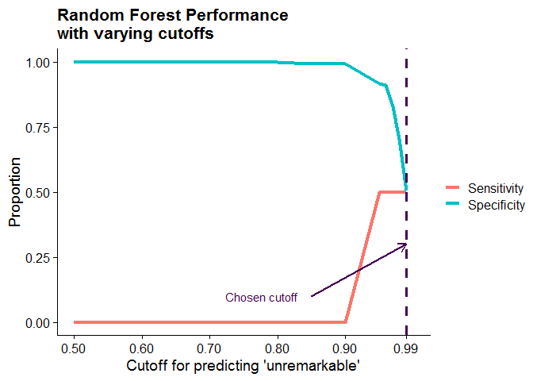

```r
install.packages("renv")
renv::restore()
```


```r
options(width = 400)
library(tidyverse)
library(gtsummary)
# library(simstudy)
library(randomForest)
library(inTrees)
library(glue)
library(icd)
# library(fabricatr)
library(mgcv)
library(ranger)
library(magrittr)
library(tidytext)
library(gt)
# library(ggforce)

# Settings
refresh = F #When true, reads in raw CSV files and processes. When false, loads in already-processed feather files
nobs <- 6000 #num of observations included in dataset
missing_threshold <- 0.05 # level of missingness acceptable for an individual variable
test_to_train <- c(0.8, 0.2) #ratio of data used from training dataset compared to testing data set
num_randomforest_trees <- 500 # number of randomForest trees

source("load_data.R") #Loads in records from outpatient visits from a folder not included in git repository
```
***
Use this template to complete your project throughout the course. Your Final Project presentation will be based on the contents of this document. Replace the title/name above and text below with your own, but keep the headers.

1. Recall that you forked the [Final Project Repo](https://github.com/HimesGroup/BMIN503_Final_Project) and have downloaded it as a project to your local computer. Write the overview and introduction for your final project. The overview consists of 2-3 sentences summarizing the project and goals. For the introduction, the first paragraph describes the problem addressed, its significance, and some background to motivate the problem. In the second paragraph, explain why your problem is interdisciplinary, what fields can contribute to its understanding, and incorporate background related to what you learned from meeting with faculty/staff. Start working on the Methods/Results section, which consists of code and its output along with text describing what you are doing (Note: we will not check your code now, but you should have something in place before Assignment 6 is distributed).


# Overview
`Give a brief a description of your project and its goal(s), what data you are using to complete it, and what three faculty/staff in different fields you have spoken to about your project with a brief summary of what you learned from each person. Include a link to your final project GitHub repository.`

For children visiting the emergency department with a chief complaint of headache of migraine, are there features of their initial clinical presentation that can predict the presence of an intracranial abnormality? As a proof of concept, this study involves a retrospective cohort of children who visited the CHOP neurology outpatient clinic between 2016 and 2020 with the complaint of headache or migraine to predict risk of positive findings seen on imaging.

# Introduction 
`Describe the problem addressed, its significance, and some background to motivate the problem.`
`Explain why your problem is interdisciplinary, what fields can contribute to its understanding, and incorporate background related to what you learned from meeting with faculty/staff.`

Headache is consistently ranked as one of the top 10 chief complaints for an emergency room visit within the United States according to the National Hospital Ambulatory Medical Care Survey [@UnitedStatesDepartmentofHealthHumanServices-NationalCenterforHealthStatistics2019]. In fact, for over 1.7 million (5% overall) pediatric emergency visits in 2017, headache was listed as a reason for the visit [@UnitedStatesDepartmentofHealthHumanServices-NationalCenterforHealthStatistics2019]. Headache can be an alarming but largely nonspecific symptom with a wide range of causes including a disabling but ultimately benign primary headache disorder such as migraine, a secondary but nonconcerning case of influenza, or something more grave such as a brain tumor or subarachnoid hemorrhage. Although a neurologist or headache subspecialist may focus on pinpointing a headache's etiology to direct treatment, an emergency room physician's goal is to identify "red flags" or signs of a serious etiology requiring urgent intervention. Still, a symptom's status as a "red flag" can be questionable: changes in vision or sensation can be associated with a stroke or simply be the aura of an incoming migraine. As a result, roughly 18-41% of children with headache end up receiving some form of neuroimaging of which only 4-10% of those imaged will have new abnormal findings seen on imaging [@Cain2018; @Kan2000; @Sheridan2013]. Uneccesary imaging can be costly for both the patient and the healthcare system [@Cain2018; @Irwin2018; @Kan2000; @Young2018]. In addition, exposure to radiation from computed tomography scanning in children can greatly increase the risk of later malignancy [@Brenner2001; @Feng2010]. The high rate of children undergoing unnecessary imaging demonstrates a gap in the knowledge base available to emergency medicine physicians who must deal with a high volume of patients diverse in their clinical presentations and levels of acuity. 

Due to bottlenecks in the data acquisition process, electronic medical record data from emergency room visits has yet to be acquired. As a result, this paper will use already available medical record data from children visiting the outpatient neurology clinic with the complaint of headache or migraine as a proof of concept. This study aims to use machine learning to 1) select features of the clinical presentation that influence the risk of an abnormal finding on imaging and 2)  simplify the predictive model generated into an algorithm that can be disseminated and shared amongst emergency room physicians.

# Methods
Describe the data used and general methodological approach. Subsequently, incorporate full R code necessary to retrieve and clean data, and perform analysis. Be sure to include a description of code so that others (including your future self) can understand what you are doing and why. 


```r
# Pull in data from outpatient redcap database

# Select names of columns that end in ".factor"
demo_factor_names <- str_subset(names(demo_data),".factor") %>% 
  str_remove(., ".factor") 

# Select names of factors with only two levels
 #Can keep binary integer columns instead
ha_factor_names_binary <- ha_data %>% 
  select(matches("^p_.*\\.factor$")) %>%
  select_if(~ nlevels(.) == 2) %>%
  names(.)

# Select names of factors with more than two factors.
# Remove integer column counterparts
ha_factor_names_nonbinary <- ha_data %>% 
  select(matches("^p_.*\\.factor$")) %>%
  select_if(~ nlevels(.) != 2) %>%
  names(.) %>%
  str_remove(., ".factor")

# Select names of columns that end in ".factor"
image_factor_names <- str_subset(names(imaging_data),".factor") %>% 
  str_remove(., ".factor")
```


```r
icd10cm <- get_icd10cm_latest()

icd_flags <- readxl::read_xlsx("Additional ICD Codes.xlsx", sheet = "WIP4") %>%
  select(flag = Flag, icd10 = `ICD-10 codes`, code_meaning = `code meaning`) %>%
  filter(!is.na(icd10)) %>%
  separate_rows(icd10, sep = "(\\s)?,(\\s)?") %>%
  mutate(icd10 = str_remove_all(icd10, "\\.")) %>%
  separate(icd10, c("icd10_1", "icd10_2"), sep = "-", fill = "right", remove = FALSE) %>%
  mutate(across(c(icd10_1, icd10_2), ~match(.x, icd10cm$code))) %>%
  rowwise() %>%
  mutate(icdx = ifelse(
    !is.na(icd10_2), list(icd10cm$code[icd10_1:icd10_2]), list(icd10cm$code[icd10_1])
  )) %>%
  unnest(icdx) %>%
  filter(!is.na(icdx))
```


```r
# Select subset of demographic data based on number of observations
# Select patients that completed headache questionnaire
# Clean up columns and remove duplicates (keep factor counterparts)
dt_demo <- demo_data %>%
  filter(between(age, 2,17) & pt_ha_quest_yn  == 1) %>%
  select(-all_of(demo_factor_names)) %>%
  rename_with(~str_remove(.x, ".factor")) %>%
  mutate(gender = fct_recode(gender, Other = "Unknown"),
         race = fct_collapse(race,
           Black = c("Black or African-American"),
           White = c("White"),
           other_level = "Other"
         ))

# Select subset of headache questionnaire data based on number of observations
# Clean up columns and remove duplicates (keep factor counterparts nonbinary, keep integer counterparts if binary)
dt_ha_data <- ha_data %>%
  filter(record_id %in% unique(dt_demo$record_id) ) %>%
  filter(patient_ha_complete == 2) %>%
  select(-all_of(c("redcap_repeat_instrument", "redcap_repeat_instance"))) %>%
  select(-starts_with("c_")) %>%
  select(-all_of(ha_factor_names_binary)) %>%
  select(-all_of(ha_factor_names_nonbinary)) %>%
  select(record_id, p_age_first_ha:p_assoc_sx_pul_ear___oth, p_prob_preg_birth:p_fam_hist_med___oth, p_ha_in_lifetime.factor:p_preg_full_term.factor) %>%
  select_if(~is.factor(.) | is.numeric(.)) %>%
  rename_with(~str_remove(.x, ".factor"))

# Merge demographic + HA data
# sample by number of observations
dt_demo_ha <- dt_demo %>%
  select(record_id, age, gender, ethnicity, race) %>%
  inner_join(dt_ha_data, by = "record_id") 

# Find cases of serious diagnostic codes given PRIOR to imaging
prior_flags <- icd_flags %>%
    filter(flag %in% c("CNS Hemorrhage", "Meningoencephalitis", "Hydrocephalus",
                      "Neoplasm - Malignant CNS", "Neoplasm - Benign CNS",
                      "Other intracranial or spinal malformation", "RCVS/PRES", 
                      "Past neurosurgical procedure", "Stroke, TIA") |
           grepl("G93", icdx) |
           grepl("Q05", icdx)
         ) %>%
  mutate(icdx = as.character(icdx)) %>%
  left_join(pmh_data %>% 
               filter(record_id %in% dt_demo_ha$record_id) %>% 
               mutate(icdx = str_remove_all(pl_icd10, "\\.")), 
             by = "icdx") %>%
  filter(!is.na(record_id))

#Exclude from dataset and sample
dt_demo_ha <- dt_demo_ha %>%
  filter(!record_id %in% prior_flags$record_id) %>%
  slice_sample(n = nobs)
```


```r
# Select subset of imaging data based on number of observations
# Select any imaging done on the first day (trying to exclude prior findings)
# Rough regex searches for key words to flag if impression mentioned a finding
dt_imaging_all <- imaging_data %>%
  filter(record_id %in% unique(dt_demo_ha$record_id)) %>%
  filter(redcap_repeat_instrument == "imaging") %>%
  group_by(record_id) %>%
  filter(img_ord_dt >= visit_dt) %>%
  filter(img_ord_dt == first(img_ord_dt)) %>% 
  mutate(
    impression_lower = str_squish(str_to_lower(img_impression)),
    finding = case_when(
      str_detect(impression_lower, 'discuss') ~ 1,
      str_detect(impression_lower, 'advise') ~ 1,
      str_detect(impression_lower, 'communicate') ~ 1,
      str_detect(impression_lower,
                 regex('112(?!.*false)' )) ~ 1,
      str_detect(impression_lower, 'finding[\\w\\s]{0,3}(?:was|were)[\\s]{0,3}(?:discuss|communica|review|relay|acknowled)') ~ 1,
      str_detect(impression_lower, '\\bemergen') ~ 1,
      str_detect(impression_lower,
                 regex('immediate(?!.*(?:postsurg|post surg|adjacent|subjacent|postoper|prior))' )) ~ 1,
      str_detect(impression_lower, 'phone') ~ 1,
      str_detect(impression_lower, 'email') ~ 1,
      TRUE ~ NA_real_),
    finding = case_when(
      finding == 1 ~ 1,
      is.na(finding) & str_detect(impression_lower,
                                  regex("(?:otherwise|essential).*[\\s,]{0,3}(?:unremarkable|normal)")) ~ 0,
      is.na(finding) & str_detect(impression_lower, "^[\\s\\d\\.]{0,4}(?:unremarkable|normal|stable)") ~ 0,
      is.na(finding) & str_detect(impression_lower, "^[\\s\\d\\.]{0,4}(?:brain mr| brain ct|brain|impression)[^a-z]{0,4}(?:unremarkable|normal)") ~ 0,
      is.na(finding) & str_detect(impression_lower, '\\b(?:no|none)[\\w\\s]{0,30}(?:finding|abnormality|mass|hydrocephalus|infarct|hemo|struct)') ~ 0,
      TRUE ~ NA_real_
    )) 

dt_imaging <- dt_imaging_all %>%
  summarise(
    finding = case_when(
      any(finding == 1) ~ 1,
      all(finding == 0) ~ 0,
      all(is.na(finding)) ~ NA_real_
    ),
    img_ord_dt = first(img_ord_dt),
    img_impression = first(img_impression),
    .groups = 'drop')
```


```r
# Merge in imaging data
# Mark if patient was imaged based on date of imaging 
# (not all kids imaged had conclusive findings)
dt_all <- dt_demo_ha %>%
  left_join(dt_imaging, by = "record_id") %>%
  mutate(imaging = ifelse(!is.na(img_ord_dt), 1, 0))

# Select names of columns with missingness above a threshold
# Exclude columns from imaging dataset as not all kids were imaged
dt_missing_cols_all <- dt_all %>%
  select(-any_of(names(dt_imaging))) %>%
  summarise(across(everything(), ~sum(is.na(.x))/length(.x))) %>%
  pivot_longer(everything(), names_to = "column", values_to = "prop") %>%
  filter(prop >= missing_threshold)

dt_missing_cols_imaged <- dt_all %>%
  filter(imaging == 1) %>%
  select(-any_of(names(dt_imaging))) %>%
  summarise(across(everything(), ~sum(is.na(.x))/length(.x))) %>%
  pivot_longer(everything(), names_to = "column", values_to = "prop") %>%
  filter(prop >= missing_threshold)

# Exclude variables with missingness above a certain variable
dt <- dt_all %>%
  select(-any_of(dt_missing_cols_imaged$column))

dt_exclude <- demo_data %>% 
  filter(between(age, 2,17)) %>% 
  select(record_id, age) %>% 
  anti_join(dt, by = "record_id")
```


## Participants
We conducted a retrospective cohort study consisting of children ages 2-18 seen in the outpatient pediatric neurology clinic between July 2016 and November 2020 with the primary complaint of headache or migraine. This study took place within a tertiary pediatric hospital system which often receives referrals from nearby healthcare systems for specialized care. This can inflate the number of cases with rare and/or serious etiologies compared to another pediatric outpatient setting. Children with a condition predisposing to an intracranial abnormality but no prior documented findings were included in the study. 

## Predictors
We used a combination of demographic features (age, sex, race, ethnicity) and clinical features as predictors. Patients and their families completed health questionnaires during their outpatient visit of interest, describing their headache type and severity, associated symptoms, medication use, and past medical and family history. Given the nature of secondary data collection, we expected to encounter records with missing variables. We excluded potential variables from our predictors if their missingness in the dataset exceeded 5%. For variables below this threshold, we imputed missing values based on proximity to other cases using the `rfImpute` function within the *randomForest* package [@AndyLiaw2002].

## Outcome
We selected outpatient cases in which imaging was performed after the outpatient visit. We then classified cases based on the documentation associated with the soonest imaging encounter performed after the clinic visit of interest. As some cases had multiple imaging procedures performed during a single encounter, subsequent imaging procedures performed on the same day as the initial imaging procedure were included. Using the `stringr` package [@RStringr], we selected cases in which the radiologist documented urgently contacting the ordering physician and cases in which the radiologist documented imaging as 'unremarkable' or 'normal'. In the former scenario, these cases were labeled as having 'urgent findings' and our primary goal is to correctly classify these cases. In the latter scenario, these cases were as 'unremarkable' and serve as the contrasting set for our predictive model.

<!-- We extracted symptom information from a health questionnaire completed by the patient for the visit of interest. Based on past work, we were particularly interested in self-report of fever and other constitutional symptoms, acute neurological deficits, age, descriptions of sudden onset or "thunderclap" headache, awakening from sleep, occipital location, and responsiveness to positional changes or the Valsalva maneuver [@Do2019]. We also included other variables often associated with headache assessment including age, family history of headache, blurry vision, nausea and vomiting, photophobia and phonophobia, headache frequency at baseline, and current headache duration. 
Given the nature of secondary data collection, we expected to encounter records with missing variables. We excluded any records that lacked a visit diagnosis commonly associated with headache such as minor trauma to extremities. Given the broad relationship between infection and headache, we included cases related to head and neck local infections such as sinusitis and dental infections, along with cases of systemic infection such as influenza and recorded sepsis. Further, we excluded records that lacked documentation of a neurological exam, headache characterization, or overall lacked data for >= XX% variables of interest. For analysis of a single variable, we excluded records with missing data if the variable's missingness in the dataset did not exceed 10% across age and sex strata. In cases where a variable's missingness rested between 10% and 20%, we used data imputation with the median for a continuous value by age and sex strata. Missingness that exceeded 20% was evaluated on a case-by-case basis to assess the value of and ramifications of analysis with investigation of nonrandom patterns. -->

## Statistical Analysis and Model Creation
Data analysis was done using R version 4.0.2 (2020-06-22) [@RCoreTeam2020]. We used the *gtsummary* package to perform descriptive analyses on the demographic characteristics of the dataset [@DanielDSjoberg2020].  We used the *tidyverse* package collection extensively throughout analysis and particularly relied on *ggplot2* for graph creation [@Wickham2019]. For descriptive purposes, data was represented using the median and interquartile ranges for continuous variables and counts and proportions for categorical data.

After descriptive analyses, we divided the dataset into 2 parts for model training (80%) and testing (20%). We used the *randomForest* R package based on Leo Breiman's machine learning method [@AndyLiaw2002; @Breiman2001] to create a supervised machine learning model capable of predicting presence of urgent imaging findings based clinical presentation. This method is notable for creating an 'ensemble' set of decision trees based on randomly generated subsets of cases and predictors which classifies cases based on general consensus. We then simplified this ensemble model into a single decision tree using the *inTrees* package [@Deng2014] and compared performance across both ensemble and simplified models. 

# Results
Describe your results and include relevant tables, plots, and code/comments used to obtain them. End with a brief conclusion of your findings related to the question you set out to address. You can include references if you'd like, but this is not required.


```r
#Table 1 to describe patient characteristics
table_1 <- dt %>%
  mutate(
    finding = factor(case_when(
      finding == 0 ~ "Unremarkable",
      finding == 1 ~ "Urgent Findings",
      is.na(finding) & imaging == 1 ~ "Non-Urgent Findings",
      is.na(finding) & imaging == 0 ~ "Not imaged"
    ), levels = c("Urgent Findings", "Non-Urgent Findings", "Unremarkable", "Not imaged"))) %>%
  mutate(across(where(is.factor), fct_drop)) %>%
  select(age, gender, race, ethnicity, finding) %>%
  rename_with(stringr::str_to_title) %>%
  tbl_summary(by = Finding)

table_1
```

<!--html_preserve--><style>html {
  font-family: -apple-system, BlinkMacSystemFont, 'Segoe UI', Roboto, Oxygen, Ubuntu, Cantarell, 'Helvetica Neue', 'Fira Sans', 'Droid Sans', Arial, sans-serif;
}

#uulavnfhfe .gt_table {
  display: table;
  border-collapse: collapse;
  margin-left: auto;
  margin-right: auto;
  color: #333333;
  font-size: 16px;
  font-weight: normal;
  font-style: normal;
  background-color: #FFFFFF;
  width: auto;
  border-top-style: solid;
  border-top-width: 2px;
  border-top-color: #A8A8A8;
  border-right-style: none;
  border-right-width: 2px;
  border-right-color: #D3D3D3;
  border-bottom-style: solid;
  border-bottom-width: 2px;
  border-bottom-color: #A8A8A8;
  border-left-style: none;
  border-left-width: 2px;
  border-left-color: #D3D3D3;
}

#uulavnfhfe .gt_heading {
  background-color: #FFFFFF;
  text-align: center;
  border-bottom-color: #FFFFFF;
  border-left-style: none;
  border-left-width: 1px;
  border-left-color: #D3D3D3;
  border-right-style: none;
  border-right-width: 1px;
  border-right-color: #D3D3D3;
}

#uulavnfhfe .gt_title {
  color: #333333;
  font-size: 125%;
  font-weight: initial;
  padding-top: 4px;
  padding-bottom: 4px;
  border-bottom-color: #FFFFFF;
  border-bottom-width: 0;
}

#uulavnfhfe .gt_subtitle {
  color: #333333;
  font-size: 85%;
  font-weight: initial;
  padding-top: 0;
  padding-bottom: 4px;
  border-top-color: #FFFFFF;
  border-top-width: 0;
}

#uulavnfhfe .gt_bottom_border {
  border-bottom-style: solid;
  border-bottom-width: 2px;
  border-bottom-color: #D3D3D3;
}

#uulavnfhfe .gt_col_headings {
  border-top-style: solid;
  border-top-width: 2px;
  border-top-color: #D3D3D3;
  border-bottom-style: solid;
  border-bottom-width: 2px;
  border-bottom-color: #D3D3D3;
  border-left-style: none;
  border-left-width: 1px;
  border-left-color: #D3D3D3;
  border-right-style: none;
  border-right-width: 1px;
  border-right-color: #D3D3D3;
}

#uulavnfhfe .gt_col_heading {
  color: #333333;
  background-color: #FFFFFF;
  font-size: 100%;
  font-weight: normal;
  text-transform: inherit;
  border-left-style: none;
  border-left-width: 1px;
  border-left-color: #D3D3D3;
  border-right-style: none;
  border-right-width: 1px;
  border-right-color: #D3D3D3;
  vertical-align: bottom;
  padding-top: 5px;
  padding-bottom: 6px;
  padding-left: 5px;
  padding-right: 5px;
  overflow-x: hidden;
}

#uulavnfhfe .gt_column_spanner_outer {
  color: #333333;
  background-color: #FFFFFF;
  font-size: 100%;
  font-weight: normal;
  text-transform: inherit;
  padding-top: 0;
  padding-bottom: 0;
  padding-left: 4px;
  padding-right: 4px;
}

#uulavnfhfe .gt_column_spanner_outer:first-child {
  padding-left: 0;
}

#uulavnfhfe .gt_column_spanner_outer:last-child {
  padding-right: 0;
}

#uulavnfhfe .gt_column_spanner {
  border-bottom-style: solid;
  border-bottom-width: 2px;
  border-bottom-color: #D3D3D3;
  vertical-align: bottom;
  padding-top: 5px;
  padding-bottom: 6px;
  overflow-x: hidden;
  display: inline-block;
  width: 100%;
}

#uulavnfhfe .gt_group_heading {
  padding: 8px;
  color: #333333;
  background-color: #FFFFFF;
  font-size: 100%;
  font-weight: initial;
  text-transform: inherit;
  border-top-style: solid;
  border-top-width: 2px;
  border-top-color: #D3D3D3;
  border-bottom-style: solid;
  border-bottom-width: 2px;
  border-bottom-color: #D3D3D3;
  border-left-style: none;
  border-left-width: 1px;
  border-left-color: #D3D3D3;
  border-right-style: none;
  border-right-width: 1px;
  border-right-color: #D3D3D3;
  vertical-align: middle;
}

#uulavnfhfe .gt_empty_group_heading {
  padding: 0.5px;
  color: #333333;
  background-color: #FFFFFF;
  font-size: 100%;
  font-weight: initial;
  border-top-style: solid;
  border-top-width: 2px;
  border-top-color: #D3D3D3;
  border-bottom-style: solid;
  border-bottom-width: 2px;
  border-bottom-color: #D3D3D3;
  vertical-align: middle;
}

#uulavnfhfe .gt_from_md > :first-child {
  margin-top: 0;
}

#uulavnfhfe .gt_from_md > :last-child {
  margin-bottom: 0;
}

#uulavnfhfe .gt_row {
  padding-top: 8px;
  padding-bottom: 8px;
  padding-left: 5px;
  padding-right: 5px;
  margin: 10px;
  border-top-style: solid;
  border-top-width: 1px;
  border-top-color: #D3D3D3;
  border-left-style: none;
  border-left-width: 1px;
  border-left-color: #D3D3D3;
  border-right-style: none;
  border-right-width: 1px;
  border-right-color: #D3D3D3;
  vertical-align: middle;
  overflow-x: hidden;
}

#uulavnfhfe .gt_stub {
  color: #333333;
  background-color: #FFFFFF;
  font-size: 100%;
  font-weight: initial;
  text-transform: inherit;
  border-right-style: solid;
  border-right-width: 2px;
  border-right-color: #D3D3D3;
  padding-left: 12px;
}

#uulavnfhfe .gt_summary_row {
  color: #333333;
  background-color: #FFFFFF;
  text-transform: inherit;
  padding-top: 8px;
  padding-bottom: 8px;
  padding-left: 5px;
  padding-right: 5px;
}

#uulavnfhfe .gt_first_summary_row {
  padding-top: 8px;
  padding-bottom: 8px;
  padding-left: 5px;
  padding-right: 5px;
  border-top-style: solid;
  border-top-width: 2px;
  border-top-color: #D3D3D3;
}

#uulavnfhfe .gt_grand_summary_row {
  color: #333333;
  background-color: #FFFFFF;
  text-transform: inherit;
  padding-top: 8px;
  padding-bottom: 8px;
  padding-left: 5px;
  padding-right: 5px;
}

#uulavnfhfe .gt_first_grand_summary_row {
  padding-top: 8px;
  padding-bottom: 8px;
  padding-left: 5px;
  padding-right: 5px;
  border-top-style: double;
  border-top-width: 6px;
  border-top-color: #D3D3D3;
}

#uulavnfhfe .gt_striped {
  background-color: rgba(128, 128, 128, 0.05);
}

#uulavnfhfe .gt_table_body {
  border-top-style: solid;
  border-top-width: 2px;
  border-top-color: #D3D3D3;
  border-bottom-style: solid;
  border-bottom-width: 2px;
  border-bottom-color: #D3D3D3;
}

#uulavnfhfe .gt_footnotes {
  color: #333333;
  background-color: #FFFFFF;
  border-bottom-style: none;
  border-bottom-width: 2px;
  border-bottom-color: #D3D3D3;
  border-left-style: none;
  border-left-width: 2px;
  border-left-color: #D3D3D3;
  border-right-style: none;
  border-right-width: 2px;
  border-right-color: #D3D3D3;
}

#uulavnfhfe .gt_footnote {
  margin: 0px;
  font-size: 90%;
  padding: 4px;
}

#uulavnfhfe .gt_sourcenotes {
  color: #333333;
  background-color: #FFFFFF;
  border-bottom-style: none;
  border-bottom-width: 2px;
  border-bottom-color: #D3D3D3;
  border-left-style: none;
  border-left-width: 2px;
  border-left-color: #D3D3D3;
  border-right-style: none;
  border-right-width: 2px;
  border-right-color: #D3D3D3;
}

#uulavnfhfe .gt_sourcenote {
  font-size: 90%;
  padding: 4px;
}

#uulavnfhfe .gt_left {
  text-align: left;
}

#uulavnfhfe .gt_center {
  text-align: center;
}

#uulavnfhfe .gt_right {
  text-align: right;
  font-variant-numeric: tabular-nums;
}

#uulavnfhfe .gt_font_normal {
  font-weight: normal;
}

#uulavnfhfe .gt_font_bold {
  font-weight: bold;
}

#uulavnfhfe .gt_font_italic {
  font-style: italic;
}

#uulavnfhfe .gt_super {
  font-size: 65%;
}

#uulavnfhfe .gt_footnote_marks {
  font-style: italic;
  font-size: 65%;
}
</style>
<div id="uulavnfhfe" style="overflow-x:auto;overflow-y:auto;width:auto;height:auto;"><table class="gt_table">
  
  <thead class="gt_col_headings">
    <tr>
      <th class="gt_col_heading gt_columns_bottom_border gt_left" rowspan="1" colspan="1"><strong>Characteristic</strong></th>
      <th class="gt_col_heading gt_columns_bottom_border gt_center" rowspan="1" colspan="1"><strong>Urgent Findings</strong>, N = 13<sup class="gt_footnote_marks">1</sup></th>
      <th class="gt_col_heading gt_columns_bottom_border gt_center" rowspan="1" colspan="1"><strong>Non-Urgent Findings</strong>, N = 174<sup class="gt_footnote_marks">1</sup></th>
      <th class="gt_col_heading gt_columns_bottom_border gt_center" rowspan="1" colspan="1"><strong>Unremarkable</strong>, N = 726<sup class="gt_footnote_marks">1</sup></th>
      <th class="gt_col_heading gt_columns_bottom_border gt_center" rowspan="1" colspan="1"><strong>Not imaged</strong>, N = 3,775<sup class="gt_footnote_marks">1</sup></th>
    </tr>
  </thead>
  <tbody class="gt_table_body">
    <tr>
      <td class="gt_row gt_left">Age</td>
      <td class="gt_row gt_center">12.0 (9.0, 14.1)</td>
      <td class="gt_row gt_center">13.1 (9.8, 15.1)</td>
      <td class="gt_row gt_center">12.6 (8.2, 15.0)</td>
      <td class="gt_row gt_center">12.7 (9.6, 15.0)</td>
    </tr>
    <tr>
      <td class="gt_row gt_left">Gender</td>
      <td class="gt_row gt_center"></td>
      <td class="gt_row gt_center"></td>
      <td class="gt_row gt_center"></td>
      <td class="gt_row gt_center"></td>
    </tr>
    <tr>
      <td class="gt_row gt_left" style="text-align: left; text-indent: 10px;">Female</td>
      <td class="gt_row gt_center">8 (62%)</td>
      <td class="gt_row gt_center">112 (64%)</td>
      <td class="gt_row gt_center">474 (65%)</td>
      <td class="gt_row gt_center">2,289 (61%)</td>
    </tr>
    <tr>
      <td class="gt_row gt_left" style="text-align: left; text-indent: 10px;">Male</td>
      <td class="gt_row gt_center">5 (38%)</td>
      <td class="gt_row gt_center">62 (36%)</td>
      <td class="gt_row gt_center">252 (35%)</td>
      <td class="gt_row gt_center">1,486 (39%)</td>
    </tr>
    <tr>
      <td class="gt_row gt_left">Race</td>
      <td class="gt_row gt_center"></td>
      <td class="gt_row gt_center"></td>
      <td class="gt_row gt_center"></td>
      <td class="gt_row gt_center"></td>
    </tr>
    <tr>
      <td class="gt_row gt_left" style="text-align: left; text-indent: 10px;">Black</td>
      <td class="gt_row gt_center">3 (23%)</td>
      <td class="gt_row gt_center">20 (11%)</td>
      <td class="gt_row gt_center">115 (16%)</td>
      <td class="gt_row gt_center">547 (14%)</td>
    </tr>
    <tr>
      <td class="gt_row gt_left" style="text-align: left; text-indent: 10px;">White</td>
      <td class="gt_row gt_center">10 (77%)</td>
      <td class="gt_row gt_center">122 (70%)</td>
      <td class="gt_row gt_center">480 (66%)</td>
      <td class="gt_row gt_center">2,538 (67%)</td>
    </tr>
    <tr>
      <td class="gt_row gt_left" style="text-align: left; text-indent: 10px;">Other</td>
      <td class="gt_row gt_center">0 (0%)</td>
      <td class="gt_row gt_center">32 (18%)</td>
      <td class="gt_row gt_center">131 (18%)</td>
      <td class="gt_row gt_center">690 (18%)</td>
    </tr>
    <tr>
      <td class="gt_row gt_left">Ethnicity</td>
      <td class="gt_row gt_center"></td>
      <td class="gt_row gt_center"></td>
      <td class="gt_row gt_center"></td>
      <td class="gt_row gt_center"></td>
    </tr>
    <tr>
      <td class="gt_row gt_left" style="text-align: left; text-indent: 10px;">Hispanic or Latino</td>
      <td class="gt_row gt_center">0 (0%)</td>
      <td class="gt_row gt_center">12 (6.9%)</td>
      <td class="gt_row gt_center">63 (8.7%)</td>
      <td class="gt_row gt_center">284 (7.5%)</td>
    </tr>
    <tr>
      <td class="gt_row gt_left" style="text-align: left; text-indent: 10px;">Not Hispanic or Latino</td>
      <td class="gt_row gt_center">13 (100%)</td>
      <td class="gt_row gt_center">154 (89%)</td>
      <td class="gt_row gt_center">650 (90%)</td>
      <td class="gt_row gt_center">3,411 (90%)</td>
    </tr>
    <tr>
      <td class="gt_row gt_left" style="text-align: left; text-indent: 10px;">Dont know</td>
      <td class="gt_row gt_center">0 (0%)</td>
      <td class="gt_row gt_center">0 (0%)</td>
      <td class="gt_row gt_center">0 (0%)</td>
      <td class="gt_row gt_center">1 (&lt;0.1%)</td>
    </tr>
    <tr>
      <td class="gt_row gt_left" style="text-align: left; text-indent: 10px;">Prefer not to answer</td>
      <td class="gt_row gt_center">0 (0%)</td>
      <td class="gt_row gt_center">8 (4.6%)</td>
      <td class="gt_row gt_center">13 (1.8%)</td>
      <td class="gt_row gt_center">79 (2.1%)</td>
    </tr>
  </tbody>
  
  <tfoot>
    <tr class="gt_footnotes">
      <td colspan="5">
        <p class="gt_footnote">
          <sup class="gt_footnote_marks">
            <em>1</em>
          </sup>
           
          Statistics presented: Median (IQR); n (%)
          <br />
        </p>
      </td>
    </tr>
  </tfoot>
</table></div><!--/html_preserve-->


We found a total of 5636 records from children ages 2 to 18 years who visited the outpatient neurology clinic with a complaint of headache or migraine and. After excluding 948 children who did not completed the headache questionnaire (median age = 12.5 yo, IQR: 9.5-15), we had a remaining 4688children (median age = 12.7 yo, IQR: 9.5-15) of which 3775 children (81%) had undergone imaging (\@ref(table-1)). For the sake of simplification, we selected 726 cases in which the radiology note describes unremarkable imaging compared to 13 cases in which the radiologists described reaching out to the ordering physician to relay findings in an urgent manner. A remaining 174 cases lacked a description of the radiologist reaching out to the ordering physician and often had findings that did not warrant urgent intervention such as anatomic variants. 


Given the nature of imaging done on an outpatient basis, few cases warranted urgent delivery of findings and we expect to have a greater proportion of urgent cases in the impending emergency medicine dataset from which the predictive model will have more data to examine for trends.


```r
set.seed(12345)

#Select variables not to include in machine learning 
trim_vars <- dt %>%
  select(record_id, img_ord_dt:imaging, starts_with("propensity")) %>%
  names(.) 

#Select predictor variables and impute
dt_findings <- dt %>% 
  filter(imaging == 1 & !is.na(finding)) %>%
  mutate(finding = factor(finding)) %>%
  select(-all_of(trim_vars))

dt_findings_impute <- rfImpute(finding ~ ., data = dt_findings)
```

```
## ntree      OOB      1      2
##   300:   1.76%  0.00%100.00%
## ntree      OOB      1      2
##   300:   1.76%  0.00%100.00%
## ntree      OOB      1      2
##   300:   1.76%  0.00%100.00%
## ntree      OOB      1      2
##   300:   1.76%  0.00%100.00%
## ntree      OOB      1      2
##   300:   1.76%  0.00%100.00%
```

```r
# Create random assignments for test and training datasets
dt_assignments <- sample(1:2, size = nrow(dt_findings_impute), 
                         replace = T, prob = test_to_train)

dt_train <- filter(dt_findings_impute, dt_assignments == 1)

dt_test <- filter(dt_findings_impute, dt_assignments == 2)


#Select predictor variables and impute
dt_predictors <- dt_train %>% select(-finding)
```


```r
set.seed(1234)

pred_normal_cutoff_seq <- c(seq(0.5,0.95, 0.05), seq(0.96,0.99, 0.01))

cutoff_performance <- pred_normal_cutoff_seq %>%
  map_df(function(curr_cutoff){
    
    outcome_cols <- c(TP = 0, FN = 0, FP = 0, TN = 0)

    curr_rf <- randomForest(
      x = dt_predictors, y = dt_train$finding, ntree = num_randomforest_trees,
      importance = TRUE, cutoff = c(curr_cutoff, 1-curr_cutoff), nodesize = 3
    )
    
    curr_pred <-  predict(curr_rf, dt_test, type = "response")
    
    curr_perform <- tibble(cutoff = curr_cutoff,
                           model = list(curr_rf),
                           true = dt_test$finding, 
                           pred = curr_pred) %>%
      count(cutoff, model, true, pred) %>%
  mutate(outcome = case_when(
    true == 1 & pred == 1 ~ "TP",
    true == 1 & pred == 0 ~ "FN",
    true == 0 & pred == 0 ~ "TN",
    true == 0 & pred == 1 ~ "FP"
  )) %>% 
  pivot_wider(id_cols = c(cutoff, model), names_from = outcome, 
              values_from = n, values_fill = 0) %>%
  add_column(!!!outcome_cols[!names(outcome_cols) %in% names(.)]) %>%
  mutate(Sensitivity = TP/(TP+FN),
         Specificity = TN/(TN+FP)) 
    
    curr_perform
  })

rf_normal_cutoff <- 0.99

cutoff_plot_df <- cutoff_performance %>%
  select(cutoff, Sensitivity, Specificity) %>%
  pivot_longer(-cutoff, names_to = "measure", values_to = "score")
  
cutoff_plot <- cutoff_plot_df %>%
  ggplot(aes(x = cutoff, y = score, group = measure, color = measure)) +
  geom_line(size = 1.5) +
  geom_vline(xintercept = rf_normal_cutoff, colour = "#440154FF", linetype = "dashed", size = 1.2) +
  annotate(
    geom = "segment", x = 0.85, y = 0.1, xend = rf_normal_cutoff, yend = 0.3, 
    colour = "#440154FF", size = 1, arrow = arrow(length = unit(3, "mm"))
  ) +
  annotate(geom = "text", x = 0.83, y = 0.1, label = "Chosen cutoff", hjust = "right", colour = "#440154FF") +
  scale_y_continuous(name = "Proportion", limits = c(0,1), breaks = seq(0,1,0.25)) +
  scale_x_continuous(name = "Cutoff for predicting 'unremarkable'", limits = c(0.5, 1), breaks = c(seq(0.5, 0.9, 0.1), 0.99)) +
  ggtitle("Random Forest Performance\nwith varying cutoffs") +
  cowplot::theme_half_open() +
  theme(legend.title = element_blank())

cutoff_plot
```

<!-- -->


After imputation, we chose a cutoff of at least 99% agreement between decision trees needed for the predictive model could label a case as 'unremarkable'. However this chosen cutoff had high sensitivity with poor specificity. In clinical practice, emergency room physicians often operate at a low threshold of suspicion for possible grave etiologies. Conversely, that means a physician must be very confident before they exclude a possible serious condition. At default, cutoffs are set at the inverse of the number of possible labels, in this case, a cutoff of 0.50 between the two labels of 'unremarkable' and 'serious'. Increasing the cutoff to higher levels would more closely mimic the natural high suspicion seen in clinical practice, however, the model appears to perform poorly with no apparent threshold that carries both high sensitivity and specificity.


```r
set.seed(12345)

dt_randomForest <- filter(cutoff_performance, cutoff == rf_normal_cutoff)$model[[1]]

# dt_randomForest <- randomForest(
#   x = dt_predictors, y = dt_train$finding, ntree = num_randomforest_trees,
#   importance = TRUE, cutoff = c(rf_normal_cutoff, 1-rf_normal_cutoff), nodesize = 3
#   )

ha_var_labels <- as_tibble(sjlabelled::get_label(ha_data), rownames = "var_name") %>%
  rename(var_mean = value)

rf_importance <- as_tibble(dt_randomForest$importance, rownames = "var_name") %>%
  select(var_name, starts_with("Mean")) %>%
  mutate(MeanDecreaseAccuracy_Rank = row_number(desc(MeanDecreaseAccuracy)),
         MeanDecreaseGini_Rank = row_number(desc(MeanDecreaseGini))) %>%
  filter(MeanDecreaseAccuracy_Rank <= 10 |
           MeanDecreaseGini_Rank <= 10) %>%
  left_join(ha_var_labels, by = "var_name") %>%
  mutate(
    `Variable Name` = case_when(
      !is.na(var_mean) ~ var_mean,
      TRUE ~ str_to_sentence(var_name)),
    `Variable Name` = str_replace(`Variable Name`, "PT", "Physical therapy" ),
    `Variable Name` = str_replace(`Variable Name`, "Ng-", "NG-" ),
    `Variable Name` = gsub("=(\\w)(\\w*)","=\\U\\1\\L\\2",`Variable Name`,perl=TRUE)
  ) %>%
  select(-var_name, -var_mean) %>%
  pivot_longer(cols = c(MeanDecreaseAccuracy, MeanDecreaseGini), names_to = "MeanDecrease", values_to = "score") %>%
  pivot_longer(cols = c(MeanDecreaseAccuracy_Rank, MeanDecreaseGini_Rank), names_to = "rank_label", values_to = "rank") %>%
  mutate(label = case_when(
    MeanDecrease == "MeanDecreaseAccuracy" & rank_label == "MeanDecreaseAccuracy_Rank" ~ "Accuracy",
     MeanDecrease == "MeanDecreaseGini" & rank_label == "MeanDecreaseGini_Rank" ~ "Gini",
    TRUE ~ NA_character_
  )) %>%
  filter(!is.na(label) & rank <= 10) %>%
  select(-MeanDecrease, -rank_label) %>%
  pivot_wider(id_cols = rank, names_from = label, 
              names_glue = "{label}.{str_to_title(.value)}",
              values_from = c(`Variable Name`, score)) %>% 
  arrange(rank) %>% 
  select(Rank = rank, `Accuracy.Variable Name`, Accuracy.Score, `Gini.Variable Name`, Gini.Score) 

rf_importance %>%
  gt() %>%
  tab_spanner_delim(delim = ".") %>%
  fmt_scientific(
    columns = vars(Accuracy.Score),
    decimals = 1
  ) %>%
  fmt_number(
    columns = vars(Gini.Score),
    decimals = 2
  )
```

<!--html_preserve--><style>html {
  font-family: -apple-system, BlinkMacSystemFont, 'Segoe UI', Roboto, Oxygen, Ubuntu, Cantarell, 'Helvetica Neue', 'Fira Sans', 'Droid Sans', Arial, sans-serif;
}

#nspzxzkxbv .gt_table {
  display: table;
  border-collapse: collapse;
  margin-left: auto;
  margin-right: auto;
  color: #333333;
  font-size: 16px;
  font-weight: normal;
  font-style: normal;
  background-color: #FFFFFF;
  width: auto;
  border-top-style: solid;
  border-top-width: 2px;
  border-top-color: #A8A8A8;
  border-right-style: none;
  border-right-width: 2px;
  border-right-color: #D3D3D3;
  border-bottom-style: solid;
  border-bottom-width: 2px;
  border-bottom-color: #A8A8A8;
  border-left-style: none;
  border-left-width: 2px;
  border-left-color: #D3D3D3;
}

#nspzxzkxbv .gt_heading {
  background-color: #FFFFFF;
  text-align: center;
  border-bottom-color: #FFFFFF;
  border-left-style: none;
  border-left-width: 1px;
  border-left-color: #D3D3D3;
  border-right-style: none;
  border-right-width: 1px;
  border-right-color: #D3D3D3;
}

#nspzxzkxbv .gt_title {
  color: #333333;
  font-size: 125%;
  font-weight: initial;
  padding-top: 4px;
  padding-bottom: 4px;
  border-bottom-color: #FFFFFF;
  border-bottom-width: 0;
}

#nspzxzkxbv .gt_subtitle {
  color: #333333;
  font-size: 85%;
  font-weight: initial;
  padding-top: 0;
  padding-bottom: 4px;
  border-top-color: #FFFFFF;
  border-top-width: 0;
}

#nspzxzkxbv .gt_bottom_border {
  border-bottom-style: solid;
  border-bottom-width: 2px;
  border-bottom-color: #D3D3D3;
}

#nspzxzkxbv .gt_col_headings {
  border-top-style: solid;
  border-top-width: 2px;
  border-top-color: #D3D3D3;
  border-bottom-style: solid;
  border-bottom-width: 2px;
  border-bottom-color: #D3D3D3;
  border-left-style: none;
  border-left-width: 1px;
  border-left-color: #D3D3D3;
  border-right-style: none;
  border-right-width: 1px;
  border-right-color: #D3D3D3;
}

#nspzxzkxbv .gt_col_heading {
  color: #333333;
  background-color: #FFFFFF;
  font-size: 100%;
  font-weight: normal;
  text-transform: inherit;
  border-left-style: none;
  border-left-width: 1px;
  border-left-color: #D3D3D3;
  border-right-style: none;
  border-right-width: 1px;
  border-right-color: #D3D3D3;
  vertical-align: bottom;
  padding-top: 5px;
  padding-bottom: 6px;
  padding-left: 5px;
  padding-right: 5px;
  overflow-x: hidden;
}

#nspzxzkxbv .gt_column_spanner_outer {
  color: #333333;
  background-color: #FFFFFF;
  font-size: 100%;
  font-weight: normal;
  text-transform: inherit;
  padding-top: 0;
  padding-bottom: 0;
  padding-left: 4px;
  padding-right: 4px;
}

#nspzxzkxbv .gt_column_spanner_outer:first-child {
  padding-left: 0;
}

#nspzxzkxbv .gt_column_spanner_outer:last-child {
  padding-right: 0;
}

#nspzxzkxbv .gt_column_spanner {
  border-bottom-style: solid;
  border-bottom-width: 2px;
  border-bottom-color: #D3D3D3;
  vertical-align: bottom;
  padding-top: 5px;
  padding-bottom: 6px;
  overflow-x: hidden;
  display: inline-block;
  width: 100%;
}

#nspzxzkxbv .gt_group_heading {
  padding: 8px;
  color: #333333;
  background-color: #FFFFFF;
  font-size: 100%;
  font-weight: initial;
  text-transform: inherit;
  border-top-style: solid;
  border-top-width: 2px;
  border-top-color: #D3D3D3;
  border-bottom-style: solid;
  border-bottom-width: 2px;
  border-bottom-color: #D3D3D3;
  border-left-style: none;
  border-left-width: 1px;
  border-left-color: #D3D3D3;
  border-right-style: none;
  border-right-width: 1px;
  border-right-color: #D3D3D3;
  vertical-align: middle;
}

#nspzxzkxbv .gt_empty_group_heading {
  padding: 0.5px;
  color: #333333;
  background-color: #FFFFFF;
  font-size: 100%;
  font-weight: initial;
  border-top-style: solid;
  border-top-width: 2px;
  border-top-color: #D3D3D3;
  border-bottom-style: solid;
  border-bottom-width: 2px;
  border-bottom-color: #D3D3D3;
  vertical-align: middle;
}

#nspzxzkxbv .gt_from_md > :first-child {
  margin-top: 0;
}

#nspzxzkxbv .gt_from_md > :last-child {
  margin-bottom: 0;
}

#nspzxzkxbv .gt_row {
  padding-top: 8px;
  padding-bottom: 8px;
  padding-left: 5px;
  padding-right: 5px;
  margin: 10px;
  border-top-style: solid;
  border-top-width: 1px;
  border-top-color: #D3D3D3;
  border-left-style: none;
  border-left-width: 1px;
  border-left-color: #D3D3D3;
  border-right-style: none;
  border-right-width: 1px;
  border-right-color: #D3D3D3;
  vertical-align: middle;
  overflow-x: hidden;
}

#nspzxzkxbv .gt_stub {
  color: #333333;
  background-color: #FFFFFF;
  font-size: 100%;
  font-weight: initial;
  text-transform: inherit;
  border-right-style: solid;
  border-right-width: 2px;
  border-right-color: #D3D3D3;
  padding-left: 12px;
}

#nspzxzkxbv .gt_summary_row {
  color: #333333;
  background-color: #FFFFFF;
  text-transform: inherit;
  padding-top: 8px;
  padding-bottom: 8px;
  padding-left: 5px;
  padding-right: 5px;
}

#nspzxzkxbv .gt_first_summary_row {
  padding-top: 8px;
  padding-bottom: 8px;
  padding-left: 5px;
  padding-right: 5px;
  border-top-style: solid;
  border-top-width: 2px;
  border-top-color: #D3D3D3;
}

#nspzxzkxbv .gt_grand_summary_row {
  color: #333333;
  background-color: #FFFFFF;
  text-transform: inherit;
  padding-top: 8px;
  padding-bottom: 8px;
  padding-left: 5px;
  padding-right: 5px;
}

#nspzxzkxbv .gt_first_grand_summary_row {
  padding-top: 8px;
  padding-bottom: 8px;
  padding-left: 5px;
  padding-right: 5px;
  border-top-style: double;
  border-top-width: 6px;
  border-top-color: #D3D3D3;
}

#nspzxzkxbv .gt_striped {
  background-color: rgba(128, 128, 128, 0.05);
}

#nspzxzkxbv .gt_table_body {
  border-top-style: solid;
  border-top-width: 2px;
  border-top-color: #D3D3D3;
  border-bottom-style: solid;
  border-bottom-width: 2px;
  border-bottom-color: #D3D3D3;
}

#nspzxzkxbv .gt_footnotes {
  color: #333333;
  background-color: #FFFFFF;
  border-bottom-style: none;
  border-bottom-width: 2px;
  border-bottom-color: #D3D3D3;
  border-left-style: none;
  border-left-width: 2px;
  border-left-color: #D3D3D3;
  border-right-style: none;
  border-right-width: 2px;
  border-right-color: #D3D3D3;
}

#nspzxzkxbv .gt_footnote {
  margin: 0px;
  font-size: 90%;
  padding: 4px;
}

#nspzxzkxbv .gt_sourcenotes {
  color: #333333;
  background-color: #FFFFFF;
  border-bottom-style: none;
  border-bottom-width: 2px;
  border-bottom-color: #D3D3D3;
  border-left-style: none;
  border-left-width: 2px;
  border-left-color: #D3D3D3;
  border-right-style: none;
  border-right-width: 2px;
  border-right-color: #D3D3D3;
}

#nspzxzkxbv .gt_sourcenote {
  font-size: 90%;
  padding: 4px;
}

#nspzxzkxbv .gt_left {
  text-align: left;
}

#nspzxzkxbv .gt_center {
  text-align: center;
}

#nspzxzkxbv .gt_right {
  text-align: right;
  font-variant-numeric: tabular-nums;
}

#nspzxzkxbv .gt_font_normal {
  font-weight: normal;
}

#nspzxzkxbv .gt_font_bold {
  font-weight: bold;
}

#nspzxzkxbv .gt_font_italic {
  font-style: italic;
}

#nspzxzkxbv .gt_super {
  font-size: 65%;
}

#nspzxzkxbv .gt_footnote_marks {
  font-style: italic;
  font-size: 65%;
}
</style>
<div id="nspzxzkxbv" style="overflow-x:auto;overflow-y:auto;width:auto;height:auto;"><table class="gt_table">
  
  <thead class="gt_col_headings">
    <tr>
      <th class="gt_col_heading gt_center gt_columns_bottom_border" rowspan="2" colspan="1">Rank</th>
      <th class="gt_center gt_columns_top_border gt_column_spanner_outer" rowspan="1" colspan="2">
        <span class="gt_column_spanner">Accuracy</span>
      </th>
      <th class="gt_center gt_columns_top_border gt_column_spanner_outer" rowspan="1" colspan="2">
        <span class="gt_column_spanner">Gini</span>
      </th>
    </tr>
    <tr>
      <th class="gt_col_heading gt_columns_bottom_border gt_center" rowspan="1" colspan="1">Variable Name</th>
      <th class="gt_col_heading gt_columns_bottom_border gt_center" rowspan="1" colspan="1">Score</th>
      <th class="gt_col_heading gt_columns_bottom_border gt_center" rowspan="1" colspan="1">Variable Name</th>
      <th class="gt_col_heading gt_columns_bottom_border gt_center" rowspan="1" colspan="1">Score</th>
    </tr>
  </thead>
  <tbody class="gt_table_body">
    <tr>
      <td class="gt_row gt_center">1</td>
      <td class="gt_row gt_left">Are there triggers that bring on headaches or make them worse? (choice=None)</td>
      <td class="gt_row gt_right">4.5 &times; 10<sup class='gt_super'>&minus;4</sup></td>
      <td class="gt_row gt_left">Age</td>
      <td class="gt_row gt_right">0.52</td>
    </tr>
    <tr>
      <td class="gt_row gt_center">2</td>
      <td class="gt_row gt_left">Other symptoms: (choice=Balance problems)</td>
      <td class="gt_row gt_right">3.9 &times; 10<sup class='gt_super'>&minus;4</sup></td>
      <td class="gt_row gt_left">How old were you when you had your first headache?   We are asking about any headaches, not just the bad or recent ones.</td>
      <td class="gt_row gt_right">0.33</td>
    </tr>
    <tr>
      <td class="gt_row gt_center">3</td>
      <td class="gt_row gt_left">Do you have any of these symptoms on BOTH SIDES of your body? (choice=None)</td>
      <td class="gt_row gt_right">3.8 &times; 10<sup class='gt_super'>&minus;4</sup></td>
      <td class="gt_row gt_left">What was the age of the patients MOTHER at delivery?</td>
      <td class="gt_row gt_right">0.31</td>
    </tr>
    <tr>
      <td class="gt_row gt_center">4</td>
      <td class="gt_row gt_left">On which side do you feel headache pain? (choice=Both sides at the same time)</td>
      <td class="gt_row gt_right">3.6 &times; 10<sup class='gt_super'>&minus;4</sup></td>
      <td class="gt_row gt_left">Abdomen:  (choice=Ng-tube, G-tube, J-tube)</td>
      <td class="gt_row gt_right">0.24</td>
    </tr>
    <tr>
      <td class="gt_row gt_center">5</td>
      <td class="gt_row gt_left">Age</td>
      <td class="gt_row gt_right">3.3 &times; 10<sup class='gt_super'>&minus;4</sup></td>
      <td class="gt_row gt_left">Do you currently receive any intervention therapies? (choice=Physical therapy)</td>
      <td class="gt_row gt_right">0.24</td>
    </tr>
    <tr>
      <td class="gt_row gt_center">6</td>
      <td class="gt_row gt_left">Do you currently receive any intervention therapies? (choice=Physical therapy)</td>
      <td class="gt_row gt_right">2.0 &times; 10<sup class='gt_super'>&minus;4</sup></td>
      <td class="gt_row gt_left">Endocrine: (choice=Diabetes)</td>
      <td class="gt_row gt_right">0.23</td>
    </tr>
    <tr>
      <td class="gt_row gt_center">7</td>
      <td class="gt_row gt_left">Ear, Nose, Throat: (choice=None)</td>
      <td class="gt_row gt_right">2.0 &times; 10<sup class='gt_super'>&minus;4</sup></td>
      <td class="gt_row gt_left">Lungs: (choice=Breathing pauses (apnea))</td>
      <td class="gt_row gt_right">0.18</td>
    </tr>
    <tr>
      <td class="gt_row gt_center">8</td>
      <td class="gt_row gt_left">Ear, Nose, Throat: (choice=Dizzi- ness)</td>
      <td class="gt_row gt_right">1.9 &times; 10<sup class='gt_super'>&minus;4</sup></td>
      <td class="gt_row gt_left">Eyes: (choice=Problems seeing)</td>
      <td class="gt_row gt_right">0.16</td>
    </tr>
    <tr>
      <td class="gt_row gt_center">9</td>
      <td class="gt_row gt_left">Sleep: (choice=None)</td>
      <td class="gt_row gt_right">1.9 &times; 10<sup class='gt_super'>&minus;4</sup></td>
      <td class="gt_row gt_left">Does anyone in the patients family have these medical problems? (choice=Genetic disorder)</td>
      <td class="gt_row gt_right">0.16</td>
    </tr>
    <tr>
      <td class="gt_row gt_center">10</td>
      <td class="gt_row gt_left">Which of the following best describes your headache when it is very bad? (choice=Pounding)</td>
      <td class="gt_row gt_right">1.8 &times; 10<sup class='gt_super'>&minus;4</sup></td>
      <td class="gt_row gt_left">Do you experience any of these symptoms on ONE SIDE of your body? (choice=Forehead and facial flushing)</td>
      <td class="gt_row gt_right">0.16</td>
    </tr>
  </tbody>
  
  
</table></div><!--/html_preserve-->


Variables ranked as important to the predictive model appeared to follow some themes. Among the 20 most important variables according to mean decrease in accuracy or Gini index upon removal, patient age, sleep symptoms, history of speech or physical therapy, family history, and headache triggers appeared to be informative. However, given the poor performance of the model, it is hard to assess the true importance of these aspects.


```r
dt_randomForest_pred <- dt_test %>%
  predict(dt_randomForest, ., type = "response")

treeList_randomForest <- RF2List(dt_randomForest)
ruleExec_randomForest <- extractRules(treeList_randomForest, X = dt_predictors, digits = 2)
```

```
## 1254 rules (length<=6) were extracted from the first 100 trees.
```

```r
ruleMetric <- getRuleMetric(ruleExec_randomForest, X = dt_predictors, target = dt_train$finding) %>%
  pruneRule(., X = dt_predictors, target = dt_train$finding, maxDecay = 0.2)

learner_randomForest <- buildLearner(ruleMetric, X = dt_predictors, target = dt_train$finding, minFreq = 0.05)


confusion_to_gt <- function(x, xtitle) {
  as_tibble(x$table) %>%
    pivot_wider(names_from = `True Outcome`, values_from = n) %>%
    mutate(across(everything(), as.character)) %>%
    add_row(
      Prediction = "",
      Finding = glue("Sensitivity: {scales::percent(x$byClass['Sensitivity'])}"),
      `No Finding` = glue("Specificity: {scales::percent(x$byClass['Specificity'])}")) %>%
    gt(rowname_col = "Prediction") %>%
    tab_spanner(
      label = "True Outcome",
      columns = vars(`Finding`, `No Finding`)) %>%
    tab_stubhead(label = "Prediction") %>%
    tab_header(title = xtitle) 
}

# Confusion matrix for ensemble model
confusionMatrix_ensemble <- caret::confusionMatrix(
    data = factor(dt_randomForest_pred, 
                  levels = 1:0, labels = c("Finding", "No Finding")),
    reference = factor(dt_test$finding, 
                       levels = 1:0, labels = c("Finding", "No Finding")), 
    positive = "Finding", dnn = c("Prediction", "True Outcome"))


# Confusion matrix for simplified model
dt_simple_pred <- applyLearner(learner_randomForest, 
                              X = select(dt_test, -any_of(trim_vars)))

confusionMatrix_simple <- caret::confusionMatrix(
    data = factor(dt_simple_pred, 
                  levels = 1:0, labels = c("Finding", "No Finding")),
    reference = factor(dt_test$finding, 
                       levels = 1:0, labels = c("Finding", "No Finding")), 
    positive = "Finding", dnn = c("Prediction", "True Outcome"))

confusion_to_gt(confusionMatrix_ensemble, "Ensemble Model")
```

<!--html_preserve--><style>html {
  font-family: -apple-system, BlinkMacSystemFont, 'Segoe UI', Roboto, Oxygen, Ubuntu, Cantarell, 'Helvetica Neue', 'Fira Sans', 'Droid Sans', Arial, sans-serif;
}

#kfgjqhgfal .gt_table {
  display: table;
  border-collapse: collapse;
  margin-left: auto;
  margin-right: auto;
  color: #333333;
  font-size: 16px;
  font-weight: normal;
  font-style: normal;
  background-color: #FFFFFF;
  width: auto;
  border-top-style: solid;
  border-top-width: 2px;
  border-top-color: #A8A8A8;
  border-right-style: none;
  border-right-width: 2px;
  border-right-color: #D3D3D3;
  border-bottom-style: solid;
  border-bottom-width: 2px;
  border-bottom-color: #A8A8A8;
  border-left-style: none;
  border-left-width: 2px;
  border-left-color: #D3D3D3;
}

#kfgjqhgfal .gt_heading {
  background-color: #FFFFFF;
  text-align: center;
  border-bottom-color: #FFFFFF;
  border-left-style: none;
  border-left-width: 1px;
  border-left-color: #D3D3D3;
  border-right-style: none;
  border-right-width: 1px;
  border-right-color: #D3D3D3;
}

#kfgjqhgfal .gt_title {
  color: #333333;
  font-size: 125%;
  font-weight: initial;
  padding-top: 4px;
  padding-bottom: 4px;
  border-bottom-color: #FFFFFF;
  border-bottom-width: 0;
}

#kfgjqhgfal .gt_subtitle {
  color: #333333;
  font-size: 85%;
  font-weight: initial;
  padding-top: 0;
  padding-bottom: 4px;
  border-top-color: #FFFFFF;
  border-top-width: 0;
}

#kfgjqhgfal .gt_bottom_border {
  border-bottom-style: solid;
  border-bottom-width: 2px;
  border-bottom-color: #D3D3D3;
}

#kfgjqhgfal .gt_col_headings {
  border-top-style: solid;
  border-top-width: 2px;
  border-top-color: #D3D3D3;
  border-bottom-style: solid;
  border-bottom-width: 2px;
  border-bottom-color: #D3D3D3;
  border-left-style: none;
  border-left-width: 1px;
  border-left-color: #D3D3D3;
  border-right-style: none;
  border-right-width: 1px;
  border-right-color: #D3D3D3;
}

#kfgjqhgfal .gt_col_heading {
  color: #333333;
  background-color: #FFFFFF;
  font-size: 100%;
  font-weight: normal;
  text-transform: inherit;
  border-left-style: none;
  border-left-width: 1px;
  border-left-color: #D3D3D3;
  border-right-style: none;
  border-right-width: 1px;
  border-right-color: #D3D3D3;
  vertical-align: bottom;
  padding-top: 5px;
  padding-bottom: 6px;
  padding-left: 5px;
  padding-right: 5px;
  overflow-x: hidden;
}

#kfgjqhgfal .gt_column_spanner_outer {
  color: #333333;
  background-color: #FFFFFF;
  font-size: 100%;
  font-weight: normal;
  text-transform: inherit;
  padding-top: 0;
  padding-bottom: 0;
  padding-left: 4px;
  padding-right: 4px;
}

#kfgjqhgfal .gt_column_spanner_outer:first-child {
  padding-left: 0;
}

#kfgjqhgfal .gt_column_spanner_outer:last-child {
  padding-right: 0;
}

#kfgjqhgfal .gt_column_spanner {
  border-bottom-style: solid;
  border-bottom-width: 2px;
  border-bottom-color: #D3D3D3;
  vertical-align: bottom;
  padding-top: 5px;
  padding-bottom: 6px;
  overflow-x: hidden;
  display: inline-block;
  width: 100%;
}

#kfgjqhgfal .gt_group_heading {
  padding: 8px;
  color: #333333;
  background-color: #FFFFFF;
  font-size: 100%;
  font-weight: initial;
  text-transform: inherit;
  border-top-style: solid;
  border-top-width: 2px;
  border-top-color: #D3D3D3;
  border-bottom-style: solid;
  border-bottom-width: 2px;
  border-bottom-color: #D3D3D3;
  border-left-style: none;
  border-left-width: 1px;
  border-left-color: #D3D3D3;
  border-right-style: none;
  border-right-width: 1px;
  border-right-color: #D3D3D3;
  vertical-align: middle;
}

#kfgjqhgfal .gt_empty_group_heading {
  padding: 0.5px;
  color: #333333;
  background-color: #FFFFFF;
  font-size: 100%;
  font-weight: initial;
  border-top-style: solid;
  border-top-width: 2px;
  border-top-color: #D3D3D3;
  border-bottom-style: solid;
  border-bottom-width: 2px;
  border-bottom-color: #D3D3D3;
  vertical-align: middle;
}

#kfgjqhgfal .gt_from_md > :first-child {
  margin-top: 0;
}

#kfgjqhgfal .gt_from_md > :last-child {
  margin-bottom: 0;
}

#kfgjqhgfal .gt_row {
  padding-top: 8px;
  padding-bottom: 8px;
  padding-left: 5px;
  padding-right: 5px;
  margin: 10px;
  border-top-style: solid;
  border-top-width: 1px;
  border-top-color: #D3D3D3;
  border-left-style: none;
  border-left-width: 1px;
  border-left-color: #D3D3D3;
  border-right-style: none;
  border-right-width: 1px;
  border-right-color: #D3D3D3;
  vertical-align: middle;
  overflow-x: hidden;
}

#kfgjqhgfal .gt_stub {
  color: #333333;
  background-color: #FFFFFF;
  font-size: 100%;
  font-weight: initial;
  text-transform: inherit;
  border-right-style: solid;
  border-right-width: 2px;
  border-right-color: #D3D3D3;
  padding-left: 12px;
}

#kfgjqhgfal .gt_summary_row {
  color: #333333;
  background-color: #FFFFFF;
  text-transform: inherit;
  padding-top: 8px;
  padding-bottom: 8px;
  padding-left: 5px;
  padding-right: 5px;
}

#kfgjqhgfal .gt_first_summary_row {
  padding-top: 8px;
  padding-bottom: 8px;
  padding-left: 5px;
  padding-right: 5px;
  border-top-style: solid;
  border-top-width: 2px;
  border-top-color: #D3D3D3;
}

#kfgjqhgfal .gt_grand_summary_row {
  color: #333333;
  background-color: #FFFFFF;
  text-transform: inherit;
  padding-top: 8px;
  padding-bottom: 8px;
  padding-left: 5px;
  padding-right: 5px;
}

#kfgjqhgfal .gt_first_grand_summary_row {
  padding-top: 8px;
  padding-bottom: 8px;
  padding-left: 5px;
  padding-right: 5px;
  border-top-style: double;
  border-top-width: 6px;
  border-top-color: #D3D3D3;
}

#kfgjqhgfal .gt_striped {
  background-color: rgba(128, 128, 128, 0.05);
}

#kfgjqhgfal .gt_table_body {
  border-top-style: solid;
  border-top-width: 2px;
  border-top-color: #D3D3D3;
  border-bottom-style: solid;
  border-bottom-width: 2px;
  border-bottom-color: #D3D3D3;
}

#kfgjqhgfal .gt_footnotes {
  color: #333333;
  background-color: #FFFFFF;
  border-bottom-style: none;
  border-bottom-width: 2px;
  border-bottom-color: #D3D3D3;
  border-left-style: none;
  border-left-width: 2px;
  border-left-color: #D3D3D3;
  border-right-style: none;
  border-right-width: 2px;
  border-right-color: #D3D3D3;
}

#kfgjqhgfal .gt_footnote {
  margin: 0px;
  font-size: 90%;
  padding: 4px;
}

#kfgjqhgfal .gt_sourcenotes {
  color: #333333;
  background-color: #FFFFFF;
  border-bottom-style: none;
  border-bottom-width: 2px;
  border-bottom-color: #D3D3D3;
  border-left-style: none;
  border-left-width: 2px;
  border-left-color: #D3D3D3;
  border-right-style: none;
  border-right-width: 2px;
  border-right-color: #D3D3D3;
}

#kfgjqhgfal .gt_sourcenote {
  font-size: 90%;
  padding: 4px;
}

#kfgjqhgfal .gt_left {
  text-align: left;
}

#kfgjqhgfal .gt_center {
  text-align: center;
}

#kfgjqhgfal .gt_right {
  text-align: right;
  font-variant-numeric: tabular-nums;
}

#kfgjqhgfal .gt_font_normal {
  font-weight: normal;
}

#kfgjqhgfal .gt_font_bold {
  font-weight: bold;
}

#kfgjqhgfal .gt_font_italic {
  font-style: italic;
}

#kfgjqhgfal .gt_super {
  font-size: 65%;
}

#kfgjqhgfal .gt_footnote_marks {
  font-style: italic;
  font-size: 65%;
}
</style>
<div id="kfgjqhgfal" style="overflow-x:auto;overflow-y:auto;width:auto;height:auto;"><table class="gt_table">
  <thead class="gt_header">
    <tr>
      <th colspan="3" class="gt_heading gt_title gt_font_normal" style>Ensemble Model</th>
    </tr>
    <tr>
      <th colspan="3" class="gt_heading gt_subtitle gt_font_normal gt_bottom_border" style></th>
    </tr>
  </thead>
  <thead class="gt_col_headings">
    <tr>
      <th class="gt_col_heading gt_columns_bottom_border gt_left" rowspan="2" colspan="1">Prediction</th>
      <th class="gt_center gt_columns_top_border gt_column_spanner_outer" rowspan="1" colspan="2">
        <span class="gt_column_spanner">True Outcome</span>
      </th>
    </tr>
    <tr>
      <th class="gt_col_heading gt_columns_bottom_border gt_center" rowspan="1" colspan="1">Finding</th>
      <th class="gt_col_heading gt_columns_bottom_border gt_center" rowspan="1" colspan="1">No Finding</th>
    </tr>
  </thead>
  <tbody class="gt_table_body">
    <tr>
      <td class="gt_row gt_left gt_stub">Finding</td>
      <td class="gt_row gt_center">2</td>
      <td class="gt_row gt_center">56</td>
    </tr>
    <tr>
      <td class="gt_row gt_left gt_stub">No Finding</td>
      <td class="gt_row gt_center">2</td>
      <td class="gt_row gt_center">74</td>
    </tr>
    <tr>
      <td class="gt_row gt_left gt_stub"></td>
      <td class="gt_row gt_center">Sensitivity: 50%</td>
      <td class="gt_row gt_center">Specificity: 57%</td>
    </tr>
  </tbody>
  
  
</table></div><!--/html_preserve-->

```r
confusion_to_gt(confusionMatrix_simple, "Simplified Model")
```

<!--html_preserve--><style>html {
  font-family: -apple-system, BlinkMacSystemFont, 'Segoe UI', Roboto, Oxygen, Ubuntu, Cantarell, 'Helvetica Neue', 'Fira Sans', 'Droid Sans', Arial, sans-serif;
}

#thzlcinmtj .gt_table {
  display: table;
  border-collapse: collapse;
  margin-left: auto;
  margin-right: auto;
  color: #333333;
  font-size: 16px;
  font-weight: normal;
  font-style: normal;
  background-color: #FFFFFF;
  width: auto;
  border-top-style: solid;
  border-top-width: 2px;
  border-top-color: #A8A8A8;
  border-right-style: none;
  border-right-width: 2px;
  border-right-color: #D3D3D3;
  border-bottom-style: solid;
  border-bottom-width: 2px;
  border-bottom-color: #A8A8A8;
  border-left-style: none;
  border-left-width: 2px;
  border-left-color: #D3D3D3;
}

#thzlcinmtj .gt_heading {
  background-color: #FFFFFF;
  text-align: center;
  border-bottom-color: #FFFFFF;
  border-left-style: none;
  border-left-width: 1px;
  border-left-color: #D3D3D3;
  border-right-style: none;
  border-right-width: 1px;
  border-right-color: #D3D3D3;
}

#thzlcinmtj .gt_title {
  color: #333333;
  font-size: 125%;
  font-weight: initial;
  padding-top: 4px;
  padding-bottom: 4px;
  border-bottom-color: #FFFFFF;
  border-bottom-width: 0;
}

#thzlcinmtj .gt_subtitle {
  color: #333333;
  font-size: 85%;
  font-weight: initial;
  padding-top: 0;
  padding-bottom: 4px;
  border-top-color: #FFFFFF;
  border-top-width: 0;
}

#thzlcinmtj .gt_bottom_border {
  border-bottom-style: solid;
  border-bottom-width: 2px;
  border-bottom-color: #D3D3D3;
}

#thzlcinmtj .gt_col_headings {
  border-top-style: solid;
  border-top-width: 2px;
  border-top-color: #D3D3D3;
  border-bottom-style: solid;
  border-bottom-width: 2px;
  border-bottom-color: #D3D3D3;
  border-left-style: none;
  border-left-width: 1px;
  border-left-color: #D3D3D3;
  border-right-style: none;
  border-right-width: 1px;
  border-right-color: #D3D3D3;
}

#thzlcinmtj .gt_col_heading {
  color: #333333;
  background-color: #FFFFFF;
  font-size: 100%;
  font-weight: normal;
  text-transform: inherit;
  border-left-style: none;
  border-left-width: 1px;
  border-left-color: #D3D3D3;
  border-right-style: none;
  border-right-width: 1px;
  border-right-color: #D3D3D3;
  vertical-align: bottom;
  padding-top: 5px;
  padding-bottom: 6px;
  padding-left: 5px;
  padding-right: 5px;
  overflow-x: hidden;
}

#thzlcinmtj .gt_column_spanner_outer {
  color: #333333;
  background-color: #FFFFFF;
  font-size: 100%;
  font-weight: normal;
  text-transform: inherit;
  padding-top: 0;
  padding-bottom: 0;
  padding-left: 4px;
  padding-right: 4px;
}

#thzlcinmtj .gt_column_spanner_outer:first-child {
  padding-left: 0;
}

#thzlcinmtj .gt_column_spanner_outer:last-child {
  padding-right: 0;
}

#thzlcinmtj .gt_column_spanner {
  border-bottom-style: solid;
  border-bottom-width: 2px;
  border-bottom-color: #D3D3D3;
  vertical-align: bottom;
  padding-top: 5px;
  padding-bottom: 6px;
  overflow-x: hidden;
  display: inline-block;
  width: 100%;
}

#thzlcinmtj .gt_group_heading {
  padding: 8px;
  color: #333333;
  background-color: #FFFFFF;
  font-size: 100%;
  font-weight: initial;
  text-transform: inherit;
  border-top-style: solid;
  border-top-width: 2px;
  border-top-color: #D3D3D3;
  border-bottom-style: solid;
  border-bottom-width: 2px;
  border-bottom-color: #D3D3D3;
  border-left-style: none;
  border-left-width: 1px;
  border-left-color: #D3D3D3;
  border-right-style: none;
  border-right-width: 1px;
  border-right-color: #D3D3D3;
  vertical-align: middle;
}

#thzlcinmtj .gt_empty_group_heading {
  padding: 0.5px;
  color: #333333;
  background-color: #FFFFFF;
  font-size: 100%;
  font-weight: initial;
  border-top-style: solid;
  border-top-width: 2px;
  border-top-color: #D3D3D3;
  border-bottom-style: solid;
  border-bottom-width: 2px;
  border-bottom-color: #D3D3D3;
  vertical-align: middle;
}

#thzlcinmtj .gt_from_md > :first-child {
  margin-top: 0;
}

#thzlcinmtj .gt_from_md > :last-child {
  margin-bottom: 0;
}

#thzlcinmtj .gt_row {
  padding-top: 8px;
  padding-bottom: 8px;
  padding-left: 5px;
  padding-right: 5px;
  margin: 10px;
  border-top-style: solid;
  border-top-width: 1px;
  border-top-color: #D3D3D3;
  border-left-style: none;
  border-left-width: 1px;
  border-left-color: #D3D3D3;
  border-right-style: none;
  border-right-width: 1px;
  border-right-color: #D3D3D3;
  vertical-align: middle;
  overflow-x: hidden;
}

#thzlcinmtj .gt_stub {
  color: #333333;
  background-color: #FFFFFF;
  font-size: 100%;
  font-weight: initial;
  text-transform: inherit;
  border-right-style: solid;
  border-right-width: 2px;
  border-right-color: #D3D3D3;
  padding-left: 12px;
}

#thzlcinmtj .gt_summary_row {
  color: #333333;
  background-color: #FFFFFF;
  text-transform: inherit;
  padding-top: 8px;
  padding-bottom: 8px;
  padding-left: 5px;
  padding-right: 5px;
}

#thzlcinmtj .gt_first_summary_row {
  padding-top: 8px;
  padding-bottom: 8px;
  padding-left: 5px;
  padding-right: 5px;
  border-top-style: solid;
  border-top-width: 2px;
  border-top-color: #D3D3D3;
}

#thzlcinmtj .gt_grand_summary_row {
  color: #333333;
  background-color: #FFFFFF;
  text-transform: inherit;
  padding-top: 8px;
  padding-bottom: 8px;
  padding-left: 5px;
  padding-right: 5px;
}

#thzlcinmtj .gt_first_grand_summary_row {
  padding-top: 8px;
  padding-bottom: 8px;
  padding-left: 5px;
  padding-right: 5px;
  border-top-style: double;
  border-top-width: 6px;
  border-top-color: #D3D3D3;
}

#thzlcinmtj .gt_striped {
  background-color: rgba(128, 128, 128, 0.05);
}

#thzlcinmtj .gt_table_body {
  border-top-style: solid;
  border-top-width: 2px;
  border-top-color: #D3D3D3;
  border-bottom-style: solid;
  border-bottom-width: 2px;
  border-bottom-color: #D3D3D3;
}

#thzlcinmtj .gt_footnotes {
  color: #333333;
  background-color: #FFFFFF;
  border-bottom-style: none;
  border-bottom-width: 2px;
  border-bottom-color: #D3D3D3;
  border-left-style: none;
  border-left-width: 2px;
  border-left-color: #D3D3D3;
  border-right-style: none;
  border-right-width: 2px;
  border-right-color: #D3D3D3;
}

#thzlcinmtj .gt_footnote {
  margin: 0px;
  font-size: 90%;
  padding: 4px;
}

#thzlcinmtj .gt_sourcenotes {
  color: #333333;
  background-color: #FFFFFF;
  border-bottom-style: none;
  border-bottom-width: 2px;
  border-bottom-color: #D3D3D3;
  border-left-style: none;
  border-left-width: 2px;
  border-left-color: #D3D3D3;
  border-right-style: none;
  border-right-width: 2px;
  border-right-color: #D3D3D3;
}

#thzlcinmtj .gt_sourcenote {
  font-size: 90%;
  padding: 4px;
}

#thzlcinmtj .gt_left {
  text-align: left;
}

#thzlcinmtj .gt_center {
  text-align: center;
}

#thzlcinmtj .gt_right {
  text-align: right;
  font-variant-numeric: tabular-nums;
}

#thzlcinmtj .gt_font_normal {
  font-weight: normal;
}

#thzlcinmtj .gt_font_bold {
  font-weight: bold;
}

#thzlcinmtj .gt_font_italic {
  font-style: italic;
}

#thzlcinmtj .gt_super {
  font-size: 65%;
}

#thzlcinmtj .gt_footnote_marks {
  font-style: italic;
  font-size: 65%;
}
</style>
<div id="thzlcinmtj" style="overflow-x:auto;overflow-y:auto;width:auto;height:auto;"><table class="gt_table">
  <thead class="gt_header">
    <tr>
      <th colspan="3" class="gt_heading gt_title gt_font_normal" style>Simplified Model</th>
    </tr>
    <tr>
      <th colspan="3" class="gt_heading gt_subtitle gt_font_normal gt_bottom_border" style></th>
    </tr>
  </thead>
  <thead class="gt_col_headings">
    <tr>
      <th class="gt_col_heading gt_columns_bottom_border gt_left" rowspan="2" colspan="1">Prediction</th>
      <th class="gt_center gt_columns_top_border gt_column_spanner_outer" rowspan="1" colspan="2">
        <span class="gt_column_spanner">True Outcome</span>
      </th>
    </tr>
    <tr>
      <th class="gt_col_heading gt_columns_bottom_border gt_center" rowspan="1" colspan="1">Finding</th>
      <th class="gt_col_heading gt_columns_bottom_border gt_center" rowspan="1" colspan="1">No Finding</th>
    </tr>
  </thead>
  <tbody class="gt_table_body">
    <tr>
      <td class="gt_row gt_left gt_stub">Finding</td>
      <td class="gt_row gt_center">0</td>
      <td class="gt_row gt_center">0</td>
    </tr>
    <tr>
      <td class="gt_row gt_left gt_stub">No Finding</td>
      <td class="gt_row gt_center">4</td>
      <td class="gt_row gt_center">130</td>
    </tr>
    <tr>
      <td class="gt_row gt_left gt_stub"></td>
      <td class="gt_row gt_center">Sensitivity: 0%</td>
      <td class="gt_row gt_center">Specificity: 100%</td>
    </tr>
  </tbody>
  
  
</table></div><!--/html_preserve-->


The ensemble model performs poorly with a higher sensitivity and low specificity of 50% and 57%. As a result of the poorly performing ensemble model, the simplified model shows even worse performance with a sensitivity of 0% and specificity of 100%. Loss of accuracy is to be expected when flattening an ensemble model, which benefits from general consensus, to a single decision tree. Given the performance of the ensemble model, this loss of nuance leaves the model unable to identify cases in which there is a serious finding.


```r
prettyLearner_randomForest <- presentRules(learner_randomForest, colnames(dt_predictors)) %>%
  as_tibble() %>%
  mutate(
    across(-condition, ~ round(as.numeric(as.character(.x)), 2)),
    value = case_when(
      str_detect(condition, ">") ~ "Yes",
      str_detect(condition, "<") ~ "No",
      TRUE ~ ""),
    Predict = case_when(
      pred == 0 ~ "Unremarkable",
      pred == 1 ~ "Abnormal"
    ),
    var_name = str_remove(condition, "[><=].*")) %>%
  left_join(ha_var_labels, by = "var_name") %>%
  mutate(`Variable Name` = case_when(
    !is.na(var_mean) ~ var_mean,
    TRUE ~ str_to_sentence(var_name)
  )) %>%
  select(Depth = len, `Variable Name`, Value = value, Predict, Frequency = freq, Error = err) 

prettyLearner_randomForest %>%
  mutate(
       `Variable Name` = gsub("=(\\w)(\\w*)","=\\U\\1\\L\\2",`Variable Name`,perl=TRUE)) %>%
  gt() %>%
  tab_style(
    style = cell_text(weight = "bold"),
    locations = cells_column_labels(everything())
  ) %>%
  tab_style(
    style = cell_fill(color = "indianred1", alpha = 0.5),
    locations = cells_body(
      columns = vars(Value),
      rows = Value == "No")
  ) %>%
  tab_style(
    style = cell_fill(color = "darkolivegreen2", alpha = 0.5),
    locations = cells_body(
      columns = vars(Value),
      rows = Value == "Yes")
  ) %>%
  tab_style(
    style = cell_text(align = "center"),
    locations = list(cells_body(
      columns = vars(Value, Predict)),
      cells_column_labels(
        columns = vars(Value, Predict)))
  )
```

<!--html_preserve--><style>html {
  font-family: -apple-system, BlinkMacSystemFont, 'Segoe UI', Roboto, Oxygen, Ubuntu, Cantarell, 'Helvetica Neue', 'Fira Sans', 'Droid Sans', Arial, sans-serif;
}

#wppbtiydhk .gt_table {
  display: table;
  border-collapse: collapse;
  margin-left: auto;
  margin-right: auto;
  color: #333333;
  font-size: 16px;
  font-weight: normal;
  font-style: normal;
  background-color: #FFFFFF;
  width: auto;
  border-top-style: solid;
  border-top-width: 2px;
  border-top-color: #A8A8A8;
  border-right-style: none;
  border-right-width: 2px;
  border-right-color: #D3D3D3;
  border-bottom-style: solid;
  border-bottom-width: 2px;
  border-bottom-color: #A8A8A8;
  border-left-style: none;
  border-left-width: 2px;
  border-left-color: #D3D3D3;
}

#wppbtiydhk .gt_heading {
  background-color: #FFFFFF;
  text-align: center;
  border-bottom-color: #FFFFFF;
  border-left-style: none;
  border-left-width: 1px;
  border-left-color: #D3D3D3;
  border-right-style: none;
  border-right-width: 1px;
  border-right-color: #D3D3D3;
}

#wppbtiydhk .gt_title {
  color: #333333;
  font-size: 125%;
  font-weight: initial;
  padding-top: 4px;
  padding-bottom: 4px;
  border-bottom-color: #FFFFFF;
  border-bottom-width: 0;
}

#wppbtiydhk .gt_subtitle {
  color: #333333;
  font-size: 85%;
  font-weight: initial;
  padding-top: 0;
  padding-bottom: 4px;
  border-top-color: #FFFFFF;
  border-top-width: 0;
}

#wppbtiydhk .gt_bottom_border {
  border-bottom-style: solid;
  border-bottom-width: 2px;
  border-bottom-color: #D3D3D3;
}

#wppbtiydhk .gt_col_headings {
  border-top-style: solid;
  border-top-width: 2px;
  border-top-color: #D3D3D3;
  border-bottom-style: solid;
  border-bottom-width: 2px;
  border-bottom-color: #D3D3D3;
  border-left-style: none;
  border-left-width: 1px;
  border-left-color: #D3D3D3;
  border-right-style: none;
  border-right-width: 1px;
  border-right-color: #D3D3D3;
}

#wppbtiydhk .gt_col_heading {
  color: #333333;
  background-color: #FFFFFF;
  font-size: 100%;
  font-weight: normal;
  text-transform: inherit;
  border-left-style: none;
  border-left-width: 1px;
  border-left-color: #D3D3D3;
  border-right-style: none;
  border-right-width: 1px;
  border-right-color: #D3D3D3;
  vertical-align: bottom;
  padding-top: 5px;
  padding-bottom: 6px;
  padding-left: 5px;
  padding-right: 5px;
  overflow-x: hidden;
}

#wppbtiydhk .gt_column_spanner_outer {
  color: #333333;
  background-color: #FFFFFF;
  font-size: 100%;
  font-weight: normal;
  text-transform: inherit;
  padding-top: 0;
  padding-bottom: 0;
  padding-left: 4px;
  padding-right: 4px;
}

#wppbtiydhk .gt_column_spanner_outer:first-child {
  padding-left: 0;
}

#wppbtiydhk .gt_column_spanner_outer:last-child {
  padding-right: 0;
}

#wppbtiydhk .gt_column_spanner {
  border-bottom-style: solid;
  border-bottom-width: 2px;
  border-bottom-color: #D3D3D3;
  vertical-align: bottom;
  padding-top: 5px;
  padding-bottom: 6px;
  overflow-x: hidden;
  display: inline-block;
  width: 100%;
}

#wppbtiydhk .gt_group_heading {
  padding: 8px;
  color: #333333;
  background-color: #FFFFFF;
  font-size: 100%;
  font-weight: initial;
  text-transform: inherit;
  border-top-style: solid;
  border-top-width: 2px;
  border-top-color: #D3D3D3;
  border-bottom-style: solid;
  border-bottom-width: 2px;
  border-bottom-color: #D3D3D3;
  border-left-style: none;
  border-left-width: 1px;
  border-left-color: #D3D3D3;
  border-right-style: none;
  border-right-width: 1px;
  border-right-color: #D3D3D3;
  vertical-align: middle;
}

#wppbtiydhk .gt_empty_group_heading {
  padding: 0.5px;
  color: #333333;
  background-color: #FFFFFF;
  font-size: 100%;
  font-weight: initial;
  border-top-style: solid;
  border-top-width: 2px;
  border-top-color: #D3D3D3;
  border-bottom-style: solid;
  border-bottom-width: 2px;
  border-bottom-color: #D3D3D3;
  vertical-align: middle;
}

#wppbtiydhk .gt_from_md > :first-child {
  margin-top: 0;
}

#wppbtiydhk .gt_from_md > :last-child {
  margin-bottom: 0;
}

#wppbtiydhk .gt_row {
  padding-top: 8px;
  padding-bottom: 8px;
  padding-left: 5px;
  padding-right: 5px;
  margin: 10px;
  border-top-style: solid;
  border-top-width: 1px;
  border-top-color: #D3D3D3;
  border-left-style: none;
  border-left-width: 1px;
  border-left-color: #D3D3D3;
  border-right-style: none;
  border-right-width: 1px;
  border-right-color: #D3D3D3;
  vertical-align: middle;
  overflow-x: hidden;
}

#wppbtiydhk .gt_stub {
  color: #333333;
  background-color: #FFFFFF;
  font-size: 100%;
  font-weight: initial;
  text-transform: inherit;
  border-right-style: solid;
  border-right-width: 2px;
  border-right-color: #D3D3D3;
  padding-left: 12px;
}

#wppbtiydhk .gt_summary_row {
  color: #333333;
  background-color: #FFFFFF;
  text-transform: inherit;
  padding-top: 8px;
  padding-bottom: 8px;
  padding-left: 5px;
  padding-right: 5px;
}

#wppbtiydhk .gt_first_summary_row {
  padding-top: 8px;
  padding-bottom: 8px;
  padding-left: 5px;
  padding-right: 5px;
  border-top-style: solid;
  border-top-width: 2px;
  border-top-color: #D3D3D3;
}

#wppbtiydhk .gt_grand_summary_row {
  color: #333333;
  background-color: #FFFFFF;
  text-transform: inherit;
  padding-top: 8px;
  padding-bottom: 8px;
  padding-left: 5px;
  padding-right: 5px;
}

#wppbtiydhk .gt_first_grand_summary_row {
  padding-top: 8px;
  padding-bottom: 8px;
  padding-left: 5px;
  padding-right: 5px;
  border-top-style: double;
  border-top-width: 6px;
  border-top-color: #D3D3D3;
}

#wppbtiydhk .gt_striped {
  background-color: rgba(128, 128, 128, 0.05);
}

#wppbtiydhk .gt_table_body {
  border-top-style: solid;
  border-top-width: 2px;
  border-top-color: #D3D3D3;
  border-bottom-style: solid;
  border-bottom-width: 2px;
  border-bottom-color: #D3D3D3;
}

#wppbtiydhk .gt_footnotes {
  color: #333333;
  background-color: #FFFFFF;
  border-bottom-style: none;
  border-bottom-width: 2px;
  border-bottom-color: #D3D3D3;
  border-left-style: none;
  border-left-width: 2px;
  border-left-color: #D3D3D3;
  border-right-style: none;
  border-right-width: 2px;
  border-right-color: #D3D3D3;
}

#wppbtiydhk .gt_footnote {
  margin: 0px;
  font-size: 90%;
  padding: 4px;
}

#wppbtiydhk .gt_sourcenotes {
  color: #333333;
  background-color: #FFFFFF;
  border-bottom-style: none;
  border-bottom-width: 2px;
  border-bottom-color: #D3D3D3;
  border-left-style: none;
  border-left-width: 2px;
  border-left-color: #D3D3D3;
  border-right-style: none;
  border-right-width: 2px;
  border-right-color: #D3D3D3;
}

#wppbtiydhk .gt_sourcenote {
  font-size: 90%;
  padding: 4px;
}

#wppbtiydhk .gt_left {
  text-align: left;
}

#wppbtiydhk .gt_center {
  text-align: center;
}

#wppbtiydhk .gt_right {
  text-align: right;
  font-variant-numeric: tabular-nums;
}

#wppbtiydhk .gt_font_normal {
  font-weight: normal;
}

#wppbtiydhk .gt_font_bold {
  font-weight: bold;
}

#wppbtiydhk .gt_font_italic {
  font-style: italic;
}

#wppbtiydhk .gt_super {
  font-size: 65%;
}

#wppbtiydhk .gt_footnote_marks {
  font-style: italic;
  font-size: 65%;
}
</style>
<div id="wppbtiydhk" style="overflow-x:auto;overflow-y:auto;width:auto;height:auto;"><table class="gt_table">
  
  <thead class="gt_col_headings">
    <tr>
      <th class="gt_col_heading gt_columns_bottom_border gt_right" rowspan="1" colspan="1" style="font-weight: bold;">Depth</th>
      <th class="gt_col_heading gt_columns_bottom_border gt_left" rowspan="1" colspan="1" style="font-weight: bold;">Variable Name</th>
      <th class="gt_col_heading gt_columns_bottom_border gt_left" rowspan="1" colspan="1" style="font-weight: bold; text-align: center;">Value</th>
      <th class="gt_col_heading gt_columns_bottom_border gt_left" rowspan="1" colspan="1" style="font-weight: bold; text-align: center;">Predict</th>
      <th class="gt_col_heading gt_columns_bottom_border gt_right" rowspan="1" colspan="1" style="font-weight: bold;">Frequency</th>
      <th class="gt_col_heading gt_columns_bottom_border gt_right" rowspan="1" colspan="1" style="font-weight: bold;">Error</th>
    </tr>
  </thead>
  <tbody class="gt_table_body">
    <tr>
      <td class="gt_row gt_right">1</td>
      <td class="gt_row gt_left">On which side do you feel headache pain? (choice=Both sides at the same time)</td>
      <td class="gt_row gt_left" style="background-color: rgba(188,238,104,0.5); text-align: center;">Yes</td>
      <td class="gt_row gt_left" style="text-align: center;">Unremarkable</td>
      <td class="gt_row gt_right">0.50</td>
      <td class="gt_row gt_right">0.00</td>
    </tr>
    <tr>
      <td class="gt_row gt_right">1</td>
      <td class="gt_row gt_left">Are there triggers that bring on headaches or make them worse? (choice=Light)</td>
      <td class="gt_row gt_left" style="background-color: rgba(188,238,104,0.5); text-align: center;">Yes</td>
      <td class="gt_row gt_left" style="text-align: center;">Unremarkable</td>
      <td class="gt_row gt_right">0.11</td>
      <td class="gt_row gt_right">0.00</td>
    </tr>
    <tr>
      <td class="gt_row gt_right">1</td>
      <td class="gt_row gt_left">Lungs: (choice=Asthma)</td>
      <td class="gt_row gt_left" style="background-color: rgba(188,238,104,0.5); text-align: center;">Yes</td>
      <td class="gt_row gt_left" style="text-align: center;">Unremarkable</td>
      <td class="gt_row gt_right">0.07</td>
      <td class="gt_row gt_right">0.00</td>
    </tr>
    <tr>
      <td class="gt_row gt_right">1</td>
      <td class="gt_row gt_left">Where on your head do you feel pain? (choice=Front/Forehead)</td>
      <td class="gt_row gt_left" style="background-color: rgba(188,238,104,0.5); text-align: center;">Yes</td>
      <td class="gt_row gt_left" style="text-align: center;">Unremarkable</td>
      <td class="gt_row gt_right">0.12</td>
      <td class="gt_row gt_right">0.01</td>
    </tr>
    <tr>
      <td class="gt_row gt_right">1</td>
      <td class="gt_row gt_left">Immune: (choice=Seasonal allergies)</td>
      <td class="gt_row gt_left" style="background-color: rgba(255,106,106,0.5); text-align: center;">No</td>
      <td class="gt_row gt_left" style="text-align: center;">Unremarkable</td>
      <td class="gt_row gt_right">0.12</td>
      <td class="gt_row gt_right">0.01</td>
    </tr>
    <tr>
      <td class="gt_row gt_right">1</td>
      <td class="gt_row gt_left">What was the age of the patients MOTHER at delivery?</td>
      <td class="gt_row gt_left" style="background-color: rgba(255,106,106,0.5); text-align: center;">No</td>
      <td class="gt_row gt_left" style="text-align: center;">Unremarkable</td>
      <td class="gt_row gt_right">0.05</td>
      <td class="gt_row gt_right">0.06</td>
    </tr>
    <tr>
      <td class="gt_row gt_right">1</td>
      <td class="gt_row gt_left">Else</td>
      <td class="gt_row gt_left" style="text-align: center;"></td>
      <td class="gt_row gt_left" style="text-align: center;">Unremarkable</td>
      <td class="gt_row gt_right">0.03</td>
      <td class="gt_row gt_right">0.26</td>
    </tr>
  </tbody>
  
  
</table></div><!--/html_preserve-->


Even though the simplified model has poor performance, it is to be expected when the model is tested with data that it was not intended for. Even so, the simplified model is relatively easy to understand. One can read the individual rules present and understand how the model classifies cases. This allows researchers to look for trends in data classification and to judge if an even simpler algorithm can be generated.


# Discussion

In this report, we created two predictive models to assess the risk of a serious finding on head imaging based on patient demographics and self-reported symptoms and history. The models failed to reach both a high sensitivity and specificity, with the ensemble randomForests model reaching a sensitivity of 50% and specificity of 57% and the simplified decision tree only 0% and 100%. To better its clinical context, we chose a suspicion threshold of 99% for the randomForests model best performed at a suspicion threshold of 99% which was the minimum consensus among trees needed to label a case as 'unremarkable'. However, the model performed poorly at any specified threshold between its default 50% and 99%, with sensitivity positively and specificity negatively associated with the cutoff value.

Although the models failed to reach the high standards needed for adoption into clinical use, there are several limitations that make future directions more promising. Ultimately, the models and associated analysis plan were designed for a dataset of emergency room encounters. Due to time constraints, we were forced to substitute in an already-available dataset of outpatient neurology visits but there were several key differences that likely contributed to the models' performance. For one, children with headache seen in the outpatient context are less likely to have a serious cause of headache due to the fast-progressing nature and severity of associated symptoms for some serious etiologies (i.e., intracranial hemorrhage due to trauma, bacterial meningitis). In addition, outpatient cases only have diagnostic codes given before or during a visit. As the vast majority of imaging was done weeks after a visit, we were unable to select a serious case based on an associated ICD code. As a result, we could only rely on documentation of the radiologist contacting the ordering physician as recorded within the radiology note. These limitations led to the selection of too few cases of serious findings on imaging (only 13). As a serious finding on imaging encompasses a varied range of etiologies and their associated symptom profiles, this small but heterogenous group of serious cases was likely too small for the models to identify distinguishing traits.  In addition, predictors for the models included a health questionnaire characterizing headache type and severity. Although rich, this set of predictors lacked information on physical exam findings noted by the physician which can be very informative. For instance, papilledema, or swelling of the optic disc, is often a sign of high intracranial pressure and can warrant more urgent investigation and intervention. However, it is only visible via an ophthalmoscope used by an experienced clinician. A patient and their family would be unable to note this finding without such a tool. A limitation outside of dataset choice is the possibility of selection bias. In order for a child to be labeled as a serious case, the physician must first choose to image them, which means that possibly there are some children who are undiscovered serious cases which could bias the predictions made.

As a result of limitations by the choice of dataset, we are still optimistic about their future performance. For one, data that poorly fits the given model is likely to lead to poor performance. Even so, the models do work, a sign that the code is at least syntactically correct. The ensemble model is able to properly classify some cases and performs better than at random given the high suspicion threshold chosen. In addition, although the simplified model is unable to detect serious cases, we are able to look into its determined methods and understand the choices it made. These signs give hope that both model will perform better when given its intended dataset. In addition, we plan to add an additional lasso regression model to examine which variables both randomForests and lasso regression models deem as important. Also, given the varied nature of headache etiologies, we expect there to be multiple symptom profiles matching to different groups of causes (i.e;, infectious, trauma, neoplasm). We plan to adopt several unsupervised methods such as K-means and hierarchical clustering to identify clinical profiles. In addition, we plan to address the possible imaging selection bias through inverse weighting. If we calculate the propensity score for children to be selected for imaging, then weighting cases by the inverse of their propensity score should, in theory, reduce selection bias within the dataset.

Although the given prediction models fail to distinguish between cases of unremarkable and urgent findings on imaging based on demographics and associated symptoms, these methods do remain promising. The code runs without errors and we are able to explore the models for general themes and trends. This means we may be able to create an algorithm based on our predictive models should they perform well with their intended data. Even if they are still unable to do so, this effort would inform future attempts on how to explore the high-dimensional space of health data using machine learning methods.

# References
