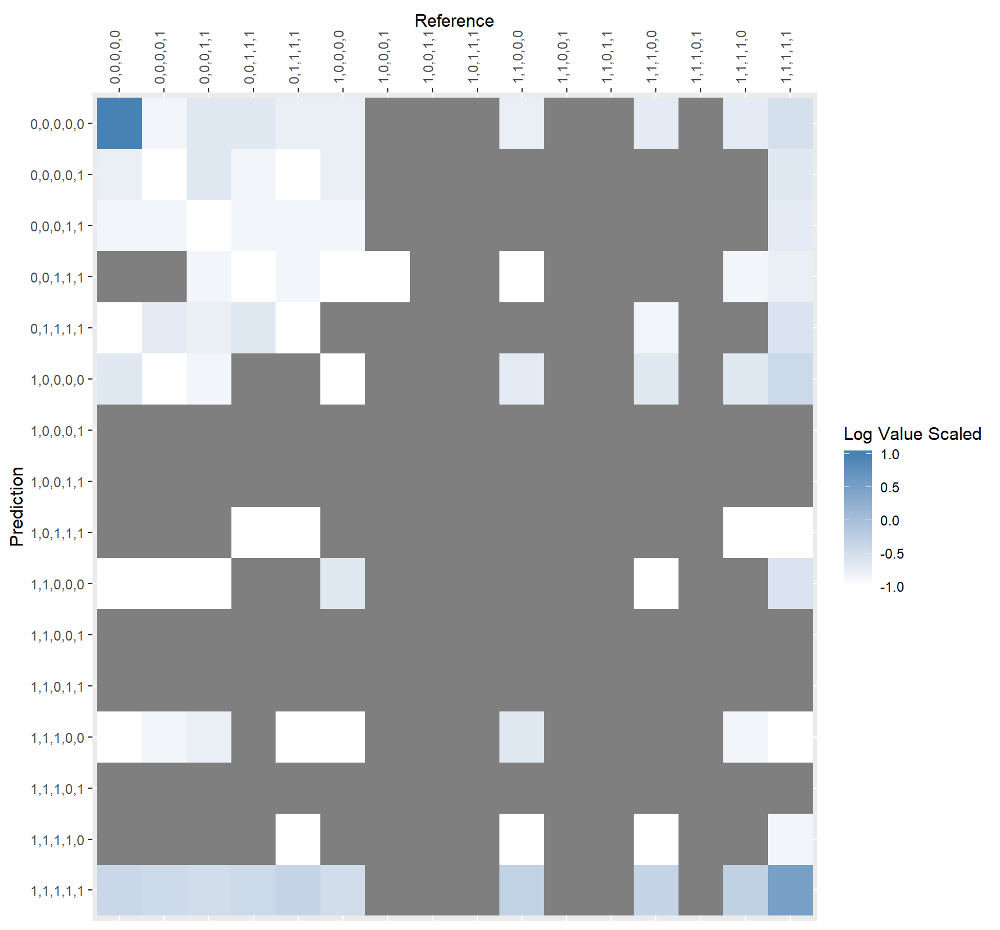

```{r set-options, echo=FALSE, cache=FALSE}
options(width = 400)
```  
***
Use this template to complete your project throughout the course. Your Final Project presentation in class will be based on the contents of this document. Replace the title/name and text below with your own, but leave the headers.

### Overview
Overview. My final project investigates the possibility of predicting amyloid protein formation using readily available, quantitative protein characteristics. The approach I chose utilizes an n-gram solution that attempts to incorporate the "context" of the potential amyloid forming sequences and features alongside the n-gram-level (sub-sequence) features.

### Introduction
Many lives are touched each year by the harmful effects of degenerative neurological disorders. Alzheimers, Chronic Traumatic Encephalopathy (CTE), Parkinson's and Huntington's are some of the more prevalent amyloid-impacted disorders that many of us have heard of. Amyloid proteins aid and abet the process of brain degeneration in these disorders. They come from otherwise normally functioning proteins. When made, they tend to accumulate into plaques, which are nigh untreatable. There exists a vested interest in understanding how and why these proteins form, including from which proteins they arise. A number have been identified and are query-able on a number of public datasets, but it is hard to say if the scientific community have discovered all of the polypeptidic culprits of amyloid-formation and their variations.

To better understand this problem, I engaged with Dr. Moore, Dr. Dunbrack and Dr. Gonzalez. My idea was the least developed when I engaged Dr. Dunbrack - an experienced protein biochemist at the Penn Cancer Institute in North Philly. His experience in the field helped me hone my question and focus on amyloid protein formation prediction. He taught me about protein disorder - which is a characteristic of some proteins that resulted from the need to develop higher functions while avoiding the extreme cost of evolutionary precision. In short, a disordered stretch of protein is a less complex section of poly-peptide that is used to interact with other proteins, resulting in some sort of function. Some think they may play a role in amyloid formation.

Meeting with Dr. Moore was an attempt to better grasp the machine learning strategy I would employ. His suggestion given the broad dataset I was operating with was to utilize a neural net.

Dr. Graciela is a natural language processing expert here at the University of Pennsylvania. She warmed to my project idea quickly, recognizing its similarity to her research group's efforts at classifying obscene language in tweets. You see, human language - especially English - is highly nuanced in its use. In today's culture our language is predicated partly from the past and partly from the quickly evolving communities on the internet. The meaning behind certain turns-of-phrase or slang is hard to keep pace with. What Graciela's group had learned is that quantifying context is extremely difficult in language. To say any phrase is offensive is to say you perfectly understand and can quantify what every preceding and following utterance really means. Luckily for my problem, quantifying the context is less murky. The "words" in my sentences are amino acids - they exist in physical space, follow physical laws and have been very incisively defined in a great deal of physio-chemical detail. I can interrogate my protein by applying any number of quantifying biochemical calculations on any number of arbitrarily sliced sections of polypeptide sequence. There are plenty of engines, predictors and tools out there to aid me in this and I made it a goal to incorporate as many as time and computational limits allowed.

### Methods
In the first paragraph, describe the data used and general methodological approach. Subsequently, incorporate full R code necessary to retrieve and clean data, and perform analysis. Be sure to include a description of code so that others (including your future self) can understand what you are doing and why. 

The work of this project was split into two general parts, ETL and Model Building.

## Extract, Transform, Load (ETL)
Firstly I utilized python extensively to download, format and parse my data into the full training dataset.

My source was firstly the XML formatted records of each protein manually annotated and curated within Uniprot. These files contained the approved sequences and other data on each protein. The second data source I used is the amyloid database at amypro.net, this dataset has the amyloid sequences of every protein found to form amyloid protein, down to the specific amino acids they arise from.

To process the protein sequences I utilized the biopython package to perform a number of calculations on each protein sequence and extract a number of protein-level features. To n-gram each sequence I used the nltk python package to process the protein sequences.

There was some effort in extracting, using NLP, the comments and other features included in the XML other than the protein sequence. These features ended up being difficult to parse, contained little information and were ultimately excluded from the final dataset. Of note is the extensive use of multi-processing. If this technique was not applied I would have to have spent over 15 hours processing my data into the final, training dataset.

Please see jupyter notebooks 06 (ngramming), 08 (protein-feature extraction), 13 (ngram-feature extraction), 14 (ngram-sub-feature extraction) and 15 (building the training set) for code on wrangling and preparing the data for modeling.

In selecting features (see rmd notebook #16 for feature selection code), I performed a number of correlation tests and chi-square tests to determine information redundancy. This identified over 108 numeric relationships and, after careful creation of an elimination algorithm that identified the maximum number of redundant features to eliminate while maintaining a representative feature for all eliminated features, removed 26 numeric features from the feature set.


I produced a handful of visualizations to understand my dataset following prep (see RMD notebook 17 for code). To understand remaining correlative relationships I visualized the correlative graphs of low (>= 0.25), medium (>=0.5) and high (>=0.75) correlations.


## Model Building
When formulating a solution I opted to attempt to predict specific amyloid protein sub-sequences. With the methods I had at my disposal, I opted to frame each potential permutation of amyloid amino acids in my pent-grams as individual classes - turning my problem into a 32 class multi-classification problem. My resulting data well over 11 Million rows and highly imbalanced in terms of class representation - required special consideration for training.

I opted for a strategy that slowly increased the amount of non-amyloid vs amyloid sequences in the training set. This was done to see if I could recognize an increase in performance as I moved toward an increasingly imbalanced dataset.

I ran these sample balances;

Amyloid | Non-Amyloid
--------|------------
1 (5000)|1 (5000)
1 (5000)|3 (15000)
1 (5000)|5 (25000)
1 (5000)|7 (35000)

In terms of model selection and boilerplate training code, I utilized the caret package extensively (see RMD notebook 18 for model training and evaluation code). It came in handy for all steps of training and evaluating my models.

### Results
Given that a model predicting everything as non-amyloid would be correct over 99.5% of the time, the bar was rather high in terms of producing something useful. Following my training, it seemed that adding more non-amyloid sequences tended to improve the classification quality of my model.


The above figure displays the kappa metric in the final training set. Clearly the C5Tree and Nearest Neighbors models performed the best.



The classification matrix is encouraging as well, with a clear link of True-Positive predictions stretching from the upper-left to the bottom-right.

Future work could be applied in fleshing out more features for the data; like "relative" n-gram level features (the n-gram before and following would give a nicer perspective on "trends" in the sequence as we go along), or combinatorial features (kernals etc). The neural net approach which would predict probability of being amyloid would also be an interesting solution to this problem worth trying. This as well as implementing more sophisticated models would surely produce something quite interesting and maybe even useful!

All-in-all I learned a TON doing this project. I learned how to process a lot of data efficiently with multi-processing, how to formulate a reasonable, predictive solution and carry it out in a scientific implementation. 10/10 would slave over this for almost 200 hours again.