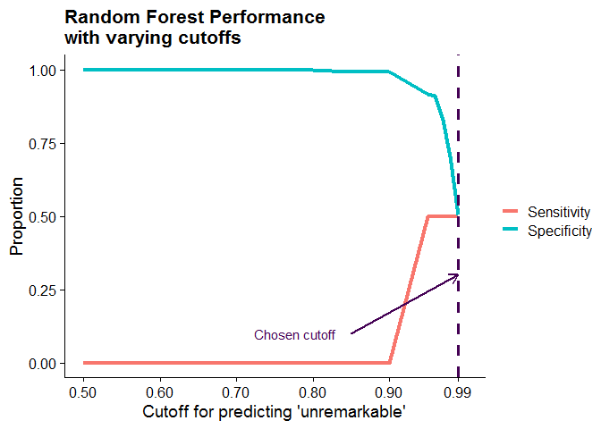

```r
# Only needs to run once
# Renv installs list of packages needed for code
install.packages("renv")
renv::restore()
```


```r
options(width = 400)

#Load required packages
library(tidyverse)
library(gtsummary)
library(randomForest)
library(inTrees)
library(glue)
library(icd)
library(mgcv)
library(gt)
```


```r
# Settings
set.seed(30131138) # Set seed (Number came from "runif(1,0,10^8)")
refresh = F #When true, reads in raw CSV files and processes. When false, loads in already-processed feather files
nobs <- 9999 #num of observations included in dataset (currently set to includeall)
missing_threshold <- 0.05 # level of missingness acceptable for an individual variable
test_to_train <- c(0.8, 0.2) #ratio of data used for training compared to testing
num_randomforest_trees <- 500 # number of randomForest trees

source("load_data.R") #Loads in records from outpatient visits from a folder not included in git repository (would include here but it's literally thousands of lines of code generated by RedCap to properly load and label data)
```
***
Use this template to complete your project throughout the course. Your Final Project presentation will be based on the contents of this document. Replace the title/name above and text below with your own, but keep the headers.

1. Recall that you forked the [Final Project Repo](https://github.com/HimesGroup/BMIN503_Final_Project) and have downloaded it as a project to your local computer. Write the overview and introduction for your final project. The overview consists of 2-3 sentences summarizing the project and goals. For the introduction, the first paragraph describes the problem addressed, its significance, and some background to motivate the problem. In the second paragraph, explain why your problem is interdisciplinary, what fields can contribute to its understanding, and incorporate background related to what you learned from meeting with faculty/staff. Start working on the Methods/Results section, which consists of code and its output along with text describing what you are doing (Note: we will not check your code now, but you should have something in place before Assignment 6 is distributed).


# Overview
`Give a brief a description of your project and its goal(s), what data you are using to complete it, and what three faculty/staff in different fields you have spoken to about your project with a brief summary of what you learned from each person. Include a link to your final project GitHub repository.`

For children visiting the emergency department with a chief complaint of headache of migraine, are there features of their initial clinical presentation that can predict the presence of an intracranial abnormality requiring urgent intervention? As a proof of concept, this study uses a retrospective cohort of children who visited the CHOP neurology outpatient clinic between 2016 and 2020 with the complaint of headache or migraine to predict risk of positive, serious findings seen on imaging.

# Introduction 
`Describe the problem addressed, its significance, and some background to motivate the problem.`
`Explain why your problem is interdisciplinary, what fields can contribute to its understanding, and incorporate background related to what you learned from meeting with faculty/staff.`

Headache is consistently ranked as one of the top 10 chief complaints for an emergency room visit within the United States according to the National Hospital Ambulatory Medical Care Survey [@UnitedStatesDepartmentofHealthHumanServices-NationalCenterforHealthStatistics2019]. In fact, headache was listed as a reason for the visit for over 1.7 million (5% overall) pediatric emergency visits in 2017 [@UnitedStatesDepartmentofHealthHumanServices-NationalCenterforHealthStatistics2019]. Headache can be an alarming but largely nonspecific symptom with a wide range of causes including a disabling but ultimately benign primary headache disorder such as migraine, a secondary but nonconcerning case of influenza, or something more grave such as a brain tumor or subarachnoid hemorrhage. 

Although a neurologist or headache subspecialist may focus on pinpointing a headache's etiology to direct treatment, an emergency room physician's goal is to identify "red flags" or signs of a serious etiology requiring urgent intervention. Still, a symptom's status as a "red flag" can be questionable: changes in vision or sensation can be associated with a stroke or simply be the aura of an incoming migraine. As a result, roughly 18-41% of children with headache end up receiving some form of neuroimaging of which only 4-10% of those imaged will have new abnormal findings seen on imaging [@Cain2018; @Kan2000; @Sheridan2013]. Unnecessary imaging can be costly for both the patient and the healthcare system [@Cain2018; @Irwin2018; @Kan2000; @Young2018]. In addition, exposure to radiation from computed tomography scanning during childhood can greatly increase the risk of later malignancy [@Brenner2001; @Feng2010]. The high rate of children undergoing unnecessary imaging demonstrates a gap in the knowledge base available to emergency medicine physicians. At the same time, physicians need to parse through large amounts of data, attempting to recognize signs for concern in an often complex presentation, while managing a high volume of patients also diverse in their clinical presentations and levels of acuity. 

We propose the use of machine learning methods to explore the high-dimensional space of health data and to find features that are significant to assigning acuity to cases of headache. Due to bottlenecks in the data acquisition process, electronic medical record data from emergency room visits has yet to be acquired. As a result, this paper will use already available medical record data from children visiting the outpatient neurology clinic with the complaint of headache or migraine as a proof of concept. This study aims to use machine learning to 1) select features of the clinical presentation that influence the risk of an abnormal finding on imaging and 2)  simplify the predictive model generated into an algorithm that can be disseminated and shared among emergency room physicians.

# Methods
Describe the data used and general methodological approach. Subsequently, incorporate full R code necessary to retrieve and clean data, and perform analysis. Be sure to include a description of code so that others (including your future self) can understand what you are doing and why. 

## Participants
We conducted a retrospective cohort study consisting of children ages 2-17 seen in the outpatient pediatric neurology clinic between July 2016 and November 2020 with the primary complaint of headache or migraine with no history of serious findings or intracranial abnormality seen on head imaging. Children with a condition predisposing to an intracranial abnormality but no prior documented findings were included in the study. This study took place within a tertiary pediatric hospital system which often receives referrals from nearby healthcare systems for specialized care. This can increase the number of cases with rare and/or serious etiologies compared to another pediatric outpatient setting. 

## Predictors
We used a combination of demographic features (age, sex, race, ethnicity) and clinical features as predictors. Patients and their families completed health questionnaires during their outpatient visit, describing their headache type and severity, associated symptoms, medication use, and past medical and family history. Given the nature of secondary data collection, we expected to encounter records with missing variables. We excluded potential variables from our predictors if their missingness in the dataset exceeded 5%. For variables below this threshold, we imputed missing values based on proximity to other cases using the `rfImpute` function within the *randomForest* package [@AndyLiaw2002].


```r
#Getting catalog of ICD codes using 'icd' package
icd10cm <- get_icd10cm_latest()

# Loading in an excel sheet of groups of ICD codes
# Transforming it to include all ICD codes mentioned (also those in ranges)
# Will use this set to exclude cases in which a serious abnormality was already noted in a patient's past medical history
icd_flags <- readxl::read_xlsx("Additional ICD Codes.xlsx", sheet = "WIP4") %>%
  select(flag = Flag, icd10 = `ICD-10 codes`, code_meaning = `code meaning`) %>%
  filter(!is.na(icd10)) %>%
  separate_rows(icd10, sep = "(\\s)?,(\\s)?") %>%
  mutate(icd10 = str_remove_all(icd10, "\\.")) %>%
  separate(icd10, c("icd10_1", "icd10_2"), sep = "-", fill = "right", remove = FALSE) %>%
  mutate(across(c(icd10_1, icd10_2), ~match(.x, icd10cm$code))) %>%
  rowwise() %>%
  mutate(icdx = ifelse(
    !is.na(icd10_2), list(icd10cm$code[icd10_1:icd10_2]), list(icd10cm$code[icd10_1])
  )) %>%
  unnest(icdx) %>%
  filter(!is.na(icdx))
```


```r
#Start processing of data from redcap database
# Dataset includes copies of variables, one stored as a numeric, the other as a factor then labeled ".factor" at the then
# Want to remove numeric variables where there is already a factor available (prevent variable duplicates from confusing model)
# But I do want to keep binary integer columns and get rid of their factor counterpart

# Select names of columns that end in ".factor" in demographic table
demo_factor_names <- str_subset(names(demo_data),".factor") %>% 
  str_remove(., ".factor") 

# Select names of factors with only two levels
# Can keep binary integer columns instead
ha_factor_names_binary <- ha_data %>% 
  select(matches("^p_.*\\.factor$")) %>%
  select_if(~ nlevels(.) == 2) %>%
  names(.)

# Select names of factors with more than two factors.
# Remove integer column counterparts
ha_factor_names_nonbinary <- ha_data %>% 
  select(matches("^p_.*\\.factor$")) %>%
  select_if(~ nlevels(.) != 2) %>%
  names(.) %>%
  str_remove(., ".factor")

# Select names of columns that end in ".factor" for imaging data
image_factor_names <- str_subset(names(imaging_data),".factor") %>% 
  str_remove(., ".factor")
```


```r
# Select subset of demographic data based on number of observations
# Select patients that completed headache questionnaire
# Clean up columns and remove duplicates (keep factor counterparts)
dt_demo <- demo_data %>%
  filter(between(age, 2,17) & pt_ha_quest_yn  == 1) %>%
  select(-all_of(demo_factor_names)) %>%
  rename_with(~str_remove(.x, ".factor")) %>%
  mutate(gender = fct_recode(gender, Other = "Unknown"),
         race = fct_collapse(race,
           Black = c("Black or African-American"),
           White = c("White"),
           other_level = "Other"
         ))

# Select subset of headache questionnaire data based on number of observations
# Clean up columns and remove duplicates (keep factor counterparts if nonbinary, keep integer counterparts if binary)
dt_ha_data <- ha_data %>%
  filter(record_id %in% unique(dt_demo$record_id) ) %>%
  filter(patient_ha_complete == 2) %>%
  select(-all_of(c("redcap_repeat_instrument", "redcap_repeat_instance"))) %>%
  select(-starts_with("c_")) %>%
  select(-all_of(ha_factor_names_binary)) %>%
  select(-all_of(ha_factor_names_nonbinary)) %>%
  select(record_id, p_age_first_ha:p_assoc_sx_pul_ear___oth, p_prob_preg_birth:p_fam_hist_med___oth, p_ha_in_lifetime.factor:p_preg_full_term.factor) %>%
  select_if(~is.factor(.) | is.numeric(.)) %>%
  rename_with(~str_remove(.x, ".factor"))

# Merge demographic + questionnaire data
# sample by number of observations
dt_demo_ha <- dt_demo %>%
  select(record_id, age, gender, ethnicity, race) %>%
  inner_join(dt_ha_data, by = "record_id") 

# Find cases of serious diagnostic codes given PRIOR to imaging
# Looking at past medical history table for codes that fall under the pre-specified flags
prior_flags <- icd_flags %>%
    filter(flag %in% c("CNS Hemorrhage", "Meningoencephalitis", "Hydrocephalus",
                      "Neoplasm - Malignant CNS", "Neoplasm - Benign CNS",
                      "Other intracranial or spinal malformation", "RCVS/PRES", 
                      "Past neurosurgical procedure", "Stroke, TIA") |
           grepl("G93", icdx) | #Exclude conditions under ICD-10 code: "Other disorders of brain"
           icdx %in% paste0("Q05",0:4) #Exclude ICD codes for spina bifida w/ hydrocephalus
         ) %>%
  mutate(icdx = as.character(icdx)) %>%
  left_join(pmh_data %>% #Find records with past medical history including one of the flagged codes
               filter(record_id %in% dt_demo_ha$record_id) %>% 
               mutate(icdx = str_remove_all(pl_icd10, "\\.")), 
             by = "icdx") %>%
  filter(!is.na(record_id)) #Remove NAs

#Exclude cases w/ prior serious findings from dataset and sample (in this case, all)
dt_demo_ha <- dt_demo_ha %>%
  filter(!record_id %in% prior_flags$record_id) %>%
  slice_sample(n = nobs)
```

## Outcome
We selected outpatient cases in which imaging was performed after the outpatient visit. We classified cases based on the documentation associated with the closest imaging encounter performed after the clinic visit of interest. As some cases had multiple imaging procedures performed during a single encounter, we included subsequent imaging procedures performed on the same day as the initial procedure. Using the *stringr* package [@RStringr], we selected cases in which the radiologist documented urgently contacting the ordering physician and cases in which the radiologist documented imaging as 'unremarkable' or 'normal'. In the former scenario, these cases were labeled as having 'urgent findings' and our primary goal is to correctly classify these cases. In the latter scenario, these cases were as 'unremarkable' and serve as the contrasting set for our predictive model.


```r
# Select subset of imaging data based on number of observations
# Select any imaging done on the first day (trying to exclude prior findings)
# Rough regex searches for key words to flag if impression mentioned a finding
dt_imaging_all <- imaging_data %>%
  filter(record_id %in% unique(dt_demo_ha$record_id)) %>%
  filter(redcap_repeat_instrument == "imaging") %>%
  group_by(record_id) %>%
  filter(img_ord_dt >= visit_dt) %>%
  filter(img_ord_dt == first(img_ord_dt)) %>% 
  mutate(
    impression_lower = str_squish(str_to_lower(img_impression)),
    finding = case_when( # Regular expression search for words indicating radiologist contacted ordering physician
      str_detect(impression_lower, 'discuss') ~ 1,
      str_detect(impression_lower, 'advise') ~ 1,
      str_detect(impression_lower, 'communicate') ~ 1,
      str_detect(impression_lower,
                 regex('112(?!.*false)' )) ~ 1,
      str_detect(impression_lower, 'finding[\\w\\s]{0,3}(?:was|were)[\\s]{0,3}(?:discuss|communica|review|relay|acknowled)') ~ 1,
      str_detect(impression_lower, '\\bemergen') ~ 1,
      str_detect(impression_lower,
                 regex('immediate(?!.*(?:postsurg|post surg|adjacent|subjacent|postoper|prior))' )) ~ 1,
      str_detect(impression_lower, 'phone') ~ 1,
      str_detect(impression_lower, 'email') ~ 1,
      TRUE ~ NA_real_),
    finding = case_when( # Otherwise label when radiologist uses word 'unremarkable' or 'normal' or 'no finding'
      finding == 1 ~ 1,
      is.na(finding) & str_detect(impression_lower,
                                  regex("(?:otherwise|essential).*[\\s,]{0,3}(?:unremarkable|normal)")) ~ 0,
      is.na(finding) & str_detect(impression_lower, "^[\\s\\d\\.]{0,4}(?:unremarkable|normal|stable)") ~ 0,
      is.na(finding) & str_detect(impression_lower, "^[\\s\\d\\.]{0,4}(?:brain mr| brain ct|brain|impression)[^a-z]{0,4}(?:unremarkable|normal)") ~ 0,
      is.na(finding) & str_detect(impression_lower, '\\b(?:no|none)[\\w\\s]{0,30}(?:finding|abnormality|mass|hydrocephalus|infarct|hemo|struct)') ~ 0,
      TRUE ~ NA_real_ #Not sure where it stands? Just label unknown
    )) 

# People can have multiple imaging done the same day. If all are normal, mark as normal. If at least 1 involves contacting physician, mark as serious. Otherwise, NA
dt_imaging <- dt_imaging_all %>%
  summarise(
    finding = case_when(
      any(finding == 1) ~ 1,
      all(finding == 0) ~ 0,
      all(is.na(finding)) ~ NA_real_
    ),
    img_ord_dt = first(img_ord_dt),
    img_impression = first(img_impression),
    .groups = 'drop')
```


```r
# Merge in imaging data
# Mark if patient was imaged based on date of imaging 
# (not all kids imaged had conclusive findings)
dt_all <- dt_demo_ha %>%
  left_join(dt_imaging, by = "record_id") %>%
  mutate(imaging = ifelse(!is.na(img_ord_dt), 1, 0))

# Select names of columns with missingness above a threshold
# Exclude columns from imaging dataset as not all kids were imaged
dt_missing_cols_imaged <- dt_all %>%
  filter(imaging == 1) %>%
  select(-any_of(names(dt_imaging))) %>%
  summarise(across(everything(), ~sum(is.na(.x))/length(.x))) %>%
  pivot_longer(everything(), names_to = "column", values_to = "prop") %>%
  filter(prop >= missing_threshold)

# Exclude variables with missingness above a certain variable
dt <- dt_all %>%
  select(-any_of(dt_missing_cols_imaged$column))

dt_exclude <- demo_data %>% 
  filter(between(age, 2,17)) %>% 
  select(record_id, age) %>% 
  anti_join(dt, by = "record_id")
```


## Statistical Analysis and Model Creation
Data analysis was done using R version 4.0.2 (2020-06-22) [@RCoreTeam2020]. We used the *gtsummary* package to perform descriptive analyses on the demographic characteristics of the dataset [@DanielDSjoberg2020].  We used the *tidyverse* package collection extensively throughout analysis and particularly relied on *ggplot2* for graph creation [@Wickham2019]. For descriptive purposes, data was represented using the median and interquartile ranges for continuous variables and counts and proportions for categorical data.

After descriptive analyses, we divided the dataset into 2 parts for model training (80%) and testing (20%). We used the *randomForest* package based on Leo Breiman's machine learning method [@AndyLiaw2002; @Breiman2001] to create a supervised machine learning model capable of predicting presence of urgent imaging findings based clinical presentation. This method is notable for creating an 'ensemble' set of decision trees based on randomly generated subsets of cases and predictors which classifies cases based on general consensus. We then simplified this ensemble model into a single decision tree using the *inTrees* package [@Deng2014] and compared performance across both ensemble and simplified models. 

# Results


```r
#Table 1 to describe patient characteristics
table_1 <- dt %>%
  mutate(
    finding = factor(case_when( # Label finding variable something meaningful for table 1
      finding == 0 ~ "Unremarkable",
      finding == 1 ~ "Urgent Findings",
      is.na(finding) & imaging == 1 ~ "Non-Urgent Findings",
      is.na(finding) & imaging == 0 ~ "Not imaged"
    ), levels = c("Urgent Findings", "Non-Urgent Findings", "Unremarkable", "Not imaged"))) %>%
  mutate(across(where(is.factor), fct_drop)) %>% # Remove factor levels with no participants (removes empty rows from table)
  select(age, gender, race, ethnicity, finding) %>%
  rename_with(stringr::str_to_title) %>% # Rename columns to title case for prettier table
  tbl_summary(by = Finding) # Show table, split up group by finding variable (now title case)

table_1
```

<!--html_preserve--><style>html {
  font-family: -apple-system, BlinkMacSystemFont, 'Segoe UI', Roboto, Oxygen, Ubuntu, Cantarell, 'Helvetica Neue', 'Fira Sans', 'Droid Sans', Arial, sans-serif;
}

#cqplvybayo .gt_table {
  display: table;
  border-collapse: collapse;
  margin-left: auto;
  margin-right: auto;
  color: #333333;
  font-size: 16px;
  font-weight: normal;
  font-style: normal;
  background-color: #FFFFFF;
  width: auto;
  border-top-style: solid;
  border-top-width: 2px;
  border-top-color: #A8A8A8;
  border-right-style: none;
  border-right-width: 2px;
  border-right-color: #D3D3D3;
  border-bottom-style: solid;
  border-bottom-width: 2px;
  border-bottom-color: #A8A8A8;
  border-left-style: none;
  border-left-width: 2px;
  border-left-color: #D3D3D3;
}

#cqplvybayo .gt_heading {
  background-color: #FFFFFF;
  text-align: center;
  border-bottom-color: #FFFFFF;
  border-left-style: none;
  border-left-width: 1px;
  border-left-color: #D3D3D3;
  border-right-style: none;
  border-right-width: 1px;
  border-right-color: #D3D3D3;
}

#cqplvybayo .gt_title {
  color: #333333;
  font-size: 125%;
  font-weight: initial;
  padding-top: 4px;
  padding-bottom: 4px;
  border-bottom-color: #FFFFFF;
  border-bottom-width: 0;
}

#cqplvybayo .gt_subtitle {
  color: #333333;
  font-size: 85%;
  font-weight: initial;
  padding-top: 0;
  padding-bottom: 4px;
  border-top-color: #FFFFFF;
  border-top-width: 0;
}

#cqplvybayo .gt_bottom_border {
  border-bottom-style: solid;
  border-bottom-width: 2px;
  border-bottom-color: #D3D3D3;
}

#cqplvybayo .gt_col_headings {
  border-top-style: solid;
  border-top-width: 2px;
  border-top-color: #D3D3D3;
  border-bottom-style: solid;
  border-bottom-width: 2px;
  border-bottom-color: #D3D3D3;
  border-left-style: none;
  border-left-width: 1px;
  border-left-color: #D3D3D3;
  border-right-style: none;
  border-right-width: 1px;
  border-right-color: #D3D3D3;
}

#cqplvybayo .gt_col_heading {
  color: #333333;
  background-color: #FFFFFF;
  font-size: 100%;
  font-weight: normal;
  text-transform: inherit;
  border-left-style: none;
  border-left-width: 1px;
  border-left-color: #D3D3D3;
  border-right-style: none;
  border-right-width: 1px;
  border-right-color: #D3D3D3;
  vertical-align: bottom;
  padding-top: 5px;
  padding-bottom: 6px;
  padding-left: 5px;
  padding-right: 5px;
  overflow-x: hidden;
}

#cqplvybayo .gt_column_spanner_outer {
  color: #333333;
  background-color: #FFFFFF;
  font-size: 100%;
  font-weight: normal;
  text-transform: inherit;
  padding-top: 0;
  padding-bottom: 0;
  padding-left: 4px;
  padding-right: 4px;
}

#cqplvybayo .gt_column_spanner_outer:first-child {
  padding-left: 0;
}

#cqplvybayo .gt_column_spanner_outer:last-child {
  padding-right: 0;
}

#cqplvybayo .gt_column_spanner {
  border-bottom-style: solid;
  border-bottom-width: 2px;
  border-bottom-color: #D3D3D3;
  vertical-align: bottom;
  padding-top: 5px;
  padding-bottom: 6px;
  overflow-x: hidden;
  display: inline-block;
  width: 100%;
}

#cqplvybayo .gt_group_heading {
  padding: 8px;
  color: #333333;
  background-color: #FFFFFF;
  font-size: 100%;
  font-weight: initial;
  text-transform: inherit;
  border-top-style: solid;
  border-top-width: 2px;
  border-top-color: #D3D3D3;
  border-bottom-style: solid;
  border-bottom-width: 2px;
  border-bottom-color: #D3D3D3;
  border-left-style: none;
  border-left-width: 1px;
  border-left-color: #D3D3D3;
  border-right-style: none;
  border-right-width: 1px;
  border-right-color: #D3D3D3;
  vertical-align: middle;
}

#cqplvybayo .gt_empty_group_heading {
  padding: 0.5px;
  color: #333333;
  background-color: #FFFFFF;
  font-size: 100%;
  font-weight: initial;
  border-top-style: solid;
  border-top-width: 2px;
  border-top-color: #D3D3D3;
  border-bottom-style: solid;
  border-bottom-width: 2px;
  border-bottom-color: #D3D3D3;
  vertical-align: middle;
}

#cqplvybayo .gt_from_md > :first-child {
  margin-top: 0;
}

#cqplvybayo .gt_from_md > :last-child {
  margin-bottom: 0;
}

#cqplvybayo .gt_row {
  padding-top: 8px;
  padding-bottom: 8px;
  padding-left: 5px;
  padding-right: 5px;
  margin: 10px;
  border-top-style: solid;
  border-top-width: 1px;
  border-top-color: #D3D3D3;
  border-left-style: none;
  border-left-width: 1px;
  border-left-color: #D3D3D3;
  border-right-style: none;
  border-right-width: 1px;
  border-right-color: #D3D3D3;
  vertical-align: middle;
  overflow-x: hidden;
}

#cqplvybayo .gt_stub {
  color: #333333;
  background-color: #FFFFFF;
  font-size: 100%;
  font-weight: initial;
  text-transform: inherit;
  border-right-style: solid;
  border-right-width: 2px;
  border-right-color: #D3D3D3;
  padding-left: 12px;
}

#cqplvybayo .gt_summary_row {
  color: #333333;
  background-color: #FFFFFF;
  text-transform: inherit;
  padding-top: 8px;
  padding-bottom: 8px;
  padding-left: 5px;
  padding-right: 5px;
}

#cqplvybayo .gt_first_summary_row {
  padding-top: 8px;
  padding-bottom: 8px;
  padding-left: 5px;
  padding-right: 5px;
  border-top-style: solid;
  border-top-width: 2px;
  border-top-color: #D3D3D3;
}

#cqplvybayo .gt_grand_summary_row {
  color: #333333;
  background-color: #FFFFFF;
  text-transform: inherit;
  padding-top: 8px;
  padding-bottom: 8px;
  padding-left: 5px;
  padding-right: 5px;
}

#cqplvybayo .gt_first_grand_summary_row {
  padding-top: 8px;
  padding-bottom: 8px;
  padding-left: 5px;
  padding-right: 5px;
  border-top-style: double;
  border-top-width: 6px;
  border-top-color: #D3D3D3;
}

#cqplvybayo .gt_striped {
  background-color: rgba(128, 128, 128, 0.05);
}

#cqplvybayo .gt_table_body {
  border-top-style: solid;
  border-top-width: 2px;
  border-top-color: #D3D3D3;
  border-bottom-style: solid;
  border-bottom-width: 2px;
  border-bottom-color: #D3D3D3;
}

#cqplvybayo .gt_footnotes {
  color: #333333;
  background-color: #FFFFFF;
  border-bottom-style: none;
  border-bottom-width: 2px;
  border-bottom-color: #D3D3D3;
  border-left-style: none;
  border-left-width: 2px;
  border-left-color: #D3D3D3;
  border-right-style: none;
  border-right-width: 2px;
  border-right-color: #D3D3D3;
}

#cqplvybayo .gt_footnote {
  margin: 0px;
  font-size: 90%;
  padding: 4px;
}

#cqplvybayo .gt_sourcenotes {
  color: #333333;
  background-color: #FFFFFF;
  border-bottom-style: none;
  border-bottom-width: 2px;
  border-bottom-color: #D3D3D3;
  border-left-style: none;
  border-left-width: 2px;
  border-left-color: #D3D3D3;
  border-right-style: none;
  border-right-width: 2px;
  border-right-color: #D3D3D3;
}

#cqplvybayo .gt_sourcenote {
  font-size: 90%;
  padding: 4px;
}

#cqplvybayo .gt_left {
  text-align: left;
}

#cqplvybayo .gt_center {
  text-align: center;
}

#cqplvybayo .gt_right {
  text-align: right;
  font-variant-numeric: tabular-nums;
}

#cqplvybayo .gt_font_normal {
  font-weight: normal;
}

#cqplvybayo .gt_font_bold {
  font-weight: bold;
}

#cqplvybayo .gt_font_italic {
  font-style: italic;
}

#cqplvybayo .gt_super {
  font-size: 65%;
}

#cqplvybayo .gt_footnote_marks {
  font-style: italic;
  font-size: 65%;
}
</style>
<div id="cqplvybayo" style="overflow-x:auto;overflow-y:auto;width:auto;height:auto;"><table class="gt_table">
  
  <thead class="gt_col_headings">
    <tr>
      <th class="gt_col_heading gt_columns_bottom_border gt_left" rowspan="1" colspan="1"><strong>Characteristic</strong></th>
      <th class="gt_col_heading gt_columns_bottom_border gt_center" rowspan="1" colspan="1"><strong>Urgent Findings</strong>, N = 13<sup class="gt_footnote_marks">1</sup></th>
      <th class="gt_col_heading gt_columns_bottom_border gt_center" rowspan="1" colspan="1"><strong>Non-Urgent Findings</strong>, N = 174<sup class="gt_footnote_marks">1</sup></th>
      <th class="gt_col_heading gt_columns_bottom_border gt_center" rowspan="1" colspan="1"><strong>Unremarkable</strong>, N = 726<sup class="gt_footnote_marks">1</sup></th>
      <th class="gt_col_heading gt_columns_bottom_border gt_center" rowspan="1" colspan="1"><strong>Not imaged</strong>, N = 3,775<sup class="gt_footnote_marks">1</sup></th>
    </tr>
  </thead>
  <tbody class="gt_table_body">
    <tr>
      <td class="gt_row gt_left">Age</td>
      <td class="gt_row gt_center">12.0 (9.0, 14.1)</td>
      <td class="gt_row gt_center">13.1 (9.8, 15.1)</td>
      <td class="gt_row gt_center">12.6 (8.2, 15.0)</td>
      <td class="gt_row gt_center">12.7 (9.6, 15.0)</td>
    </tr>
    <tr>
      <td class="gt_row gt_left">Gender</td>
      <td class="gt_row gt_center"></td>
      <td class="gt_row gt_center"></td>
      <td class="gt_row gt_center"></td>
      <td class="gt_row gt_center"></td>
    </tr>
    <tr>
      <td class="gt_row gt_left" style="text-align: left; text-indent: 10px;">Female</td>
      <td class="gt_row gt_center">8 (62%)</td>
      <td class="gt_row gt_center">112 (64%)</td>
      <td class="gt_row gt_center">474 (65%)</td>
      <td class="gt_row gt_center">2,289 (61%)</td>
    </tr>
    <tr>
      <td class="gt_row gt_left" style="text-align: left; text-indent: 10px;">Male</td>
      <td class="gt_row gt_center">5 (38%)</td>
      <td class="gt_row gt_center">62 (36%)</td>
      <td class="gt_row gt_center">252 (35%)</td>
      <td class="gt_row gt_center">1,486 (39%)</td>
    </tr>
    <tr>
      <td class="gt_row gt_left">Race</td>
      <td class="gt_row gt_center"></td>
      <td class="gt_row gt_center"></td>
      <td class="gt_row gt_center"></td>
      <td class="gt_row gt_center"></td>
    </tr>
    <tr>
      <td class="gt_row gt_left" style="text-align: left; text-indent: 10px;">Black</td>
      <td class="gt_row gt_center">3 (23%)</td>
      <td class="gt_row gt_center">20 (11%)</td>
      <td class="gt_row gt_center">115 (16%)</td>
      <td class="gt_row gt_center">547 (14%)</td>
    </tr>
    <tr>
      <td class="gt_row gt_left" style="text-align: left; text-indent: 10px;">White</td>
      <td class="gt_row gt_center">10 (77%)</td>
      <td class="gt_row gt_center">122 (70%)</td>
      <td class="gt_row gt_center">480 (66%)</td>
      <td class="gt_row gt_center">2,538 (67%)</td>
    </tr>
    <tr>
      <td class="gt_row gt_left" style="text-align: left; text-indent: 10px;">Other</td>
      <td class="gt_row gt_center">0 (0%)</td>
      <td class="gt_row gt_center">32 (18%)</td>
      <td class="gt_row gt_center">131 (18%)</td>
      <td class="gt_row gt_center">690 (18%)</td>
    </tr>
    <tr>
      <td class="gt_row gt_left">Ethnicity</td>
      <td class="gt_row gt_center"></td>
      <td class="gt_row gt_center"></td>
      <td class="gt_row gt_center"></td>
      <td class="gt_row gt_center"></td>
    </tr>
    <tr>
      <td class="gt_row gt_left" style="text-align: left; text-indent: 10px;">Hispanic or Latino</td>
      <td class="gt_row gt_center">0 (0%)</td>
      <td class="gt_row gt_center">12 (6.9%)</td>
      <td class="gt_row gt_center">63 (8.7%)</td>
      <td class="gt_row gt_center">284 (7.5%)</td>
    </tr>
    <tr>
      <td class="gt_row gt_left" style="text-align: left; text-indent: 10px;">Not Hispanic or Latino</td>
      <td class="gt_row gt_center">13 (100%)</td>
      <td class="gt_row gt_center">154 (89%)</td>
      <td class="gt_row gt_center">650 (90%)</td>
      <td class="gt_row gt_center">3,411 (90%)</td>
    </tr>
    <tr>
      <td class="gt_row gt_left" style="text-align: left; text-indent: 10px;">Dont know</td>
      <td class="gt_row gt_center">0 (0%)</td>
      <td class="gt_row gt_center">0 (0%)</td>
      <td class="gt_row gt_center">0 (0%)</td>
      <td class="gt_row gt_center">1 (&lt;0.1%)</td>
    </tr>
    <tr>
      <td class="gt_row gt_left" style="text-align: left; text-indent: 10px;">Prefer not to answer</td>
      <td class="gt_row gt_center">0 (0%)</td>
      <td class="gt_row gt_center">8 (4.6%)</td>
      <td class="gt_row gt_center">13 (1.8%)</td>
      <td class="gt_row gt_center">79 (2.1%)</td>
    </tr>
  </tbody>
  
  <tfoot>
    <tr class="gt_footnotes">
      <td colspan="5">
        <p class="gt_footnote">
          <sup class="gt_footnote_marks">
            <em>1</em>
          </sup>
           
          Statistics presented: Median (IQR); n (%)
          <br />
        </p>
      </td>
    </tr>
  </tfoot>
</table></div><!--/html_preserve-->


We found a total of 5636 records from children ages 2 to 18 years who visited the outpatient neurology clinic with a complaint of headache or migraine and. After excluding 948 children who did not completed the headache questionnaire (median age = 12.5 yo, IQR: 9.5-15), we had a remaining 4688children (median age = 12.7 yo, IQR: 9.5-15) of which 3775 children (81%) had undergone imaging (see table above). For the sake of simplification, we selected 726 cases in which the radiology note describes unremarkable imaging compared to 13 cases in which the note describes the radiologist reaching out to the ordering physician to relay findings in an urgent manner. A remaining 174 cases lacked a description of the radiologist reaching out to the ordering physician and often had findings that did not warrant urgent intervention such as anatomic variants. 


Given the nature of imaging done on an outpatient basis, few cases warranted urgent delivery of findings and we expect to have a greater proportion of urgent cases in the impending emergency medicine dataset from which the predictive model will have more data to examine for trends.


```r
# Select variables not to include in machine learning 
# That includes removing variables related to imaging table
trim_vars <- dt %>%
  select(record_id, img_ord_dt:imaging) %>%
  names(.) 

# Remove kids not imaged or kids with nonurgent findings
# Transform outcome variable into a factor (makes predictions cleaner)
dt_findings <- dt %>% 
  filter(imaging == 1 & !is.na(finding)) %>%
  mutate(finding = factor(finding)) %>%
  select(-all_of(trim_vars))

# Impute  missing data
# Remember variables with > 5% missingness were already removed
dt_findings_impute <- rfImpute(finding ~ ., data = dt_findings)
```

```
## ntree      OOB      1      2
##   300:   1.76%  0.00%100.00%
## ntree      OOB      1      2
##   300:   1.76%  0.00%100.00%
## ntree      OOB      1      2
##   300:   1.76%  0.00%100.00%
## ntree      OOB      1      2
##   300:   1.76%  0.00%100.00%
## ntree      OOB      1      2
##   300:   1.76%  0.00%100.00%
```

```r
# Create random assignments for test and training datasets
# Make sure both classes are evenly distributed
dt_assignments <- caret::createDataPartition(
  dt_findings_impute$finding, p = test_to_train[[1]], 
  list = FALSE, times = 1)

# Training data
dt_train <- dt_findings_impute[dt_assignments,]

# Testing data
dt_test <- dt_findings_impute[-dt_assignments,]


#Select predictor variables 
dt_predictors <- dt_train %>% select(-finding)
```


```r
# Create list of cutoff variables to try
pred_normal_cutoff_seq <- c(seq(0.5,0.95, 0.05), seq(0.96,0.99, 0.01))

# Map through each proposed cutoff
cutoff_performance <- pred_normal_cutoff_seq %>%
  map_df(function(curr_cutoff){
    
    outcome_cols <- c(TP = 0, FN = 0, FP = 0, TN = 0) #Note groups for confusion matric

    curr_rf <- randomForest( # run RandomForst with specified cutoff
      x = dt_predictors, y = dt_train$finding, ntree = num_randomforest_trees,
      importance = TRUE, cutoff = c(curr_cutoff, 1-curr_cutoff), nodesize = 3
    )
    
    curr_pred <-  predict(curr_rf, dt_test, type = "response") # Predict values based on current randomForest model
    
    curr_perform <- tibble(cutoff = curr_cutoff, # Create tibble counting true/false positives/negatives, w/ calculated sensitivity + specificity
                           model = list(curr_rf), #Include the model too (won't have to calculate again for chosen cutoff)
                           true = dt_test$finding, 
                           pred = curr_pred) %>%
      count(cutoff, model, true, pred) %>%
  mutate(outcome = case_when(
    true == 1 & pred == 1 ~ "TP",
    true == 1 & pred == 0 ~ "FN",
    true == 0 & pred == 0 ~ "TN",
    true == 0 & pred == 1 ~ "FP"
  )) %>% 
  pivot_wider(id_cols = c(cutoff, model), names_from = outcome, 
              values_from = n, values_fill = 0) %>%
  add_column(!!!outcome_cols[!names(outcome_cols) %in% names(.)]) %>%
  mutate(Sensitivity = TP/(TP+FN),
         Specificity = TN/(TN+FP)) 
    
    curr_perform #Output tibble. Map_df function will bind them all together into a larger table
  })

rf_normal_cutoff <- 0.99 # Based on values. Chose this cutoff and will plot vertical line on chart

cutoff_plot_df <- cutoff_performance %>%
  select(cutoff, Sensitivity, Specificity) %>% # Only want sensitivity + specificity for chart
  pivot_longer(-cutoff, names_to = "measure", values_to = "score") # Lengthen for geom_line (can group and color multiple lines)
  
cutoff_plot <- cutoff_plot_df %>%
  ggplot(aes(x = cutoff, y = score, group = measure, color = measure)) + #Plot sens + spec lines across cutoffs. Measures have different colours
  geom_line(size = 1.5) +
  geom_vline(xintercept = rf_normal_cutoff, colour = "#440154FF", linetype = "dashed", size = 1.2) + # Add vertical line at chosen cutoff for emphasis
  annotate( # Add arrow at chosen cutoff for emphasis
    geom = "segment", x = 0.85, y = 0.1, xend = rf_normal_cutoff, yend = 0.3, 
    colour = "#440154FF", size = 1, arrow = arrow(length = unit(3, "mm"))
  ) +
  annotate(geom = "text", x = 0.83, y = 0.1, label = "Chosen cutoff", hjust = "right", colour = "#440154FF") + # Annotate location of cutoff
  scale_y_continuous(name = "Proportion", limits = c(0,1), breaks = seq(0,1,0.25)) + #scale and label axes
  scale_x_continuous(name = "Cutoff for predicting 'unremarkable'", limits = c(0.5, 1), breaks = c(seq(0.5, 0.9, 0.1), 0.99)) +
  ggtitle("Random Forest Performance\nwith varying cutoffs") +
  cowplot::theme_half_open() + # Add theme
  theme(legend.title = element_blank()) # Remove legend title (not useful)

cutoff_plot
```

<!-- -->


After imputation, we chose a cutoff of at least 99% agreement between decision trees needed for the predictive model could label a case as 'unremarkable'. However this chosen cutoff had moderate sensitivity with poor specificity. In clinical practice, emergency room physicians often operate at a low threshold of suspicion for possible grave etiologies. Conversely, that means a physician must be very confident before they exclude a possible serious condition. At default, cutoffs are set at the inverse of the number of possible labels, in this case, a cutoff of 50% between the two labels of 'unremarkable' and 'serious'. Increasing the cutoff to higher levels would more closely mimic the high suspicion seen in clinical practice, however, the model appears to perform poorly with no apparent threshold that carries both high sensitivity and specificity.


```r
# Select model at chosen cutoff
dt_randomForest <- filter(cutoff_performance, cutoff == rf_normal_cutoff)$model[[1]]

# Variables normally have short ugly names
# Grab variable labels from raw dataset and insert for meaning
ha_var_labels <- as_tibble(sjlabelled::get_label(ha_data), rownames = "var_name") %>%
  rename(var_mean = value)

# Create a table of variables ranked as important based on
# Loss in accuracy or loss in Gini index
rf_importance <- as_tibble(dt_randomForest$importance, rownames = "var_name") %>% # Get importance table from RF model
  select(var_name, starts_with("Mean")) %>%
  mutate(MeanDecreaseAccuracy_Rank = row_number(desc(MeanDecreaseAccuracy)), #Get ranking for variables based on accuracy or gini index
         MeanDecreaseGini_Rank = row_number(desc(MeanDecreaseGini))) %>%
  filter(MeanDecreaseAccuracy_Rank <= 10 | # Only keep variables ranked as top ten most important by either measure
           MeanDecreaseGini_Rank <= 10) %>%
  left_join(ha_var_labels, by = "var_name") %>% # Add in variable labels for readability
  mutate( # Some regular expression formatting to clean up variable labels
    `Variable Name` = case_when(
      !is.na(var_mean) ~ var_mean,
      TRUE ~ str_to_sentence(var_name)),
    `Variable Name` = str_replace(`Variable Name`, "PT", "Physical therapy" ),
    `Variable Name` = str_replace(`Variable Name`, "Ng-", "NG-" ),
    `Variable Name` = gsub("=(\\w)(\\w*)","=\\U\\1\\L\\2",`Variable Name`,perl=TRUE)
  ) %>%
  select(-var_name, -var_mean) %>% # Repeating pivotting to get table format I want
  pivot_longer(cols = c(MeanDecreaseAccuracy, MeanDecreaseGini), names_to = "MeanDecrease", values_to = "score") %>%
  pivot_longer(cols = c(MeanDecreaseAccuracy_Rank, MeanDecreaseGini_Rank), names_to = "rank_label", values_to = "rank") %>%
  mutate(label = case_when(
    MeanDecrease == "MeanDecreaseAccuracy" & rank_label == "MeanDecreaseAccuracy_Rank" ~ "Accuracy",
     MeanDecrease == "MeanDecreaseGini" & rank_label == "MeanDecreaseGini_Rank" ~ "Gini",
    TRUE ~ NA_character_
  )) %>%
  filter(!is.na(label) & rank <= 10) %>% # Some variables could be #5 in accuracy and #55 in gini index. Remove the #55 gini ranking and only keep #5 accuracy ranking so table only has 10 rows in total
  select(-MeanDecrease, -rank_label) %>%
  pivot_wider(id_cols = rank, names_from = label, #Final pivot. Names formatted for a column spanner to be seen in gt
              names_glue = "{label}.{str_to_title(.value)}",
              values_from = c(`Variable Name`, score)) %>% 
  arrange(rank) %>% #Finally arrange by rank
  select(Rank = rank, `Accuracy.Variable Name`, Accuracy.Score, `Gini.Variable Name`, Gini.Score) 

rf_importance %>% # Display table as gt table
  gt() %>%
  tab_spanner_delim(delim = ".") %>% # Add column spanner. For instance "Petal.Length" and "Petal.Width" would become columns "Length" and "Width" spanned by "Petal" above
  fmt_scientific( # Super small numbers in accuracy get scientific notation
    columns = vars(Accuracy.Score),
    decimals = 1
  ) %>%
  fmt_number( # Numbers in Gini get rounded to 2 decimal places
    columns = vars(Gini.Score),
    decimals = 2
  )
```

<!--html_preserve--><style>html {
  font-family: -apple-system, BlinkMacSystemFont, 'Segoe UI', Roboto, Oxygen, Ubuntu, Cantarell, 'Helvetica Neue', 'Fira Sans', 'Droid Sans', Arial, sans-serif;
}

#thpdoqolnt .gt_table {
  display: table;
  border-collapse: collapse;
  margin-left: auto;
  margin-right: auto;
  color: #333333;
  font-size: 16px;
  font-weight: normal;
  font-style: normal;
  background-color: #FFFFFF;
  width: auto;
  border-top-style: solid;
  border-top-width: 2px;
  border-top-color: #A8A8A8;
  border-right-style: none;
  border-right-width: 2px;
  border-right-color: #D3D3D3;
  border-bottom-style: solid;
  border-bottom-width: 2px;
  border-bottom-color: #A8A8A8;
  border-left-style: none;
  border-left-width: 2px;
  border-left-color: #D3D3D3;
}

#thpdoqolnt .gt_heading {
  background-color: #FFFFFF;
  text-align: center;
  border-bottom-color: #FFFFFF;
  border-left-style: none;
  border-left-width: 1px;
  border-left-color: #D3D3D3;
  border-right-style: none;
  border-right-width: 1px;
  border-right-color: #D3D3D3;
}

#thpdoqolnt .gt_title {
  color: #333333;
  font-size: 125%;
  font-weight: initial;
  padding-top: 4px;
  padding-bottom: 4px;
  border-bottom-color: #FFFFFF;
  border-bottom-width: 0;
}

#thpdoqolnt .gt_subtitle {
  color: #333333;
  font-size: 85%;
  font-weight: initial;
  padding-top: 0;
  padding-bottom: 4px;
  border-top-color: #FFFFFF;
  border-top-width: 0;
}

#thpdoqolnt .gt_bottom_border {
  border-bottom-style: solid;
  border-bottom-width: 2px;
  border-bottom-color: #D3D3D3;
}

#thpdoqolnt .gt_col_headings {
  border-top-style: solid;
  border-top-width: 2px;
  border-top-color: #D3D3D3;
  border-bottom-style: solid;
  border-bottom-width: 2px;
  border-bottom-color: #D3D3D3;
  border-left-style: none;
  border-left-width: 1px;
  border-left-color: #D3D3D3;
  border-right-style: none;
  border-right-width: 1px;
  border-right-color: #D3D3D3;
}

#thpdoqolnt .gt_col_heading {
  color: #333333;
  background-color: #FFFFFF;
  font-size: 100%;
  font-weight: normal;
  text-transform: inherit;
  border-left-style: none;
  border-left-width: 1px;
  border-left-color: #D3D3D3;
  border-right-style: none;
  border-right-width: 1px;
  border-right-color: #D3D3D3;
  vertical-align: bottom;
  padding-top: 5px;
  padding-bottom: 6px;
  padding-left: 5px;
  padding-right: 5px;
  overflow-x: hidden;
}

#thpdoqolnt .gt_column_spanner_outer {
  color: #333333;
  background-color: #FFFFFF;
  font-size: 100%;
  font-weight: normal;
  text-transform: inherit;
  padding-top: 0;
  padding-bottom: 0;
  padding-left: 4px;
  padding-right: 4px;
}

#thpdoqolnt .gt_column_spanner_outer:first-child {
  padding-left: 0;
}

#thpdoqolnt .gt_column_spanner_outer:last-child {
  padding-right: 0;
}

#thpdoqolnt .gt_column_spanner {
  border-bottom-style: solid;
  border-bottom-width: 2px;
  border-bottom-color: #D3D3D3;
  vertical-align: bottom;
  padding-top: 5px;
  padding-bottom: 6px;
  overflow-x: hidden;
  display: inline-block;
  width: 100%;
}

#thpdoqolnt .gt_group_heading {
  padding: 8px;
  color: #333333;
  background-color: #FFFFFF;
  font-size: 100%;
  font-weight: initial;
  text-transform: inherit;
  border-top-style: solid;
  border-top-width: 2px;
  border-top-color: #D3D3D3;
  border-bottom-style: solid;
  border-bottom-width: 2px;
  border-bottom-color: #D3D3D3;
  border-left-style: none;
  border-left-width: 1px;
  border-left-color: #D3D3D3;
  border-right-style: none;
  border-right-width: 1px;
  border-right-color: #D3D3D3;
  vertical-align: middle;
}

#thpdoqolnt .gt_empty_group_heading {
  padding: 0.5px;
  color: #333333;
  background-color: #FFFFFF;
  font-size: 100%;
  font-weight: initial;
  border-top-style: solid;
  border-top-width: 2px;
  border-top-color: #D3D3D3;
  border-bottom-style: solid;
  border-bottom-width: 2px;
  border-bottom-color: #D3D3D3;
  vertical-align: middle;
}

#thpdoqolnt .gt_from_md > :first-child {
  margin-top: 0;
}

#thpdoqolnt .gt_from_md > :last-child {
  margin-bottom: 0;
}

#thpdoqolnt .gt_row {
  padding-top: 8px;
  padding-bottom: 8px;
  padding-left: 5px;
  padding-right: 5px;
  margin: 10px;
  border-top-style: solid;
  border-top-width: 1px;
  border-top-color: #D3D3D3;
  border-left-style: none;
  border-left-width: 1px;
  border-left-color: #D3D3D3;
  border-right-style: none;
  border-right-width: 1px;
  border-right-color: #D3D3D3;
  vertical-align: middle;
  overflow-x: hidden;
}

#thpdoqolnt .gt_stub {
  color: #333333;
  background-color: #FFFFFF;
  font-size: 100%;
  font-weight: initial;
  text-transform: inherit;
  border-right-style: solid;
  border-right-width: 2px;
  border-right-color: #D3D3D3;
  padding-left: 12px;
}

#thpdoqolnt .gt_summary_row {
  color: #333333;
  background-color: #FFFFFF;
  text-transform: inherit;
  padding-top: 8px;
  padding-bottom: 8px;
  padding-left: 5px;
  padding-right: 5px;
}

#thpdoqolnt .gt_first_summary_row {
  padding-top: 8px;
  padding-bottom: 8px;
  padding-left: 5px;
  padding-right: 5px;
  border-top-style: solid;
  border-top-width: 2px;
  border-top-color: #D3D3D3;
}

#thpdoqolnt .gt_grand_summary_row {
  color: #333333;
  background-color: #FFFFFF;
  text-transform: inherit;
  padding-top: 8px;
  padding-bottom: 8px;
  padding-left: 5px;
  padding-right: 5px;
}

#thpdoqolnt .gt_first_grand_summary_row {
  padding-top: 8px;
  padding-bottom: 8px;
  padding-left: 5px;
  padding-right: 5px;
  border-top-style: double;
  border-top-width: 6px;
  border-top-color: #D3D3D3;
}

#thpdoqolnt .gt_striped {
  background-color: rgba(128, 128, 128, 0.05);
}

#thpdoqolnt .gt_table_body {
  border-top-style: solid;
  border-top-width: 2px;
  border-top-color: #D3D3D3;
  border-bottom-style: solid;
  border-bottom-width: 2px;
  border-bottom-color: #D3D3D3;
}

#thpdoqolnt .gt_footnotes {
  color: #333333;
  background-color: #FFFFFF;
  border-bottom-style: none;
  border-bottom-width: 2px;
  border-bottom-color: #D3D3D3;
  border-left-style: none;
  border-left-width: 2px;
  border-left-color: #D3D3D3;
  border-right-style: none;
  border-right-width: 2px;
  border-right-color: #D3D3D3;
}

#thpdoqolnt .gt_footnote {
  margin: 0px;
  font-size: 90%;
  padding: 4px;
}

#thpdoqolnt .gt_sourcenotes {
  color: #333333;
  background-color: #FFFFFF;
  border-bottom-style: none;
  border-bottom-width: 2px;
  border-bottom-color: #D3D3D3;
  border-left-style: none;
  border-left-width: 2px;
  border-left-color: #D3D3D3;
  border-right-style: none;
  border-right-width: 2px;
  border-right-color: #D3D3D3;
}

#thpdoqolnt .gt_sourcenote {
  font-size: 90%;
  padding: 4px;
}

#thpdoqolnt .gt_left {
  text-align: left;
}

#thpdoqolnt .gt_center {
  text-align: center;
}

#thpdoqolnt .gt_right {
  text-align: right;
  font-variant-numeric: tabular-nums;
}

#thpdoqolnt .gt_font_normal {
  font-weight: normal;
}

#thpdoqolnt .gt_font_bold {
  font-weight: bold;
}

#thpdoqolnt .gt_font_italic {
  font-style: italic;
}

#thpdoqolnt .gt_super {
  font-size: 65%;
}

#thpdoqolnt .gt_footnote_marks {
  font-style: italic;
  font-size: 65%;
}
</style>
<div id="thpdoqolnt" style="overflow-x:auto;overflow-y:auto;width:auto;height:auto;"><table class="gt_table">
  
  <thead class="gt_col_headings">
    <tr>
      <th class="gt_col_heading gt_center gt_columns_bottom_border" rowspan="2" colspan="1">Rank</th>
      <th class="gt_center gt_columns_top_border gt_column_spanner_outer" rowspan="1" colspan="2">
        <span class="gt_column_spanner">Accuracy</span>
      </th>
      <th class="gt_center gt_columns_top_border gt_column_spanner_outer" rowspan="1" colspan="2">
        <span class="gt_column_spanner">Gini</span>
      </th>
    </tr>
    <tr>
      <th class="gt_col_heading gt_columns_bottom_border gt_center" rowspan="1" colspan="1">Variable Name</th>
      <th class="gt_col_heading gt_columns_bottom_border gt_center" rowspan="1" colspan="1">Score</th>
      <th class="gt_col_heading gt_columns_bottom_border gt_center" rowspan="1" colspan="1">Variable Name</th>
      <th class="gt_col_heading gt_columns_bottom_border gt_center" rowspan="1" colspan="1">Score</th>
    </tr>
  </thead>
  <tbody class="gt_table_body">
    <tr>
      <td class="gt_row gt_center">1</td>
      <td class="gt_row gt_left">Are there triggers that bring on headaches or make them worse? (choice=None)</td>
      <td class="gt_row gt_right">5.5 &times; 10<sup class='gt_super'>&minus;4</sup></td>
      <td class="gt_row gt_left">Age</td>
      <td class="gt_row gt_right">0.59</td>
    </tr>
    <tr>
      <td class="gt_row gt_center">2</td>
      <td class="gt_row gt_left">How old were you when you had your first headache?   We are asking about any headaches, not just the bad or recent ones.</td>
      <td class="gt_row gt_right">3.5 &times; 10<sup class='gt_super'>&minus;4</sup></td>
      <td class="gt_row gt_left">How old were you when you had your first headache?   We are asking about any headaches, not just the bad or recent ones.</td>
      <td class="gt_row gt_right">0.39</td>
    </tr>
    <tr>
      <td class="gt_row gt_center">3</td>
      <td class="gt_row gt_left">Sleep: (choice=Drowsy in daytime)</td>
      <td class="gt_row gt_right">2.6 &times; 10<sup class='gt_super'>&minus;4</sup></td>
      <td class="gt_row gt_left">Where on your head do you feel pain? (choice=Unable to describe)</td>
      <td class="gt_row gt_right">0.34</td>
    </tr>
    <tr>
      <td class="gt_row gt_center">4</td>
      <td class="gt_row gt_left">Age</td>
      <td class="gt_row gt_right">2.6 &times; 10<sup class='gt_super'>&minus;4</sup></td>
      <td class="gt_row gt_left">What was the age of the patients MOTHER at delivery?</td>
      <td class="gt_row gt_right">0.26</td>
    </tr>
    <tr>
      <td class="gt_row gt_center">5</td>
      <td class="gt_row gt_left">Ear, Nose, Throat: (choice=None)</td>
      <td class="gt_row gt_right">2.5 &times; 10<sup class='gt_super'>&minus;4</sup></td>
      <td class="gt_row gt_left">Do you currently receive any intervention therapies? (choice=Physical therapy)</td>
      <td class="gt_row gt_right">0.25</td>
    </tr>
    <tr>
      <td class="gt_row gt_center">6</td>
      <td class="gt_row gt_left">Musculoskeletal: (choice=None)</td>
      <td class="gt_row gt_right">2.3 &times; 10<sup class='gt_super'>&minus;4</sup></td>
      <td class="gt_row gt_left">Are there triggers that bring on headaches or make them worse? (choice=Other)</td>
      <td class="gt_row gt_right">0.23</td>
    </tr>
    <tr>
      <td class="gt_row gt_center">7</td>
      <td class="gt_row gt_left">Sleep: (choice=None)</td>
      <td class="gt_row gt_right">2.1 &times; 10<sup class='gt_super'>&minus;4</sup></td>
      <td class="gt_row gt_left">Do you experience any of these symptoms on ONE SIDE of your body? (choice=Forehead and facial flushing)</td>
      <td class="gt_row gt_right">0.22</td>
    </tr>
    <tr>
      <td class="gt_row gt_center">8</td>
      <td class="gt_row gt_left">Other symptoms: (choice=Sensitivity to sounds)</td>
      <td class="gt_row gt_right">2.0 &times; 10<sup class='gt_super'>&minus;4</sup></td>
      <td class="gt_row gt_left">Does anyone in the patients family have these medical problems? (choice=Early deaths (children &amp; young adults))</td>
      <td class="gt_row gt_right">0.22</td>
    </tr>
    <tr>
      <td class="gt_row gt_center">9</td>
      <td class="gt_row gt_left">Do any of these make headaches much worse?  (choice=Standing up)</td>
      <td class="gt_row gt_right">2.0 &times; 10<sup class='gt_super'>&minus;4</sup></td>
      <td class="gt_row gt_left">Musculoskeletal: (choice=None)</td>
      <td class="gt_row gt_right">0.21</td>
    </tr>
    <tr>
      <td class="gt_row gt_center">10</td>
      <td class="gt_row gt_left">Stomach changes: (choice=Vomiting)</td>
      <td class="gt_row gt_right">1.9 &times; 10<sup class='gt_super'>&minus;4</sup></td>
      <td class="gt_row gt_left">The arrow in the image above shows the time that your headaches started. Did anything happen around the time your headaches started? (choice=Other injury)</td>
      <td class="gt_row gt_right">0.21</td>
    </tr>
  </tbody>
  
  
</table></div><!--/html_preserve-->


Variables ranked as important to the predictive model appeared to follow some themes. Among the 20 most important variables according to mean decrease in accuracy or Gini index upon removal, patient age, sleep symptoms, history of speech or physical therapy, family history, and headache triggers appeared to be informative. However, given the poor performance of the model, it is hard to assess the true importance of these aspects.


```r
# Finally take the chosen RF model and predict using test data
dt_randomForest_pred <- dt_test %>%
  predict(dt_randomForest, ., type = "response")

# Set of steps here to condense RF model into a single decision tree
treeList_randomForest <- RF2List(dt_randomForest) # Convert into a list of trees
ruleExec_randomForest <- extractRules(treeList_randomForest, X = dt_predictors, digits = 2) #Pull out rules from the list of trees

ruleMetric <- getRuleMetric(ruleExec_randomForest, X = dt_predictors, target = dt_train$finding) %>% # Takes rules, predictors and outomes and measures performance
  pruneRule(., X = dt_predictors, target = dt_train$finding, maxDecay = 0.2) # Remove variable-value pairs from rules

learner_randomForest <- buildLearner(ruleMetric, X = dt_predictors, target = dt_train$finding, minFreq = 0.05) # Finally make a simplified single decision tree


confusion_to_gt <- function(x, xtitle) { # Function that takes predicted values, compares to actual values, and creates a 2x2 confusion table in gt that is prettier
  as_tibble(x$table) %>%
    pivot_wider(names_from = `True Outcome`, values_from = n) %>%
    mutate(across(everything(), as.character)) %>%
    add_row(
      Prediction = "",
      Finding = glue("Sensitivity: {scales::percent(x$byClass['Sensitivity'])}"),
      `No Finding` = glue("Specificity: {scales::percent(x$byClass['Specificity'])}")) %>%
    gt(rowname_col = "Prediction") %>%
    tab_spanner(
      label = "True Outcome",
      columns = vars(`Finding`, `No Finding`)) %>%
    tab_stubhead(label = "Prediction") %>%
    tab_header(title = xtitle) 
}

# Confusion matrix for ensemble model
confusionMatrix_ensemble <- caret::confusionMatrix( 
    data = factor(dt_randomForest_pred, 
                  levels = 1:0, labels = c("Finding", "No Finding")),
    reference = factor(dt_test$finding, 
                       levels = 1:0, labels = c("Finding", "No Finding")), 
    positive = "Finding", dnn = c("Prediction", "True Outcome"))


# Confusion matrix for simplified model
dt_simple_pred <- applyLearner(learner_randomForest, 
                              X = select(dt_test, -any_of(trim_vars)))

confusionMatrix_simple <- caret::confusionMatrix(
    data = factor(dt_simple_pred, 
                  levels = 1:0, labels = c("Finding", "No Finding")),
    reference = factor(dt_test$finding, 
                       levels = 1:0, labels = c("Finding", "No Finding")), 
    positive = "Finding", dnn = c("Prediction", "True Outcome"))

confusion_to_gt(confusionMatrix_ensemble, "Ensemble Model") # Turn into gt table

confusion_to_gt(confusionMatrix_simple, "Simplified Model") # Turn into gt table
```

```
## 1403 rules (length<=6) were extracted from the first 100 trees.
```

<!--html_preserve--><style>html {
  font-family: -apple-system, BlinkMacSystemFont, 'Segoe UI', Roboto, Oxygen, Ubuntu, Cantarell, 'Helvetica Neue', 'Fira Sans', 'Droid Sans', Arial, sans-serif;
}

#nsmnhgetqu .gt_table {
  display: table;
  border-collapse: collapse;
  margin-left: auto;
  margin-right: auto;
  color: #333333;
  font-size: 16px;
  font-weight: normal;
  font-style: normal;
  background-color: #FFFFFF;
  width: auto;
  border-top-style: solid;
  border-top-width: 2px;
  border-top-color: #A8A8A8;
  border-right-style: none;
  border-right-width: 2px;
  border-right-color: #D3D3D3;
  border-bottom-style: solid;
  border-bottom-width: 2px;
  border-bottom-color: #A8A8A8;
  border-left-style: none;
  border-left-width: 2px;
  border-left-color: #D3D3D3;
}

#nsmnhgetqu .gt_heading {
  background-color: #FFFFFF;
  text-align: center;
  border-bottom-color: #FFFFFF;
  border-left-style: none;
  border-left-width: 1px;
  border-left-color: #D3D3D3;
  border-right-style: none;
  border-right-width: 1px;
  border-right-color: #D3D3D3;
}

#nsmnhgetqu .gt_title {
  color: #333333;
  font-size: 125%;
  font-weight: initial;
  padding-top: 4px;
  padding-bottom: 4px;
  border-bottom-color: #FFFFFF;
  border-bottom-width: 0;
}

#nsmnhgetqu .gt_subtitle {
  color: #333333;
  font-size: 85%;
  font-weight: initial;
  padding-top: 0;
  padding-bottom: 4px;
  border-top-color: #FFFFFF;
  border-top-width: 0;
}

#nsmnhgetqu .gt_bottom_border {
  border-bottom-style: solid;
  border-bottom-width: 2px;
  border-bottom-color: #D3D3D3;
}

#nsmnhgetqu .gt_col_headings {
  border-top-style: solid;
  border-top-width: 2px;
  border-top-color: #D3D3D3;
  border-bottom-style: solid;
  border-bottom-width: 2px;
  border-bottom-color: #D3D3D3;
  border-left-style: none;
  border-left-width: 1px;
  border-left-color: #D3D3D3;
  border-right-style: none;
  border-right-width: 1px;
  border-right-color: #D3D3D3;
}

#nsmnhgetqu .gt_col_heading {
  color: #333333;
  background-color: #FFFFFF;
  font-size: 100%;
  font-weight: normal;
  text-transform: inherit;
  border-left-style: none;
  border-left-width: 1px;
  border-left-color: #D3D3D3;
  border-right-style: none;
  border-right-width: 1px;
  border-right-color: #D3D3D3;
  vertical-align: bottom;
  padding-top: 5px;
  padding-bottom: 6px;
  padding-left: 5px;
  padding-right: 5px;
  overflow-x: hidden;
}

#nsmnhgetqu .gt_column_spanner_outer {
  color: #333333;
  background-color: #FFFFFF;
  font-size: 100%;
  font-weight: normal;
  text-transform: inherit;
  padding-top: 0;
  padding-bottom: 0;
  padding-left: 4px;
  padding-right: 4px;
}

#nsmnhgetqu .gt_column_spanner_outer:first-child {
  padding-left: 0;
}

#nsmnhgetqu .gt_column_spanner_outer:last-child {
  padding-right: 0;
}

#nsmnhgetqu .gt_column_spanner {
  border-bottom-style: solid;
  border-bottom-width: 2px;
  border-bottom-color: #D3D3D3;
  vertical-align: bottom;
  padding-top: 5px;
  padding-bottom: 6px;
  overflow-x: hidden;
  display: inline-block;
  width: 100%;
}

#nsmnhgetqu .gt_group_heading {
  padding: 8px;
  color: #333333;
  background-color: #FFFFFF;
  font-size: 100%;
  font-weight: initial;
  text-transform: inherit;
  border-top-style: solid;
  border-top-width: 2px;
  border-top-color: #D3D3D3;
  border-bottom-style: solid;
  border-bottom-width: 2px;
  border-bottom-color: #D3D3D3;
  border-left-style: none;
  border-left-width: 1px;
  border-left-color: #D3D3D3;
  border-right-style: none;
  border-right-width: 1px;
  border-right-color: #D3D3D3;
  vertical-align: middle;
}

#nsmnhgetqu .gt_empty_group_heading {
  padding: 0.5px;
  color: #333333;
  background-color: #FFFFFF;
  font-size: 100%;
  font-weight: initial;
  border-top-style: solid;
  border-top-width: 2px;
  border-top-color: #D3D3D3;
  border-bottom-style: solid;
  border-bottom-width: 2px;
  border-bottom-color: #D3D3D3;
  vertical-align: middle;
}

#nsmnhgetqu .gt_from_md > :first-child {
  margin-top: 0;
}

#nsmnhgetqu .gt_from_md > :last-child {
  margin-bottom: 0;
}

#nsmnhgetqu .gt_row {
  padding-top: 8px;
  padding-bottom: 8px;
  padding-left: 5px;
  padding-right: 5px;
  margin: 10px;
  border-top-style: solid;
  border-top-width: 1px;
  border-top-color: #D3D3D3;
  border-left-style: none;
  border-left-width: 1px;
  border-left-color: #D3D3D3;
  border-right-style: none;
  border-right-width: 1px;
  border-right-color: #D3D3D3;
  vertical-align: middle;
  overflow-x: hidden;
}

#nsmnhgetqu .gt_stub {
  color: #333333;
  background-color: #FFFFFF;
  font-size: 100%;
  font-weight: initial;
  text-transform: inherit;
  border-right-style: solid;
  border-right-width: 2px;
  border-right-color: #D3D3D3;
  padding-left: 12px;
}

#nsmnhgetqu .gt_summary_row {
  color: #333333;
  background-color: #FFFFFF;
  text-transform: inherit;
  padding-top: 8px;
  padding-bottom: 8px;
  padding-left: 5px;
  padding-right: 5px;
}

#nsmnhgetqu .gt_first_summary_row {
  padding-top: 8px;
  padding-bottom: 8px;
  padding-left: 5px;
  padding-right: 5px;
  border-top-style: solid;
  border-top-width: 2px;
  border-top-color: #D3D3D3;
}

#nsmnhgetqu .gt_grand_summary_row {
  color: #333333;
  background-color: #FFFFFF;
  text-transform: inherit;
  padding-top: 8px;
  padding-bottom: 8px;
  padding-left: 5px;
  padding-right: 5px;
}

#nsmnhgetqu .gt_first_grand_summary_row {
  padding-top: 8px;
  padding-bottom: 8px;
  padding-left: 5px;
  padding-right: 5px;
  border-top-style: double;
  border-top-width: 6px;
  border-top-color: #D3D3D3;
}

#nsmnhgetqu .gt_striped {
  background-color: rgba(128, 128, 128, 0.05);
}

#nsmnhgetqu .gt_table_body {
  border-top-style: solid;
  border-top-width: 2px;
  border-top-color: #D3D3D3;
  border-bottom-style: solid;
  border-bottom-width: 2px;
  border-bottom-color: #D3D3D3;
}

#nsmnhgetqu .gt_footnotes {
  color: #333333;
  background-color: #FFFFFF;
  border-bottom-style: none;
  border-bottom-width: 2px;
  border-bottom-color: #D3D3D3;
  border-left-style: none;
  border-left-width: 2px;
  border-left-color: #D3D3D3;
  border-right-style: none;
  border-right-width: 2px;
  border-right-color: #D3D3D3;
}

#nsmnhgetqu .gt_footnote {
  margin: 0px;
  font-size: 90%;
  padding: 4px;
}

#nsmnhgetqu .gt_sourcenotes {
  color: #333333;
  background-color: #FFFFFF;
  border-bottom-style: none;
  border-bottom-width: 2px;
  border-bottom-color: #D3D3D3;
  border-left-style: none;
  border-left-width: 2px;
  border-left-color: #D3D3D3;
  border-right-style: none;
  border-right-width: 2px;
  border-right-color: #D3D3D3;
}

#nsmnhgetqu .gt_sourcenote {
  font-size: 90%;
  padding: 4px;
}

#nsmnhgetqu .gt_left {
  text-align: left;
}

#nsmnhgetqu .gt_center {
  text-align: center;
}

#nsmnhgetqu .gt_right {
  text-align: right;
  font-variant-numeric: tabular-nums;
}

#nsmnhgetqu .gt_font_normal {
  font-weight: normal;
}

#nsmnhgetqu .gt_font_bold {
  font-weight: bold;
}

#nsmnhgetqu .gt_font_italic {
  font-style: italic;
}

#nsmnhgetqu .gt_super {
  font-size: 65%;
}

#nsmnhgetqu .gt_footnote_marks {
  font-style: italic;
  font-size: 65%;
}
</style>
<div id="nsmnhgetqu" style="overflow-x:auto;overflow-y:auto;width:auto;height:auto;"><table class="gt_table">
  <thead class="gt_header">
    <tr>
      <th colspan="3" class="gt_heading gt_title gt_font_normal" style>Ensemble Model</th>
    </tr>
    <tr>
      <th colspan="3" class="gt_heading gt_subtitle gt_font_normal gt_bottom_border" style></th>
    </tr>
  </thead>
  <thead class="gt_col_headings">
    <tr>
      <th class="gt_col_heading gt_columns_bottom_border gt_left" rowspan="2" colspan="1">Prediction</th>
      <th class="gt_center gt_columns_top_border gt_column_spanner_outer" rowspan="1" colspan="2">
        <span class="gt_column_spanner">True Outcome</span>
      </th>
    </tr>
    <tr>
      <th class="gt_col_heading gt_columns_bottom_border gt_center" rowspan="1" colspan="1">Finding</th>
      <th class="gt_col_heading gt_columns_bottom_border gt_center" rowspan="1" colspan="1">No Finding</th>
    </tr>
  </thead>
  <tbody class="gt_table_body">
    <tr>
      <td class="gt_row gt_left gt_stub">Finding</td>
      <td class="gt_row gt_center">1</td>
      <td class="gt_row gt_center">72</td>
    </tr>
    <tr>
      <td class="gt_row gt_left gt_stub">No Finding</td>
      <td class="gt_row gt_center">1</td>
      <td class="gt_row gt_center">73</td>
    </tr>
    <tr>
      <td class="gt_row gt_left gt_stub"></td>
      <td class="gt_row gt_center">Sensitivity: 50%</td>
      <td class="gt_row gt_center">Specificity: 50%</td>
    </tr>
  </tbody>
  
  
</table></div><!--/html_preserve--><!--html_preserve--><style>html {
  font-family: -apple-system, BlinkMacSystemFont, 'Segoe UI', Roboto, Oxygen, Ubuntu, Cantarell, 'Helvetica Neue', 'Fira Sans', 'Droid Sans', Arial, sans-serif;
}

#pwwqwaxfgb .gt_table {
  display: table;
  border-collapse: collapse;
  margin-left: auto;
  margin-right: auto;
  color: #333333;
  font-size: 16px;
  font-weight: normal;
  font-style: normal;
  background-color: #FFFFFF;
  width: auto;
  border-top-style: solid;
  border-top-width: 2px;
  border-top-color: #A8A8A8;
  border-right-style: none;
  border-right-width: 2px;
  border-right-color: #D3D3D3;
  border-bottom-style: solid;
  border-bottom-width: 2px;
  border-bottom-color: #A8A8A8;
  border-left-style: none;
  border-left-width: 2px;
  border-left-color: #D3D3D3;
}

#pwwqwaxfgb .gt_heading {
  background-color: #FFFFFF;
  text-align: center;
  border-bottom-color: #FFFFFF;
  border-left-style: none;
  border-left-width: 1px;
  border-left-color: #D3D3D3;
  border-right-style: none;
  border-right-width: 1px;
  border-right-color: #D3D3D3;
}

#pwwqwaxfgb .gt_title {
  color: #333333;
  font-size: 125%;
  font-weight: initial;
  padding-top: 4px;
  padding-bottom: 4px;
  border-bottom-color: #FFFFFF;
  border-bottom-width: 0;
}

#pwwqwaxfgb .gt_subtitle {
  color: #333333;
  font-size: 85%;
  font-weight: initial;
  padding-top: 0;
  padding-bottom: 4px;
  border-top-color: #FFFFFF;
  border-top-width: 0;
}

#pwwqwaxfgb .gt_bottom_border {
  border-bottom-style: solid;
  border-bottom-width: 2px;
  border-bottom-color: #D3D3D3;
}

#pwwqwaxfgb .gt_col_headings {
  border-top-style: solid;
  border-top-width: 2px;
  border-top-color: #D3D3D3;
  border-bottom-style: solid;
  border-bottom-width: 2px;
  border-bottom-color: #D3D3D3;
  border-left-style: none;
  border-left-width: 1px;
  border-left-color: #D3D3D3;
  border-right-style: none;
  border-right-width: 1px;
  border-right-color: #D3D3D3;
}

#pwwqwaxfgb .gt_col_heading {
  color: #333333;
  background-color: #FFFFFF;
  font-size: 100%;
  font-weight: normal;
  text-transform: inherit;
  border-left-style: none;
  border-left-width: 1px;
  border-left-color: #D3D3D3;
  border-right-style: none;
  border-right-width: 1px;
  border-right-color: #D3D3D3;
  vertical-align: bottom;
  padding-top: 5px;
  padding-bottom: 6px;
  padding-left: 5px;
  padding-right: 5px;
  overflow-x: hidden;
}

#pwwqwaxfgb .gt_column_spanner_outer {
  color: #333333;
  background-color: #FFFFFF;
  font-size: 100%;
  font-weight: normal;
  text-transform: inherit;
  padding-top: 0;
  padding-bottom: 0;
  padding-left: 4px;
  padding-right: 4px;
}

#pwwqwaxfgb .gt_column_spanner_outer:first-child {
  padding-left: 0;
}

#pwwqwaxfgb .gt_column_spanner_outer:last-child {
  padding-right: 0;
}

#pwwqwaxfgb .gt_column_spanner {
  border-bottom-style: solid;
  border-bottom-width: 2px;
  border-bottom-color: #D3D3D3;
  vertical-align: bottom;
  padding-top: 5px;
  padding-bottom: 6px;
  overflow-x: hidden;
  display: inline-block;
  width: 100%;
}

#pwwqwaxfgb .gt_group_heading {
  padding: 8px;
  color: #333333;
  background-color: #FFFFFF;
  font-size: 100%;
  font-weight: initial;
  text-transform: inherit;
  border-top-style: solid;
  border-top-width: 2px;
  border-top-color: #D3D3D3;
  border-bottom-style: solid;
  border-bottom-width: 2px;
  border-bottom-color: #D3D3D3;
  border-left-style: none;
  border-left-width: 1px;
  border-left-color: #D3D3D3;
  border-right-style: none;
  border-right-width: 1px;
  border-right-color: #D3D3D3;
  vertical-align: middle;
}

#pwwqwaxfgb .gt_empty_group_heading {
  padding: 0.5px;
  color: #333333;
  background-color: #FFFFFF;
  font-size: 100%;
  font-weight: initial;
  border-top-style: solid;
  border-top-width: 2px;
  border-top-color: #D3D3D3;
  border-bottom-style: solid;
  border-bottom-width: 2px;
  border-bottom-color: #D3D3D3;
  vertical-align: middle;
}

#pwwqwaxfgb .gt_from_md > :first-child {
  margin-top: 0;
}

#pwwqwaxfgb .gt_from_md > :last-child {
  margin-bottom: 0;
}

#pwwqwaxfgb .gt_row {
  padding-top: 8px;
  padding-bottom: 8px;
  padding-left: 5px;
  padding-right: 5px;
  margin: 10px;
  border-top-style: solid;
  border-top-width: 1px;
  border-top-color: #D3D3D3;
  border-left-style: none;
  border-left-width: 1px;
  border-left-color: #D3D3D3;
  border-right-style: none;
  border-right-width: 1px;
  border-right-color: #D3D3D3;
  vertical-align: middle;
  overflow-x: hidden;
}

#pwwqwaxfgb .gt_stub {
  color: #333333;
  background-color: #FFFFFF;
  font-size: 100%;
  font-weight: initial;
  text-transform: inherit;
  border-right-style: solid;
  border-right-width: 2px;
  border-right-color: #D3D3D3;
  padding-left: 12px;
}

#pwwqwaxfgb .gt_summary_row {
  color: #333333;
  background-color: #FFFFFF;
  text-transform: inherit;
  padding-top: 8px;
  padding-bottom: 8px;
  padding-left: 5px;
  padding-right: 5px;
}

#pwwqwaxfgb .gt_first_summary_row {
  padding-top: 8px;
  padding-bottom: 8px;
  padding-left: 5px;
  padding-right: 5px;
  border-top-style: solid;
  border-top-width: 2px;
  border-top-color: #D3D3D3;
}

#pwwqwaxfgb .gt_grand_summary_row {
  color: #333333;
  background-color: #FFFFFF;
  text-transform: inherit;
  padding-top: 8px;
  padding-bottom: 8px;
  padding-left: 5px;
  padding-right: 5px;
}

#pwwqwaxfgb .gt_first_grand_summary_row {
  padding-top: 8px;
  padding-bottom: 8px;
  padding-left: 5px;
  padding-right: 5px;
  border-top-style: double;
  border-top-width: 6px;
  border-top-color: #D3D3D3;
}

#pwwqwaxfgb .gt_striped {
  background-color: rgba(128, 128, 128, 0.05);
}

#pwwqwaxfgb .gt_table_body {
  border-top-style: solid;
  border-top-width: 2px;
  border-top-color: #D3D3D3;
  border-bottom-style: solid;
  border-bottom-width: 2px;
  border-bottom-color: #D3D3D3;
}

#pwwqwaxfgb .gt_footnotes {
  color: #333333;
  background-color: #FFFFFF;
  border-bottom-style: none;
  border-bottom-width: 2px;
  border-bottom-color: #D3D3D3;
  border-left-style: none;
  border-left-width: 2px;
  border-left-color: #D3D3D3;
  border-right-style: none;
  border-right-width: 2px;
  border-right-color: #D3D3D3;
}

#pwwqwaxfgb .gt_footnote {
  margin: 0px;
  font-size: 90%;
  padding: 4px;
}

#pwwqwaxfgb .gt_sourcenotes {
  color: #333333;
  background-color: #FFFFFF;
  border-bottom-style: none;
  border-bottom-width: 2px;
  border-bottom-color: #D3D3D3;
  border-left-style: none;
  border-left-width: 2px;
  border-left-color: #D3D3D3;
  border-right-style: none;
  border-right-width: 2px;
  border-right-color: #D3D3D3;
}

#pwwqwaxfgb .gt_sourcenote {
  font-size: 90%;
  padding: 4px;
}

#pwwqwaxfgb .gt_left {
  text-align: left;
}

#pwwqwaxfgb .gt_center {
  text-align: center;
}

#pwwqwaxfgb .gt_right {
  text-align: right;
  font-variant-numeric: tabular-nums;
}

#pwwqwaxfgb .gt_font_normal {
  font-weight: normal;
}

#pwwqwaxfgb .gt_font_bold {
  font-weight: bold;
}

#pwwqwaxfgb .gt_font_italic {
  font-style: italic;
}

#pwwqwaxfgb .gt_super {
  font-size: 65%;
}

#pwwqwaxfgb .gt_footnote_marks {
  font-style: italic;
  font-size: 65%;
}
</style>
<div id="pwwqwaxfgb" style="overflow-x:auto;overflow-y:auto;width:auto;height:auto;"><table class="gt_table">
  <thead class="gt_header">
    <tr>
      <th colspan="3" class="gt_heading gt_title gt_font_normal" style>Simplified Model</th>
    </tr>
    <tr>
      <th colspan="3" class="gt_heading gt_subtitle gt_font_normal gt_bottom_border" style></th>
    </tr>
  </thead>
  <thead class="gt_col_headings">
    <tr>
      <th class="gt_col_heading gt_columns_bottom_border gt_left" rowspan="2" colspan="1">Prediction</th>
      <th class="gt_center gt_columns_top_border gt_column_spanner_outer" rowspan="1" colspan="2">
        <span class="gt_column_spanner">True Outcome</span>
      </th>
    </tr>
    <tr>
      <th class="gt_col_heading gt_columns_bottom_border gt_center" rowspan="1" colspan="1">Finding</th>
      <th class="gt_col_heading gt_columns_bottom_border gt_center" rowspan="1" colspan="1">No Finding</th>
    </tr>
  </thead>
  <tbody class="gt_table_body">
    <tr>
      <td class="gt_row gt_left gt_stub">Finding</td>
      <td class="gt_row gt_center">0</td>
      <td class="gt_row gt_center">0</td>
    </tr>
    <tr>
      <td class="gt_row gt_left gt_stub">No Finding</td>
      <td class="gt_row gt_center">2</td>
      <td class="gt_row gt_center">145</td>
    </tr>
    <tr>
      <td class="gt_row gt_left gt_stub"></td>
      <td class="gt_row gt_center">Sensitivity: 0%</td>
      <td class="gt_row gt_center">Specificity: 100%</td>
    </tr>
  </tbody>
  
  
</table></div><!--/html_preserve-->


The ensemble model performs poorly with a sensitivity and specificity of 50% and 50%. As a result of the poorly performing ensemble model, the simplified model shows even worse performance with a sensitivity of 0% and specificity of 100%. Loss of accuracy is to be expected when flattening an ensemble model, which benefits from general consensus, to a single decision tree. Given the performance of the ensemble model, this loss of nuance leaves the model unable to identify cases in which there is a serious finding.


```r
# Consensus from feedback is that people wanted to see how the model would perform with cases of non-urgent findings
# Cutoffs were given with some trial-and-error
# Table at the end describes sensitivity and specificity for each class

# Remove kids not imaged
# Transform outcome variable into a factor (makes predictions cleaner)
dt_findings_all <- dt %>% 
  filter(imaging == 1) %>%
  mutate(finding = factor(case_when(
    finding == 1 ~ "Urgent",
    is.na(finding) ~ "Non-Urgent",
    finding == 0 ~ "Unremarkable"),
    levels = c("Unremarkable", "Non-Urgent", "Urgent"))) %>% # Include NA findings but marked as 'non-urgent'
  select(-all_of(trim_vars))

# Impute  missing data
# Remember variables with > 5% missingness were already removed
dt_findings_impute_all <- rfImpute(finding ~ ., data = dt_findings_all)

# Create random assignments for test and training datasets
# Make sure both classes are evenly distributed
dt_assignments_all <- caret::createDataPartition(
  dt_findings_impute_all$finding, p = test_to_train[[1]], 
  list = FALSE, times = 1)

# Training data
dt_train_all <- dt_findings_impute_all[dt_assignments_all,]

# Testing data
dt_test_all <- dt_findings_impute_all[-dt_assignments_all,]


#Select predictor variables 
dt_predictors_all <- dt_train_all %>% select(-finding)

dt_randomForest_all <- randomForest( # run RandomForst with specified cutoff
      x = dt_predictors_all, y = dt_train_all$finding, ntree = num_randomforest_trees,
      importance = TRUE, cutoff = c(0.7, 0.29, .01), nodesize = 3
    )

# Finally take the chosen RF model and predict using test data
dt_randomForest_pred_all <- dt_test_all %>%
  predict(dt_randomForest_all, ., type = "response")

# Confusion matrix for ensemble model
confusionMatrix_ensemble_all <- caret::confusionMatrix( 
    data = factor(dt_randomForest_pred_all, 
                  levels = rev(c("Unremarkable", "Non-Urgent", "Urgent")), 
                  labels = rev(c("Unremarkable", "Non-Urgent", "Urgent"))),
    reference = factor(dt_test_all$finding, 
                       levels = rev(c("Unremarkable", "Non-Urgent", "Urgent")), 
                       labels = rev(c("Unremarkable", "Non-Urgent", "Urgent"))), 
    positive = "Finding", dnn = c("Prediction", "True Outcome"))

measure_byClass <- as_tibble( # Grab sensitivity + specificity measures for each class
  confusionMatrix_ensemble_all$byClass, rownames = "class") %>%
  mutate(class = str_remove(class, "Class: ")) %>%
  select(class, Sensitivity, Specificity) %>% 
  pivot_longer(cols = -class) %>% # Shift table to match count table below for binding
  pivot_wider(id_cols = name, names_from = class, values_from = value) %>%
  rename(Prediction = name) %>% # Rename solely for binding
  mutate(across(where(is.numeric), ~scales::percent(.x, accuracy = 1))) #Display as whole percentage points

as_tibble(confusionMatrix_ensemble_all$table) %>% # Get 3x3 confusion matrix
  pivot_wider(names_from = `True Outcome`, values_from = n) %>%
  mutate(across(everything(), as.character)) %>%
  bind_rows(measure_byClass) %>% # Shape it so predicted classes as rows and true classes as columns
  gt(rowname_col = "Prediction") %>% # Transform into gt table
  tab_spanner(
    label = "True Outcome", # Spans column labels for true classes
    columns = vars(`Urgent`, `Non-Urgent`, Unremarkable)) %>%
  tab_stubhead(label = "Prediction") %>% # spans row names for predicted classes
  tab_style( # Two rows at end mark sens + spec for each class. marked w/ gray to be distinct
    style = cell_fill(color = "gray90"),
    locations = cells_body(
      rows = Prediction %in% c("Sensitivity", "Specificity"))
  ) %>%
  tab_style(
    style = cell_fill(color = "gray90"),
    locations = cells_stub(
      rows = c("Sensitivity", "Specificity"))
  ) %>%
  tab_header(title = "Ensemble Model (All Cases)") 
```

```
## ntree      OOB      1      2      3
##   300:  20.48%  0.00%100.00%100.00%
## ntree      OOB      1      2      3
##   300:  20.48%  0.00%100.00%100.00%
## ntree      OOB      1      2      3
##   300:  20.48%  0.00%100.00%100.00%
## ntree      OOB      1      2      3
##   300:  20.48%  0.00%100.00%100.00%
## ntree      OOB      1      2      3
##   300:  20.48%  0.00%100.00%100.00%
```

<!--html_preserve--><style>html {
  font-family: -apple-system, BlinkMacSystemFont, 'Segoe UI', Roboto, Oxygen, Ubuntu, Cantarell, 'Helvetica Neue', 'Fira Sans', 'Droid Sans', Arial, sans-serif;
}

#dregtxgkrz .gt_table {
  display: table;
  border-collapse: collapse;
  margin-left: auto;
  margin-right: auto;
  color: #333333;
  font-size: 16px;
  font-weight: normal;
  font-style: normal;
  background-color: #FFFFFF;
  width: auto;
  border-top-style: solid;
  border-top-width: 2px;
  border-top-color: #A8A8A8;
  border-right-style: none;
  border-right-width: 2px;
  border-right-color: #D3D3D3;
  border-bottom-style: solid;
  border-bottom-width: 2px;
  border-bottom-color: #A8A8A8;
  border-left-style: none;
  border-left-width: 2px;
  border-left-color: #D3D3D3;
}

#dregtxgkrz .gt_heading {
  background-color: #FFFFFF;
  text-align: center;
  border-bottom-color: #FFFFFF;
  border-left-style: none;
  border-left-width: 1px;
  border-left-color: #D3D3D3;
  border-right-style: none;
  border-right-width: 1px;
  border-right-color: #D3D3D3;
}

#dregtxgkrz .gt_title {
  color: #333333;
  font-size: 125%;
  font-weight: initial;
  padding-top: 4px;
  padding-bottom: 4px;
  border-bottom-color: #FFFFFF;
  border-bottom-width: 0;
}

#dregtxgkrz .gt_subtitle {
  color: #333333;
  font-size: 85%;
  font-weight: initial;
  padding-top: 0;
  padding-bottom: 4px;
  border-top-color: #FFFFFF;
  border-top-width: 0;
}

#dregtxgkrz .gt_bottom_border {
  border-bottom-style: solid;
  border-bottom-width: 2px;
  border-bottom-color: #D3D3D3;
}

#dregtxgkrz .gt_col_headings {
  border-top-style: solid;
  border-top-width: 2px;
  border-top-color: #D3D3D3;
  border-bottom-style: solid;
  border-bottom-width: 2px;
  border-bottom-color: #D3D3D3;
  border-left-style: none;
  border-left-width: 1px;
  border-left-color: #D3D3D3;
  border-right-style: none;
  border-right-width: 1px;
  border-right-color: #D3D3D3;
}

#dregtxgkrz .gt_col_heading {
  color: #333333;
  background-color: #FFFFFF;
  font-size: 100%;
  font-weight: normal;
  text-transform: inherit;
  border-left-style: none;
  border-left-width: 1px;
  border-left-color: #D3D3D3;
  border-right-style: none;
  border-right-width: 1px;
  border-right-color: #D3D3D3;
  vertical-align: bottom;
  padding-top: 5px;
  padding-bottom: 6px;
  padding-left: 5px;
  padding-right: 5px;
  overflow-x: hidden;
}

#dregtxgkrz .gt_column_spanner_outer {
  color: #333333;
  background-color: #FFFFFF;
  font-size: 100%;
  font-weight: normal;
  text-transform: inherit;
  padding-top: 0;
  padding-bottom: 0;
  padding-left: 4px;
  padding-right: 4px;
}

#dregtxgkrz .gt_column_spanner_outer:first-child {
  padding-left: 0;
}

#dregtxgkrz .gt_column_spanner_outer:last-child {
  padding-right: 0;
}

#dregtxgkrz .gt_column_spanner {
  border-bottom-style: solid;
  border-bottom-width: 2px;
  border-bottom-color: #D3D3D3;
  vertical-align: bottom;
  padding-top: 5px;
  padding-bottom: 6px;
  overflow-x: hidden;
  display: inline-block;
  width: 100%;
}

#dregtxgkrz .gt_group_heading {
  padding: 8px;
  color: #333333;
  background-color: #FFFFFF;
  font-size: 100%;
  font-weight: initial;
  text-transform: inherit;
  border-top-style: solid;
  border-top-width: 2px;
  border-top-color: #D3D3D3;
  border-bottom-style: solid;
  border-bottom-width: 2px;
  border-bottom-color: #D3D3D3;
  border-left-style: none;
  border-left-width: 1px;
  border-left-color: #D3D3D3;
  border-right-style: none;
  border-right-width: 1px;
  border-right-color: #D3D3D3;
  vertical-align: middle;
}

#dregtxgkrz .gt_empty_group_heading {
  padding: 0.5px;
  color: #333333;
  background-color: #FFFFFF;
  font-size: 100%;
  font-weight: initial;
  border-top-style: solid;
  border-top-width: 2px;
  border-top-color: #D3D3D3;
  border-bottom-style: solid;
  border-bottom-width: 2px;
  border-bottom-color: #D3D3D3;
  vertical-align: middle;
}

#dregtxgkrz .gt_from_md > :first-child {
  margin-top: 0;
}

#dregtxgkrz .gt_from_md > :last-child {
  margin-bottom: 0;
}

#dregtxgkrz .gt_row {
  padding-top: 8px;
  padding-bottom: 8px;
  padding-left: 5px;
  padding-right: 5px;
  margin: 10px;
  border-top-style: solid;
  border-top-width: 1px;
  border-top-color: #D3D3D3;
  border-left-style: none;
  border-left-width: 1px;
  border-left-color: #D3D3D3;
  border-right-style: none;
  border-right-width: 1px;
  border-right-color: #D3D3D3;
  vertical-align: middle;
  overflow-x: hidden;
}

#dregtxgkrz .gt_stub {
  color: #333333;
  background-color: #FFFFFF;
  font-size: 100%;
  font-weight: initial;
  text-transform: inherit;
  border-right-style: solid;
  border-right-width: 2px;
  border-right-color: #D3D3D3;
  padding-left: 12px;
}

#dregtxgkrz .gt_summary_row {
  color: #333333;
  background-color: #FFFFFF;
  text-transform: inherit;
  padding-top: 8px;
  padding-bottom: 8px;
  padding-left: 5px;
  padding-right: 5px;
}

#dregtxgkrz .gt_first_summary_row {
  padding-top: 8px;
  padding-bottom: 8px;
  padding-left: 5px;
  padding-right: 5px;
  border-top-style: solid;
  border-top-width: 2px;
  border-top-color: #D3D3D3;
}

#dregtxgkrz .gt_grand_summary_row {
  color: #333333;
  background-color: #FFFFFF;
  text-transform: inherit;
  padding-top: 8px;
  padding-bottom: 8px;
  padding-left: 5px;
  padding-right: 5px;
}

#dregtxgkrz .gt_first_grand_summary_row {
  padding-top: 8px;
  padding-bottom: 8px;
  padding-left: 5px;
  padding-right: 5px;
  border-top-style: double;
  border-top-width: 6px;
  border-top-color: #D3D3D3;
}

#dregtxgkrz .gt_striped {
  background-color: rgba(128, 128, 128, 0.05);
}

#dregtxgkrz .gt_table_body {
  border-top-style: solid;
  border-top-width: 2px;
  border-top-color: #D3D3D3;
  border-bottom-style: solid;
  border-bottom-width: 2px;
  border-bottom-color: #D3D3D3;
}

#dregtxgkrz .gt_footnotes {
  color: #333333;
  background-color: #FFFFFF;
  border-bottom-style: none;
  border-bottom-width: 2px;
  border-bottom-color: #D3D3D3;
  border-left-style: none;
  border-left-width: 2px;
  border-left-color: #D3D3D3;
  border-right-style: none;
  border-right-width: 2px;
  border-right-color: #D3D3D3;
}

#dregtxgkrz .gt_footnote {
  margin: 0px;
  font-size: 90%;
  padding: 4px;
}

#dregtxgkrz .gt_sourcenotes {
  color: #333333;
  background-color: #FFFFFF;
  border-bottom-style: none;
  border-bottom-width: 2px;
  border-bottom-color: #D3D3D3;
  border-left-style: none;
  border-left-width: 2px;
  border-left-color: #D3D3D3;
  border-right-style: none;
  border-right-width: 2px;
  border-right-color: #D3D3D3;
}

#dregtxgkrz .gt_sourcenote {
  font-size: 90%;
  padding: 4px;
}

#dregtxgkrz .gt_left {
  text-align: left;
}

#dregtxgkrz .gt_center {
  text-align: center;
}

#dregtxgkrz .gt_right {
  text-align: right;
  font-variant-numeric: tabular-nums;
}

#dregtxgkrz .gt_font_normal {
  font-weight: normal;
}

#dregtxgkrz .gt_font_bold {
  font-weight: bold;
}

#dregtxgkrz .gt_font_italic {
  font-style: italic;
}

#dregtxgkrz .gt_super {
  font-size: 65%;
}

#dregtxgkrz .gt_footnote_marks {
  font-style: italic;
  font-size: 65%;
}
</style>
<div id="dregtxgkrz" style="overflow-x:auto;overflow-y:auto;width:auto;height:auto;"><table class="gt_table">
  <thead class="gt_header">
    <tr>
      <th colspan="4" class="gt_heading gt_title gt_font_normal" style>Ensemble Model (All Cases)</th>
    </tr>
    <tr>
      <th colspan="4" class="gt_heading gt_subtitle gt_font_normal gt_bottom_border" style></th>
    </tr>
  </thead>
  <thead class="gt_col_headings">
    <tr>
      <th class="gt_col_heading gt_columns_bottom_border gt_left" rowspan="2" colspan="1">Prediction</th>
      <th class="gt_center gt_columns_top_border gt_column_spanner_outer" rowspan="1" colspan="3">
        <span class="gt_column_spanner">True Outcome</span>
      </th>
    </tr>
    <tr>
      <th class="gt_col_heading gt_columns_bottom_border gt_center" rowspan="1" colspan="1">Urgent</th>
      <th class="gt_col_heading gt_columns_bottom_border gt_center" rowspan="1" colspan="1">Non-Urgent</th>
      <th class="gt_col_heading gt_columns_bottom_border gt_center" rowspan="1" colspan="1">Unremarkable</th>
    </tr>
  </thead>
  <tbody class="gt_table_body">
    <tr>
      <td class="gt_row gt_left gt_stub">Urgent</td>
      <td class="gt_row gt_left">1</td>
      <td class="gt_row gt_left">18</td>
      <td class="gt_row gt_left">66</td>
    </tr>
    <tr>
      <td class="gt_row gt_left gt_stub">Non-Urgent</td>
      <td class="gt_row gt_left">0</td>
      <td class="gt_row gt_left">0</td>
      <td class="gt_row gt_left">4</td>
    </tr>
    <tr>
      <td class="gt_row gt_left gt_stub">Unremarkable</td>
      <td class="gt_row gt_left">1</td>
      <td class="gt_row gt_left">16</td>
      <td class="gt_row gt_left">75</td>
    </tr>
    <tr>
      <td class="gt_row gt_left gt_stub" style="background-color: #E5E5E5;">Sensitivity</td>
      <td class="gt_row gt_left" style="background-color: #E5E5E5;">50%</td>
      <td class="gt_row gt_left" style="background-color: #E5E5E5;">0%</td>
      <td class="gt_row gt_left" style="background-color: #E5E5E5;">52%</td>
    </tr>
    <tr>
      <td class="gt_row gt_left gt_stub" style="background-color: #E5E5E5;">Specificity</td>
      <td class="gt_row gt_left" style="background-color: #E5E5E5;">53%</td>
      <td class="gt_row gt_left" style="background-color: #E5E5E5;">97%</td>
      <td class="gt_row gt_left" style="background-color: #E5E5E5;">53%</td>
    </tr>
  </tbody>
  
  
</table></div><!--/html_preserve-->


Peer feedback specified curiosity as to how the randomForest model would perform with additional cases of non-urgent findings (previously excluded). Overall, the model is still quite poor at differentiation, and fails to correctly label the cases of interest, those with serious findings. However, if we compare overall performance, both the original and the 3-class model are close with accuracy of 50% vs. 42% and Cohen's Kappa of 1.86e-04 vs. 5.75e-03. Overall, the model performance does not improve in a meaningful manner.


```r
prettyLearner_randomForest <- presentRules(learner_randomForest, colnames(dt_predictors)) %>% # Takes simplified model and substitutes into actual variable names (example, "variable_1" becomes "age")
  as_tibble() %>% # Into tidyr table
  mutate(
    across(-condition, ~ round(as.numeric(as.character(.x)), 2)),
    value = case_when( # Predictors are binary. So values > 0.5 are 1 or "positive" or "yes
      str_detect(condition, ">") ~ "Yes",
      str_detect(condition, "<") ~ "No", # Values < 0.5 are 0 or "negative" or "no"
      TRUE ~ ""), 
    Predict = case_when( # Translating outcome variable
      pred == 0 ~ "Unremarkable",
      pred == 1 ~ "Abnormal"
    ),
    var_name = str_remove(condition, "[><=].*")) %>% # Get rid of anything after >/<, including those signs. Will only include variable name
  left_join(ha_var_labels, by = "var_name") %>% # Add variable labels for meaning
  mutate(`Variable Name` = case_when( # If no variable label, then just the raw variable name (but in sentence case so prettier)
    !is.na(var_mean) ~ var_mean,
    TRUE ~ str_to_sentence(var_name)
  )) %>%
  select(Depth = len, `Variable Name`, Value = value, Predict, Frequency = freq, Error = err) 

prettyLearner_randomForest %>% # Present table of rules for single tree
  mutate( # Regex so words after the equals sign are upper case
       `Variable Name` = gsub("=(\\w)(\\w*)","=\\U\\1\\L\\2",`Variable Name`,perl=TRUE)) %>%
  gt() %>%
  tab_style( # Make column headers bold
    style = cell_text(weight = "bold"),
    locations = cells_column_labels(everything())
  ) %>%
  tab_style( # Cells with "No" have a red background
    style = cell_fill(color = "indianred1", alpha = 0.5),
    locations = cells_body(
      columns = vars(Value),
      rows = Value == "No")
  ) %>%
  tab_style( # Cells with "Yes" have a green background
    style = cell_fill(color = "darkolivegreen2", alpha = 0.5),
    locations = cells_body(
      columns = vars(Value),
      rows = Value == "Yes")
  ) %>%
  tab_style( # Center two columns (it's prettier)
    style = cell_text(align = "center"),
    locations = list(cells_body(
      columns = vars(Value, Predict)),
      cells_column_labels(
        columns = vars(Value, Predict)))
  )
```

<!--html_preserve--><style>html {
  font-family: -apple-system, BlinkMacSystemFont, 'Segoe UI', Roboto, Oxygen, Ubuntu, Cantarell, 'Helvetica Neue', 'Fira Sans', 'Droid Sans', Arial, sans-serif;
}

#jrozkkdxmo .gt_table {
  display: table;
  border-collapse: collapse;
  margin-left: auto;
  margin-right: auto;
  color: #333333;
  font-size: 16px;
  font-weight: normal;
  font-style: normal;
  background-color: #FFFFFF;
  width: auto;
  border-top-style: solid;
  border-top-width: 2px;
  border-top-color: #A8A8A8;
  border-right-style: none;
  border-right-width: 2px;
  border-right-color: #D3D3D3;
  border-bottom-style: solid;
  border-bottom-width: 2px;
  border-bottom-color: #A8A8A8;
  border-left-style: none;
  border-left-width: 2px;
  border-left-color: #D3D3D3;
}

#jrozkkdxmo .gt_heading {
  background-color: #FFFFFF;
  text-align: center;
  border-bottom-color: #FFFFFF;
  border-left-style: none;
  border-left-width: 1px;
  border-left-color: #D3D3D3;
  border-right-style: none;
  border-right-width: 1px;
  border-right-color: #D3D3D3;
}

#jrozkkdxmo .gt_title {
  color: #333333;
  font-size: 125%;
  font-weight: initial;
  padding-top: 4px;
  padding-bottom: 4px;
  border-bottom-color: #FFFFFF;
  border-bottom-width: 0;
}

#jrozkkdxmo .gt_subtitle {
  color: #333333;
  font-size: 85%;
  font-weight: initial;
  padding-top: 0;
  padding-bottom: 4px;
  border-top-color: #FFFFFF;
  border-top-width: 0;
}

#jrozkkdxmo .gt_bottom_border {
  border-bottom-style: solid;
  border-bottom-width: 2px;
  border-bottom-color: #D3D3D3;
}

#jrozkkdxmo .gt_col_headings {
  border-top-style: solid;
  border-top-width: 2px;
  border-top-color: #D3D3D3;
  border-bottom-style: solid;
  border-bottom-width: 2px;
  border-bottom-color: #D3D3D3;
  border-left-style: none;
  border-left-width: 1px;
  border-left-color: #D3D3D3;
  border-right-style: none;
  border-right-width: 1px;
  border-right-color: #D3D3D3;
}

#jrozkkdxmo .gt_col_heading {
  color: #333333;
  background-color: #FFFFFF;
  font-size: 100%;
  font-weight: normal;
  text-transform: inherit;
  border-left-style: none;
  border-left-width: 1px;
  border-left-color: #D3D3D3;
  border-right-style: none;
  border-right-width: 1px;
  border-right-color: #D3D3D3;
  vertical-align: bottom;
  padding-top: 5px;
  padding-bottom: 6px;
  padding-left: 5px;
  padding-right: 5px;
  overflow-x: hidden;
}

#jrozkkdxmo .gt_column_spanner_outer {
  color: #333333;
  background-color: #FFFFFF;
  font-size: 100%;
  font-weight: normal;
  text-transform: inherit;
  padding-top: 0;
  padding-bottom: 0;
  padding-left: 4px;
  padding-right: 4px;
}

#jrozkkdxmo .gt_column_spanner_outer:first-child {
  padding-left: 0;
}

#jrozkkdxmo .gt_column_spanner_outer:last-child {
  padding-right: 0;
}

#jrozkkdxmo .gt_column_spanner {
  border-bottom-style: solid;
  border-bottom-width: 2px;
  border-bottom-color: #D3D3D3;
  vertical-align: bottom;
  padding-top: 5px;
  padding-bottom: 6px;
  overflow-x: hidden;
  display: inline-block;
  width: 100%;
}

#jrozkkdxmo .gt_group_heading {
  padding: 8px;
  color: #333333;
  background-color: #FFFFFF;
  font-size: 100%;
  font-weight: initial;
  text-transform: inherit;
  border-top-style: solid;
  border-top-width: 2px;
  border-top-color: #D3D3D3;
  border-bottom-style: solid;
  border-bottom-width: 2px;
  border-bottom-color: #D3D3D3;
  border-left-style: none;
  border-left-width: 1px;
  border-left-color: #D3D3D3;
  border-right-style: none;
  border-right-width: 1px;
  border-right-color: #D3D3D3;
  vertical-align: middle;
}

#jrozkkdxmo .gt_empty_group_heading {
  padding: 0.5px;
  color: #333333;
  background-color: #FFFFFF;
  font-size: 100%;
  font-weight: initial;
  border-top-style: solid;
  border-top-width: 2px;
  border-top-color: #D3D3D3;
  border-bottom-style: solid;
  border-bottom-width: 2px;
  border-bottom-color: #D3D3D3;
  vertical-align: middle;
}

#jrozkkdxmo .gt_from_md > :first-child {
  margin-top: 0;
}

#jrozkkdxmo .gt_from_md > :last-child {
  margin-bottom: 0;
}

#jrozkkdxmo .gt_row {
  padding-top: 8px;
  padding-bottom: 8px;
  padding-left: 5px;
  padding-right: 5px;
  margin: 10px;
  border-top-style: solid;
  border-top-width: 1px;
  border-top-color: #D3D3D3;
  border-left-style: none;
  border-left-width: 1px;
  border-left-color: #D3D3D3;
  border-right-style: none;
  border-right-width: 1px;
  border-right-color: #D3D3D3;
  vertical-align: middle;
  overflow-x: hidden;
}

#jrozkkdxmo .gt_stub {
  color: #333333;
  background-color: #FFFFFF;
  font-size: 100%;
  font-weight: initial;
  text-transform: inherit;
  border-right-style: solid;
  border-right-width: 2px;
  border-right-color: #D3D3D3;
  padding-left: 12px;
}

#jrozkkdxmo .gt_summary_row {
  color: #333333;
  background-color: #FFFFFF;
  text-transform: inherit;
  padding-top: 8px;
  padding-bottom: 8px;
  padding-left: 5px;
  padding-right: 5px;
}

#jrozkkdxmo .gt_first_summary_row {
  padding-top: 8px;
  padding-bottom: 8px;
  padding-left: 5px;
  padding-right: 5px;
  border-top-style: solid;
  border-top-width: 2px;
  border-top-color: #D3D3D3;
}

#jrozkkdxmo .gt_grand_summary_row {
  color: #333333;
  background-color: #FFFFFF;
  text-transform: inherit;
  padding-top: 8px;
  padding-bottom: 8px;
  padding-left: 5px;
  padding-right: 5px;
}

#jrozkkdxmo .gt_first_grand_summary_row {
  padding-top: 8px;
  padding-bottom: 8px;
  padding-left: 5px;
  padding-right: 5px;
  border-top-style: double;
  border-top-width: 6px;
  border-top-color: #D3D3D3;
}

#jrozkkdxmo .gt_striped {
  background-color: rgba(128, 128, 128, 0.05);
}

#jrozkkdxmo .gt_table_body {
  border-top-style: solid;
  border-top-width: 2px;
  border-top-color: #D3D3D3;
  border-bottom-style: solid;
  border-bottom-width: 2px;
  border-bottom-color: #D3D3D3;
}

#jrozkkdxmo .gt_footnotes {
  color: #333333;
  background-color: #FFFFFF;
  border-bottom-style: none;
  border-bottom-width: 2px;
  border-bottom-color: #D3D3D3;
  border-left-style: none;
  border-left-width: 2px;
  border-left-color: #D3D3D3;
  border-right-style: none;
  border-right-width: 2px;
  border-right-color: #D3D3D3;
}

#jrozkkdxmo .gt_footnote {
  margin: 0px;
  font-size: 90%;
  padding: 4px;
}

#jrozkkdxmo .gt_sourcenotes {
  color: #333333;
  background-color: #FFFFFF;
  border-bottom-style: none;
  border-bottom-width: 2px;
  border-bottom-color: #D3D3D3;
  border-left-style: none;
  border-left-width: 2px;
  border-left-color: #D3D3D3;
  border-right-style: none;
  border-right-width: 2px;
  border-right-color: #D3D3D3;
}

#jrozkkdxmo .gt_sourcenote {
  font-size: 90%;
  padding: 4px;
}

#jrozkkdxmo .gt_left {
  text-align: left;
}

#jrozkkdxmo .gt_center {
  text-align: center;
}

#jrozkkdxmo .gt_right {
  text-align: right;
  font-variant-numeric: tabular-nums;
}

#jrozkkdxmo .gt_font_normal {
  font-weight: normal;
}

#jrozkkdxmo .gt_font_bold {
  font-weight: bold;
}

#jrozkkdxmo .gt_font_italic {
  font-style: italic;
}

#jrozkkdxmo .gt_super {
  font-size: 65%;
}

#jrozkkdxmo .gt_footnote_marks {
  font-style: italic;
  font-size: 65%;
}
</style>
<div id="jrozkkdxmo" style="overflow-x:auto;overflow-y:auto;width:auto;height:auto;"><table class="gt_table">
  
  <thead class="gt_col_headings">
    <tr>
      <th class="gt_col_heading gt_columns_bottom_border gt_right" rowspan="1" colspan="1" style="font-weight: bold;">Depth</th>
      <th class="gt_col_heading gt_columns_bottom_border gt_left" rowspan="1" colspan="1" style="font-weight: bold;">Variable Name</th>
      <th class="gt_col_heading gt_columns_bottom_border gt_left" rowspan="1" colspan="1" style="font-weight: bold; text-align: center;">Value</th>
      <th class="gt_col_heading gt_columns_bottom_border gt_left" rowspan="1" colspan="1" style="font-weight: bold; text-align: center;">Predict</th>
      <th class="gt_col_heading gt_columns_bottom_border gt_right" rowspan="1" colspan="1" style="font-weight: bold;">Frequency</th>
      <th class="gt_col_heading gt_columns_bottom_border gt_right" rowspan="1" colspan="1" style="font-weight: bold;">Error</th>
    </tr>
  </thead>
  <tbody class="gt_table_body">
    <tr>
      <td class="gt_row gt_right">1</td>
      <td class="gt_row gt_left">Are there triggers that bring on headaches or make them worse? (choice=Light)</td>
      <td class="gt_row gt_left" style="background-color: rgba(188,238,104,0.5); text-align: center;">Yes</td>
      <td class="gt_row gt_left" style="text-align: center;">Unremarkable</td>
      <td class="gt_row gt_right">0.29</td>
      <td class="gt_row gt_right">0.00</td>
    </tr>
    <tr>
      <td class="gt_row gt_right">1</td>
      <td class="gt_row gt_left">Changes in vision: (choice=Blurred vision)</td>
      <td class="gt_row gt_left" style="background-color: rgba(188,238,104,0.5); text-align: center;">Yes</td>
      <td class="gt_row gt_left" style="text-align: center;">Unremarkable</td>
      <td class="gt_row gt_right">0.15</td>
      <td class="gt_row gt_right">0.00</td>
    </tr>
    <tr>
      <td class="gt_row gt_right">1</td>
      <td class="gt_row gt_left">Where on your head do you feel pain? (choice=All over)</td>
      <td class="gt_row gt_left" style="background-color: rgba(188,238,104,0.5); text-align: center;">Yes</td>
      <td class="gt_row gt_left" style="text-align: center;">Unremarkable</td>
      <td class="gt_row gt_right">0.07</td>
      <td class="gt_row gt_right">0.00</td>
    </tr>
    <tr>
      <td class="gt_row gt_right">1</td>
      <td class="gt_row gt_left">Where on your head do you feel pain? (choice=Front/Forehead)</td>
      <td class="gt_row gt_left" style="background-color: rgba(188,238,104,0.5); text-align: center;">Yes</td>
      <td class="gt_row gt_left" style="text-align: center;">Unremarkable</td>
      <td class="gt_row gt_right">0.20</td>
      <td class="gt_row gt_right">0.02</td>
    </tr>
    <tr>
      <td class="gt_row gt_right">1</td>
      <td class="gt_row gt_left">Do bad headaches occur at a particular time (time of day, season, or day of the week)? (choice=No)</td>
      <td class="gt_row gt_left" style="background-color: rgba(255,106,106,0.5); text-align: center;">No</td>
      <td class="gt_row gt_left" style="text-align: center;">Unremarkable</td>
      <td class="gt_row gt_right">0.20</td>
      <td class="gt_row gt_right">0.02</td>
    </tr>
    <tr>
      <td class="gt_row gt_right">1</td>
      <td class="gt_row gt_left">Were there complications during pregnancy, labor, or delivery?</td>
      <td class="gt_row gt_left" style="background-color: rgba(255,106,106,0.5); text-align: center;">No</td>
      <td class="gt_row gt_left" style="text-align: center;">Unremarkable</td>
      <td class="gt_row gt_right">0.09</td>
      <td class="gt_row gt_right">0.04</td>
    </tr>
    <tr>
      <td class="gt_row gt_right">1</td>
      <td class="gt_row gt_left">Else</td>
      <td class="gt_row gt_left" style="text-align: center;"></td>
      <td class="gt_row gt_left" style="text-align: center;">Unremarkable</td>
      <td class="gt_row gt_right">0.02</td>
      <td class="gt_row gt_right">0.36</td>
    </tr>
  </tbody>
  
  
</table></div><!--/html_preserve-->


Even though the simplified model has poor performance, it is to be expected when the model is tested with data that it was not intended for. Even so, the simplified model is relatively easy to understand. One can read the individual rules present and understand how the model classifies cases. This allows researchers to look for trends in data classification and to judge if an even simpler algorithm can be generated.


# Discussion

In this report, we created two predictive models to assess the risk of a serious finding on head imaging based on patient demographics and self-reported symptoms and history. The models failed to reach both a high sensitivity and specificity, with the ensemble randomForests model reaching a sensitivity of 50% and specificity of 50% and the simplified decision tree only 0% and 100%. To mimic its clinical context, we chose a suspicion threshold of 99% for the randomForests model best performed at a suspicion threshold of 99% which was the minimum consensus among trees needed to label a case as 'unremarkable'. However, the model performed poorly at any specified threshold between its default 50% and 99%, with sensitivity positively and specificity negatively associated with the cutoff value. Adding cases of non-urgent findings to the model did not improve its ability to select cases of serious findings.

Although the models failed to reach the high standards needed for adoption into clinical use, there are several limitations that make future directions more promising. Ultimately, the models and associated analysis plan were designed for a dataset of emergency room encounters. Due to time constraints, we were forced to substitute in an already-available dataset of outpatient neurology visits but there were several key differences that likely contributed to the models' performance. For one, children with headache seen in the outpatient context are less likely to have a serious cause of headache due to the fast-progressing nature and severity of associated symptoms for some serious etiologies (i.e., intracranial hemorrhage due to trauma, bacterial meningitis). In addition, outpatient cases only have diagnostic codes given before or during a visit. As the vast majority of imaging was done weeks after a visit, we were unable to select a serious case based on an associated ICD code. As a result, we could only rely on documentation of the radiologist contacting the ordering physician as recorded within the radiology note. These limitations led to the selection of too few cases of serious findings on imaging (only 13). As a serious finding on imaging encompasses a varied range of etiologies and their associated symptom profiles, this small but heterogenous group of serious cases was likely too small for the models to identify distinguishing traits.  In addition, predictors for the models included a health questionnaire characterizing headache type and severity. Although rich, this set of predictors lacked information on physical exam findings noted by the physician which can be very informative. For instance, papilledema, or swelling of the optic disc, is often a sign of high intracranial pressure and can warrant more urgent investigation and intervention. However, it is only visible via an ophthalmoscope used by an experienced clinician. A patient and their family would be unable to note this finding without such a tool. A limitation outside of dataset choice is the possibility of selection bias. In order for a child to be labeled as a serious case, the physician must first choose to image them, which means that possibly there are some children who are undiscovered serious cases which could bias the predictions made.

As a result of limitations by the choice of dataset, we are still optimistic about their future performance. For one, data that poorly fits the given model is likely to lead to poor performance. Even so, the models do work, a sign that the code is at least syntactically correct. The ensemble model is able to properly classify some cases and performs better than at random given the high suspicion threshold chosen. In addition, although the simplified model is unable to detect serious cases, we are able to look into its determined methods and understand the choices it made. These signs give hope that both model will perform better when given its intended dataset. In addition, we plan to add an additional lasso regression model to examine which variables both randomForests and lasso regression models deem as important. Also, given the varied nature of headache etiologies, we expect there to be multiple symptom profiles matching to different groups of causes (i.e;, infectious, trauma, neoplasm). We plan to adopt several unsupervised methods such as K-means and hierarchical clustering to identify clinical profiles. In addition, we plan to address the possible imaging selection bias through inverse weighting. If we calculate the propensity score for children to be selected for imaging, then weighting cases by the inverse of their propensity score should, in theory, reduce selection bias within the dataset.

Although the given prediction models fail to distinguish between cases of unremarkable and urgent findings on imaging based on demographics and associated symptoms, these methods do remain promising. The code runs without errors and we are able to explore the models for general themes and trends. This means we may be able to create an algorithm based on our predictive models should they perform well with their intended data. Even if they are still unable to do so, this effort would inform future attempts on how to explore the high-dimensional space of health data using machine learning methods.

# References
